[TOC]

# 一、操作系统引论

## 1.1 操作系统的目标和作用

### 一、操作系统（OS）的定义

OS能做什么？不能做什么？OS是什么？

结论： OS不直接解决最终具体应用问题，为你完成所有 “硬件相关、应用无关”的工作，以给你方便、效率、安全。

`OS是直接控制和管理计算机硬件、软件资源，合理地对各类作业进行调度，以方便用户使用的程序集合`

### 二、OS在计算机中的地位

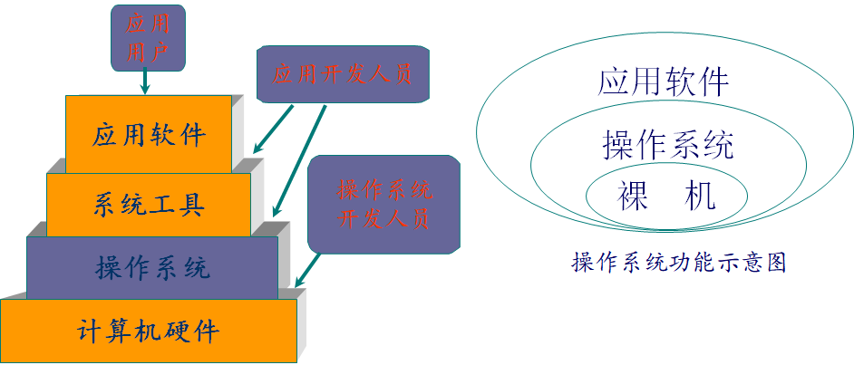

### 三、OS的目标

有效性      方便性      可扩充性      开放性

### 四、OS的作用

- 作为用户和计算机硬件间的接口

  ​	OS处于用户与计算机硬件系统之间，用户通过OS来使用计算机系统

- 作为计算机系统资源的管理者

  ​	处理机管理、存储器管理、设备管理、文件管理

- 实现了对计算机资源的抽象

  ​	隐藏了对硬件操作的细节，使用户能更方便地使用机器。

  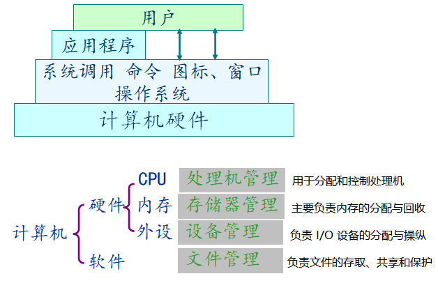
  
  用户通过3种方式使用计算机：1.系统调用 2.命令 3.图标、窗口

### 五、推动OS发展的主要动力

  1、不断提高计算机资源的利用率

  2、方便用户

  3、元器件的不断更新换代

  4、计算机体系结构的不断发展

## 1.2 操作系统的发展过程

### 一、无OS

人工操作方式

工作方式：

用户：既是程序员又是操作员；用户是专业人员；

输入输出：纸带或卡片；

缺点：用户独占全机，CPU等待人工操作

### 二、脱机I/O方式

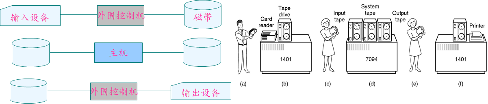

优点：

1、减少了CPU的空闲时间

2、提高了I/O速度

### 三、有OS（主要）

#### 批处理系统 （Batch Processing System)

- 用户使用系统提供的作业控制语言（JCL）来描述自己对作业运行的控制意图，并将这些控制信息连同作业一起提交给计算机。

- 由OS去控制、调度各作业的运行并输出结果。

- 由于作业进入系统后用户不再干预，从而提高了效率。

- 设计目标：提高系统资源的使用效率；提高作业吞吐量

单道批处理系统；多道批处理系统

##### 单道批处理系统

为实现对作业的连续处理，需要先把一批作业以脱机方式输入到磁带上，并在系统中配上监督程序(Monitor)，在它的控制下，使这批作业能一个接一个地连续处理。

单道批处理系统的处理过程:

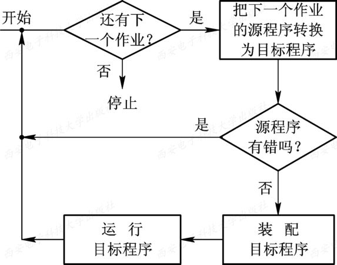

单道程序的运行情况示意图：

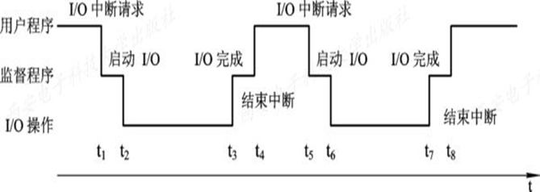

单道批处理系统的缺点：系统中的资源得不到充分的利用。这是因为在内存中仅有一道程序，每逢该程序在运行中发出I/O请求后，CPU便处于等待状态，必须在其I/O完成后才继续运行。又因I/O设备的低速性，更使CPU的利用率显著降低。下一张幻灯片里的图示出了单道程序的运行情况，从图可以看出：在t2～t3、t6～t7时间间隔内CPU空闲。

单道批处理系统的特征：自动性 顺序性 单道性

##### 多道批处理系统

什么是多道程序设计？

​    在多道批处理系统中，用户所提交的作业都先存放在外存上并排成一个队列，称为“后备队列”；然后，由作业调度程序按一定的算法从后备队列中选择若干个作业调入内存，使它们共享CPU和系统中的各种资源。

​    所以为了进一步提高资源的利用率和系统吞吐量，在20世纪60年代中期引入了多道程序设计技术，由此形成了多道批处理系统。

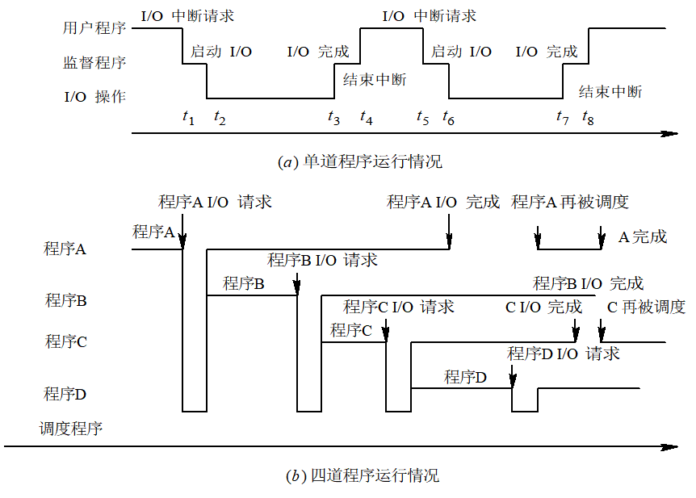

多道程序运行，系统性能明显改善。将多道程序设计技术应用于批处理系统，就形成多道批处理系统。

- 优点：资源利用率高、系统吞吐量大

- 缺点：周转时间变长、无交互能力

多道批处理系统的特征

- 多道性
- 无序性
- 调度性 

多道批处理系统需要解决的问题：

- 处理机争用问题；内存分配和保护问题；I/O设备分配问题；

- 文件的组织和管理问题；作业管理问题；用户与系统的接口问题；


#### 分时系统   (Time-Sharing System)

- 分时系统是指，在一台主机上连接了多个带有显示器和键盘的终端，同时允许多个用户通过自己的终端，以交互方式使用计算机，共享主机中的资源。

- 一台计算机连接多个终端，用户通过各自的终端把作业送入计算机；计算机又通过终端向各个用户报告其作业的运行情况。
- 计算机能分时轮流地为各终端用户服务，并能及时地对用户服务请求予以响应。

目标：对用户的请求及时响应；尽量提高系统资源的利用率

及时接收、及时处理

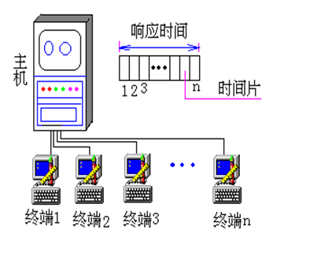

因此，作业应直接进入内存；应该规定每个作业只运行一个很短的时间；然后便暂停该作业的运行，并立即调度下一个程序运行

**分时系统基本特征：**

1. 多路性  允许在一台主机上同时联接多台联机终端，系统按分时原则为每个用户服务。
2. 独立性  每个用户各占一个终端，彼此独立操作，互不干扰。
3. 及时性  用户的请求能在很短的时间内获得响应。
4. 交互性  用户可通过终端与系统进行广泛的人机对话。

#### 实时系统  (Real-Time System)

提高系统的响应时间，对随机发生的外部事件作出**及时**响应并在**规定的时间内**对其进行处理。

**应用需求**

1. **实时控制**系统要求

   ​	计算机能尽快处理测量系统测得的数据，以尽快实施响应控制。

   ​	如：工业控制；导弹发射；飞机飞行

2. **实时信息**系统要求

   ​	计算机能对终端设备发来的服务请求及时予以正确的回答。

   ​	如：订票系统；股票交易系统

**实时任务** 

1)按任务执行时是否呈现周期性来划分

- 周期性实时任务。
- 非周期性实时任务。

   都必须联系着一个截止时间(Deadline)。

- 开始截止时间——任务在某时间以前必须开始执行；

- 完成截止时间——任务在某时间以前必须完成。

2)根据对截止时间的要求来划分

- 硬实时任务(hard real-time task)。系统必须满足任务对截止时间的要求，否则可能出现难以预测的结果。

- 软实时任务(Soft real-time task)。它也联系着一个截止时间，但并不严格，若偶尔错过了任务的截止时间，对系统产生的影响也不会太大。 

**实时系统基本特征：**

1. 快速的响应时间

2. 有限的交互能力

3. 高可靠性

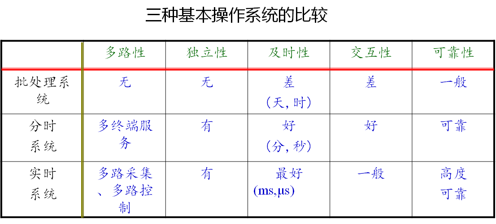

## 1.3 操作系统的基本特性

四大特性：并发、共享、虚拟、异步

- 并发(Concurrence)

  - 并发：指两个或多个事件在同一时间间隔内发生。
  - 并行：指两个或多个事件在同一时刻发生。

- 共享(Sharing)

  - 指系统中的资源供内存中的多道程序所共同使用。

  分类：互斥共享方式：打印机；

  ​					同时访问方式：磁盘；

  （1）互斥共享：计算机中的某个资源在一段时间内只能允许一个进程访问，别的进程没有使用权
  临界资源(独占资源)：在一段时间内只允许一个进程访问的资源，计算机中大多数物理设备及某些软件中的栈、变量和表格都属于临界资源，它们被要求互斥共享
  举个例子：比如QQ和微信视频。同一段时间内摄像头只能分配给其中一个进程

  （2）同时共享：计算机中的某个资源在在一段时间内可以同时允许多个进程访问
  同时共享通常要求一个请求分为几个时间片段间隔的完成，即交替进行，“分时共享”
  这里的同时指在宏观上是同时的，在微观上是交替进行访问的，只是cpu处理速度很快，我们感觉不到，在宏观上感觉是在同时进行
  举个例子：比如QQ在发送文件A，微信在发送文件B，宏观上两个进程A和B都在访问磁盘，在我们看来是同时进行的，但是在微观上两个进程A和B是交替进行访问磁盘的，只是时间太短，cpu处理速度太快，我们感觉不到。
  注意：有时候多个进程可能真的是在同时进行资源访问，比如玩游戏时可以放音乐，游戏声音和音乐声音都能听见

- 虚拟(Virtual)技术

  - 指通过某种技术把一个物理实体变成若干个逻辑上的对应物。

  - 例，分时系统将一机虚拟为多机。

    （1）时分复用技术  （cpu时间片）    （2）空分复用技术（分盘）

- 异步性(Asynchronism)       <———由于共享资源

  - 系统中并发执行的多道程序“走走停停”，以不可预知的速度向前推进

    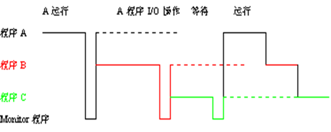

## 1.4 操作系统的主要功能

### 一、处理机管理功能

1. 进程控制

进程控制的主要功能是为作业创建进程、撤消已结束的进程，以及控制进程在运行过程中的状态转换。

2. 进程同步

进程同步的主要任务是为多个进程(含线程)的运行进行协调。有两种协调方式： ① 进程互斥方式 ② 进程同步方式

3. 进程通信

  例如，有三个相互合作的进程， 它们是输入进程、计算进程和打印进程。输入进程负责将所输入的数据传送给计算进程；计算进程利用输入数据进行计算， 并把计算结果传送给打印进程；最后，由打印进程把计算结果打印出来。进程通信的任务就是用来实现在相互合作的进程之间的信息交换。

4. 调度

  作业调度的基本任务，是从后备队列中按照一定的算法，选择出若干个作业，为它们分配其必需的资源(首先是分配内存)。 在将它们调入内存后，便分别为它们建立进程，使它们都成为可能获得处理机的就绪进程，并按照一定的算法将它们插入就绪队列。而进程调度的任务，则是从进程的就绪队列中选出一新进程，把处理机分配给它，并为它设置运行现场， 使进程投入执行。

### 二、存储器管理功能

1. 内存分配 

   ​	内存分配数据结构，该结构用于记录内存空间的使用情况，作为内存分配的依据；

   ​	内存分配功能，系统按照一定的内存分配算法，为用户程序分配内存空间；

   ​	内存回收功能，系统对于用户不再需要的内存，通过用户的释放请求，去完成系统的回收功能。

2. 内存保护

   ​	内存保护的主要任务，是确保每道用户程序都只在自己的内存空间内运行，彼此互不干扰。

3. 地址映射

4. 内存扩充

   请求调入功能。

   置换功能。

### 三、设备管理功能

1. 缓冲管理
2. 设备分配
3. 设备处理

### 四、文件管理功能

1. 文件存储空间的管理
2. 目录管理
3. 文件的读/写管理和保护

## 1.5 OS结构设计

- 传统的操作系统结构
  - 无结构操作系统
  - 模块化OS结构
  - 分层式OS结构
- 现代操作系统结构
  - 微内核的OS结构

### 一、无结构操作系统（整体式结构）

OS是由众多的过程直接构成，各过程之间可相互调用，但OS内部不存在任何结构，所以这种OS是无结构的，又称为整体系统结构。

缺点： 既庞大又杂乱，缺乏清晰的程序结构；程序错误多，调试难、阅读理解难、维护难。

Linux是采用整体结构的操作系统，即所有的内核系统功能都包含在一个大型的内核软件之中。

### 二、模块化操作系统结构 

构  成：安装[内核](https://baike.baidu.com/item/内核)和安装口令包

OS是采用“模块化程序设计”技术，按其功能划分为若干个独立的模块，管理相应的功能，同时规定好各模块之间的接口，以实现其交互，对较大模块又可按子功能进一步细分下去。

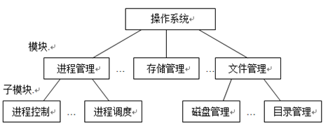

- 优点
  - 提高了OS设计的正确性、可理解性
  - 容易扩充和维护
  - 加速了OS的开发过程
  - 使系统所占空间达到最小化
- 缺点
  - 模块及接口划分较困难
  - 从功能上划分模块，未区别共享资源和独占资源
  - 由于管理的差异，使OS结构变得不够清晰

### 三、分层式操作系统结构（层次结构）

分层式OS结构是对模块化结构的一种改进，它按分层式结构设计的基本原则，将OS 划分为若干个层次，`每一层`都只能使用`其底层`所提供的功能和服务，从硬件开始，在其上面一层一层地**自底向上**增添相应功能的软件，这种OS结构称为分层式OS结构。

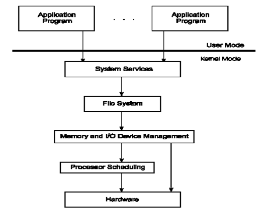

- 特点：
  - 每一步设计都建立在可靠的基础上，结构更清晰
  - 调试和验证更容易，正确性更高
- 缺点：
  - 系统效率降低了。
  

UNIX系统的核心层采用的是层次结构。

### 四、微内核的OS结构

在OS内核中只留下一些**最基本的功能**，而将其他服务分离出去，由工作在用户态下的进程来实现，形成所谓“**客户/服务器**”模式。客户进程可通过内核向服务器进程发送请求，以获取OS的服务。

- 特点
  - 小而精练
  - 系统的灵活性和可扩充性好
  - 系统的可靠性高
  - 适用于分布式系统

例，windows 2000/XP、UNIX、嵌入式OS

Windows系列操作系统采用微内核技术，尽可能地使操作系统保持最小的核心，并由核心来负责处理客户和服务器之间的通信。

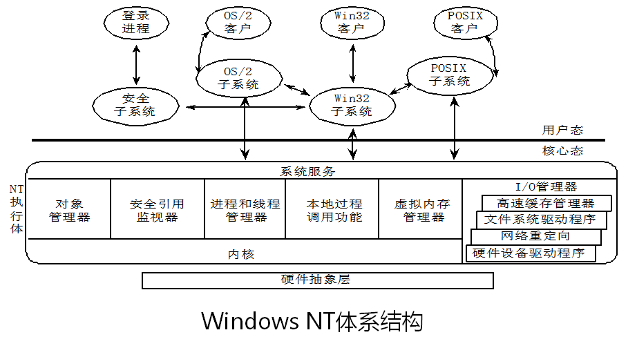

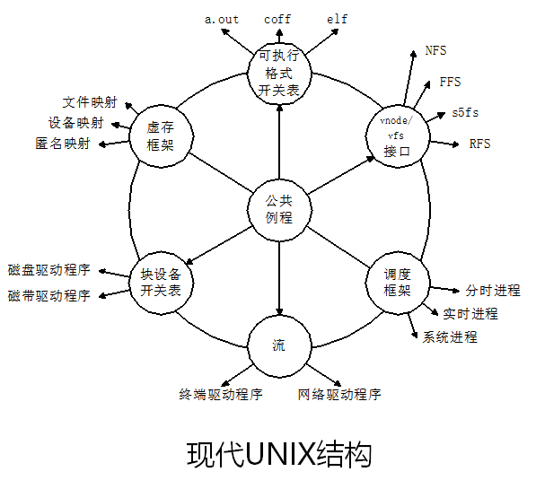

### 常见的OS

- MS DOS
- MS Windows 
- UNIX
- Linux
- 手持系统（handheld system）
- 嵌入式操作系统 (Embedded OS）

## 中断和异常


# 二、进程的描述与控制

## 2.1 前趋图和程序执行

### 一、程序的顺序执行及其特征

1. 程序的顺序执行

   ​	 一个程序由若干个程序段组成，而这些程序段的执行必须是顺序的，这种程序执行的方式就称为程序的顺序执行。

   ​	S1: a:=x+y；

   ​	S2: b:=a-5；

   ​	S3: c:=b+1；

2. 程序顺序执行时的特征

   (1) 顺序性      处理机的操作严格按照程序所规定的顺序执行.
   
   (2) 封闭性      程序一旦开始执行，其计算结果不受外界因素的影响。
   
   (3) 可再现性  程序执行的结果与它的执行速度无关(即与时间无关)，而只与初始条件有关。

### 二、前趋图

前趋图是一个有向无循环图(DAG)，用于描述进程之间执行的前后关系

 结点：表示一个程序段或进程，或一条语句

 有向边：结点之间的偏序或前序关系“-->”

 -->={(Pi,Pj)| Pi must complete before Pj may start}

 若(Pi,Pj)ή,记为Pi®Pj，则

 Pi是Pj的直接前趋，Pj是Pi的直接后继

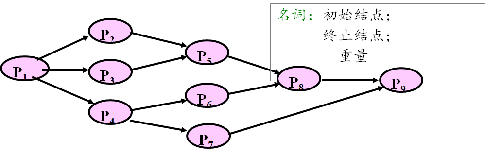

注意：前趋图中禁止存在循环

### 三、程序的并发执行及其特征

1.程序的并发执行

 例： 在系统中有n个作业，每个作业都有三个处理步骤:

  输入数据、处理、输出结果，即Ii , Ci , Pi (i=1,2,3,...,n)

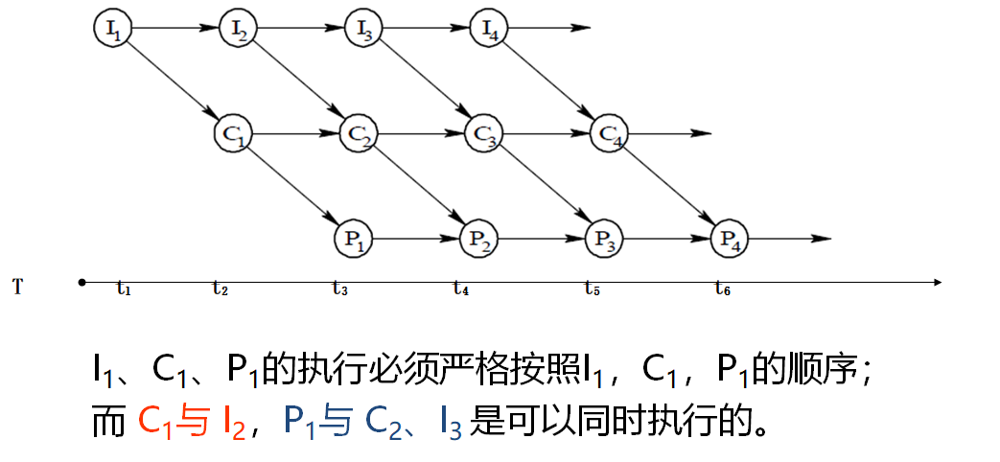

2.程序并发执行时的特征

1. 间断性

​		相互制约导致并发程序具有“执行—暂停—执行”这种间断性的活动规律。

2. 失去封闭性

​		程序在并发执行时，系统的资源状态由多道程序来改变，程序运行失去封闭性。程序的运行受到其他程序的影响。

3. 不可再现性

​		程序在并发执行时，多次运行初始条件相同的同一程序会得出不同的运行结果。

​		例：共享公共变量的两个程序，它们执行时可能产生不同结果。

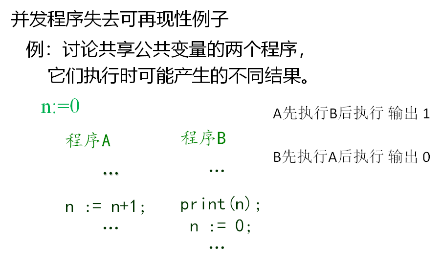

#### 四、进程的特征与状态

在多道程序设计的环境下，为了描述程序在计算机系统内的执行情况，必须引入新的概念--进程。

## 2.2进程的描述

### 1、进程的定义

进程：程序关于某个数据集合的一次执行过程。

进程（有时称为任务）是一个程序与其数据一道通过处理机的执行所发生的活动。

进程是执行中的程序。

进程动态过程。

### 2、进程的特征（与程序比较）

1. 结构特征

   ​	进程控制块(PCB) + 程序 + 数据 = 进程实体

2. 动态性--最基本特征

   ​	进程：进程实体的一次执行过程，有生命周期。

   ​	程序：程序是一组有序指令的集合，是静态的概念。

3. 并发性

4. 独立性

5. 异步性  进程按各自独立的、不可预知的速度向前推进

### 3、进程的三种基本状态

1. 就绪状态(Ready)

   ​	进程已获得除CPU之外的所有必需的资源，一旦得到CPU控制权，立即可以运行。

2. 运行状态(Running)

   ​	进程已获得运行所必需的资源，它正在处理机上执行。

3. 阻塞状态(Blocked)

   ​	正在执行的进程由于发生某事件而暂时无法执行时，便放弃处理机而处于暂停状态，称该进程处于阻塞状态或等待状态。

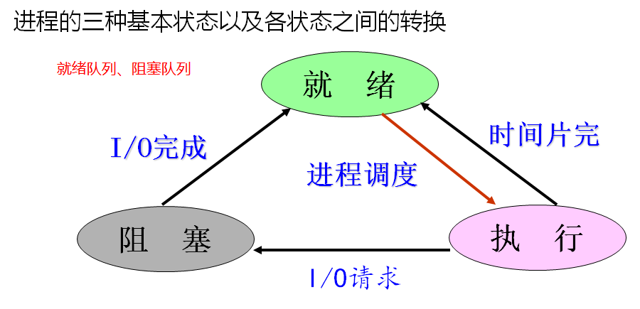

### 4、挂起状态

​	进程由内存挪到外存的过程就叫挂起

1）引起挂起状态的原因：

- 终端用户的请求
- 父进程请求
- 负荷调节的需要
- 操作系统的需要

2）进程状态的转换

​	引入挂起状态后，增加了挂起状态(静止状态)到非挂起状态(活动状态)的转换，或者相反。

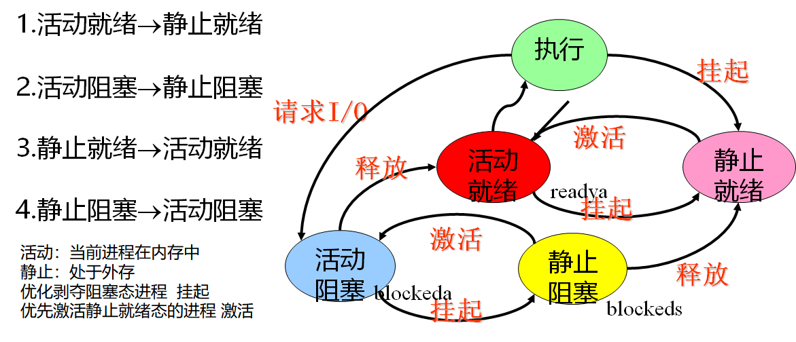

### 5、进程控制块（PCB）

#### 进程控制块的作用

存放进程管理和控制信息的数据结构称为进程控制块。它是进程管理和控制的**最重要的数据结构**，在创建时，建立PCB，并伴随进程运行的全过程，直到进程撤消而撤消。

- PCB就像我们的户口。
- PCB是进程存在的唯一标志。

系统的所有PCB组织成链表或队列，常驻内存的PCB区。

**PCB的具体作用：**

(1) 作为独立运行基本单位的标志。

(2) 能实现间断性运行方式。 

(3) 提供进程管理所需要的信息。

(4) 提供进程调度所需要的信息。

(5) 实现与其它进程的同步与通信。

#### 进程控制块中的信息

1. 进程标示符  

   ​	每个进程都必须有一个唯一的标识符

   ​		内部标示符 

   ​		外部标示符

2. 处理机状态

   ​	主要由处理机的各种寄存器中的内容组成。处理机运行时的信息存放在寄存器中，当被中断时这些信息要存放在PCB中。

3. 进程调度信息

   ​	进程状态

   ​	进程优先级

   ​	进程调度所需的其他信息

   ​	事件

4. 进程控制信息

   ​	程序和数据的地址

   ​	进程通信和同步机制

   ​	资源清单

   ​	链接指针

#### 进程控制块的组织方式

1）链接方式

  把具有同一状态的PCB用其中的链接字链接成一个队列。

- 就绪队列；  
- 若干个阻塞队列；

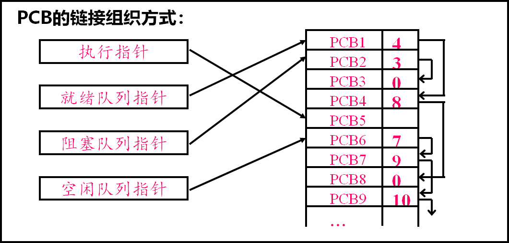

2) 索引方式

系统根据所有进程的状态建立几张索引表，把各表的内存首地址记录在内存的专用单元中。

索引表的表目中记录了相应状态的某个PCB在PCB表中的地址。

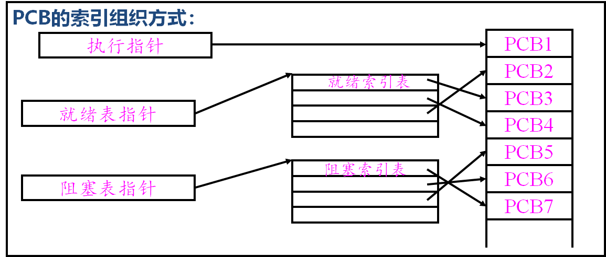

## 2.3 进程控制

进程控制是对系统中的全部进程实施有效的管理，包括进程创建、终止、进程阻塞和唤醒。

### 一、进程的创建

1.进程图

   描述进程的家族关系的有向树   

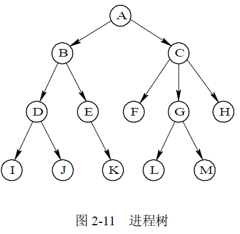

2.进程的创建

操作系统发现要求**创建新进程的事件**后，调用进程创建原语Creat()创建新进程。

创建新进程的事件有：

- 用户登录

- 作业调度

- 提供服务

- 应用请求

  原语：若干条指令组成，能够完成一定功能的程序段，要么全执行要么都不执行

进程的创建过程：

申请空白PCB  ——>   为新进程分配资源  ——>    初始化进程控制块（优先级、状态等）  ——>    将新进程插入就绪队列

### 二、进程的终止

1.引起进程终止的事件

​	1)正常结束

​	 2)异常结束

​			越界错误、非法指令等

​	 3)外界干预

​		   操作员或操作系统干预；

​	 	  父进程请求；

​	   	父进程终止

2.进程的终止过程

- 找出被终止进程的PCB  ——>  若进程状态为运行态，置CPU调度标志为真  ——>  若其有子孙进程，终止其子孙进程并回收其资源——>   回收终止进程的资源  ——>  回收终止进程的PCB

### 三、进程的阻塞与唤醒

1.引起进程阻塞和唤醒的事件

​	  1)请求系统服务  

​	  2)启动某种操作

​	  3)新数据尚未到达 

​	  4)无新工作可做

2.进程阻塞过程

- 调用阻塞原语阻塞自己 ——>  将PCB中的状态改为阻塞，并加入阻塞队列  ——>   转进程调度。

3.进程唤醒过程

阻塞进程等待的事件发生，有关进程调用唤醒原语 wakeup()

唤醒等待该事件的进程

- 把阻塞进程从等待该事件的阻塞队列中移出 ——> 置进程状态为就绪态，将PCB插入到就绪队列中。

- [ ] `阻塞原语与唤醒原语作用相反，成对使用`

### 四、进程的挂起与激活

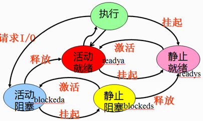

当出现引起**进程挂起**的事件时，系统利用挂起原语suspend()将**指定进程**或**处于阻塞的进程**挂起。

1.进程的挂起过程

​	检查被挂起进程的状态：

- 若处于活动就绪，则改为静止就绪；
- 若处于活动阻塞，则改为静止阻塞；
- 若挂起的进程正在执行，则重新进行进程调度。

当发生**激活进程**的事件时，系统利用激活原语active()将指定进程激活。

2.进程的激活过程

  1) 激活原语先将进程从外存调入内存；

  2) 检查该进程的状态：

- 若为静止就绪，则改为活动就绪；
- 若为静止阻塞，则改为活动阻塞。

## 2.4 进程同步与互斥★

进程同步的主要任务：

对多个相关进程在执行次序上进行协调，使并发执行的诸进程之间能有效地共享资源和相互合作，从而使程序的执行具有可再现性。

### 一、进程的同步基本概念

进程同步：它主要源于进程合作，是进程间共同完成一项任务时直接发生相互作用的关系。为进程之间的直接制约关系。
比如说进程A需要从缓冲区读取进程B产生的信息，当缓冲区为空时，进程B因为读取不到信息而被阻塞。而当进程A产生信息放入缓冲区时，进程B才会被唤醒。

同步也称为直接制约关系。实现多个相关进程在执行次序上的协调

在多道程序环境下，进程是并发执行的，不同进程之间存在着不同的相互制约关系。为了协调进程之间的相互制约关系,如等待、传递信息等，引入了进程同步的概念。进程同步是为了解决进程的异步问题。

一个简单的例子来理解这个概念。

例如，让系统计算1 + 2x3，假设系统产生两个进程: 一个是加法进程，一个是乘法进程。要让计算结果是正确的，一定要让加法进程发生在乘法进程之后,但实际上操作系统具有异步性,若不加以制约，加法进程发生在乘法进程之前是绝对有可能的，因此要制定一定的机制去约束加法进程，让它在乘法进程完成之后才发生。

> 异步性：进程具有异步性的特征。异步性是指，各并发执行的进程以各自独立的、不可预知的速度向前推进。

进程互斥：主要源于资源共享，是进程之间的间接制约关系。进程互斥就是保证每次只有一个进程使用临界资源。
比如进程B需要访问打印机，但此时进程A占有了打印机，进程B会被阻塞，直到进程A释放了打印机资源,进程B才可以继续执行。

同步和互斥这两种制约关系的区别：进程的互斥是进程间竞争共享资源的使用权，这种竞争没有固定的必然关系；而进程同步时，涉及到共享资源的并发进程之间有一种必然的依赖关系。

#### 1.进程间两种形式的制约关系

(1) 间接相互制约关系 --- 源于**资源共享**       打印机共享

(2) 直接相互制约关系 --- 源于**进程合作**     （流水线）A--(存放)-->□□buffer□□---(取)-->B

互斥共享和同时共享

#### 2.临界资源

临界资源（Critical Resource）:把一段时间内只允许一个进程访问的资源称为临界资源或独占资源

临界区（Critical Section）:每个进程中访问临界资源的那段代码称为临界区

打印机：一段时间内只能允许一个进程的访问打印机让其工作，相当于一个临界资源；

​			   进程A申请打印机，使用上了打印机进去操作这个区就叫临界区

教室：8点-10点只允许1班访问教室来上课，教室也相当于一个临界资源；

​			8点-10点1班使用教室上课这个区就叫临界区

**生产者—消费者问题：**

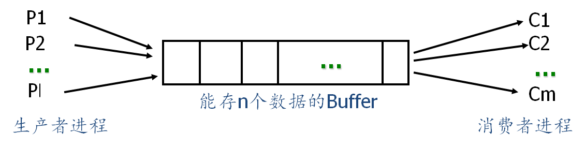

​	生产者进程和消费者进程都以**异步方式**运行，但它们之间必须保持同步。

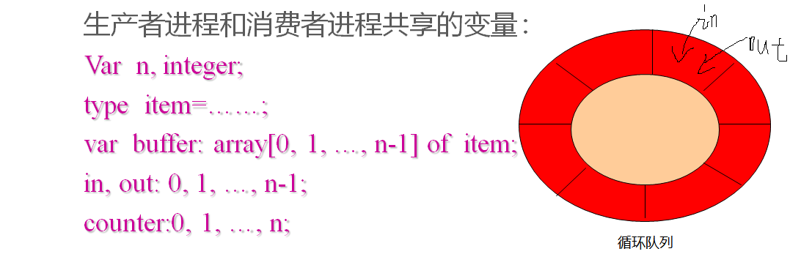

注意：缓冲池组织为循环缓冲，

输入指针加1表示为in:=(in+1)mod n，

输出指针加1表示为out:=(out+1)mod n，

当(in+1)mod n=out时表示缓冲池满，

in=out表示缓冲池空。

输入指针**in**指示下一个可投放产品的缓冲区，输出指针**out**指示下一个可从中获取产品的缓冲区，初值均为**1**。

初始值为**0**，放入产品使其加**1**，取出产品使其减**1**

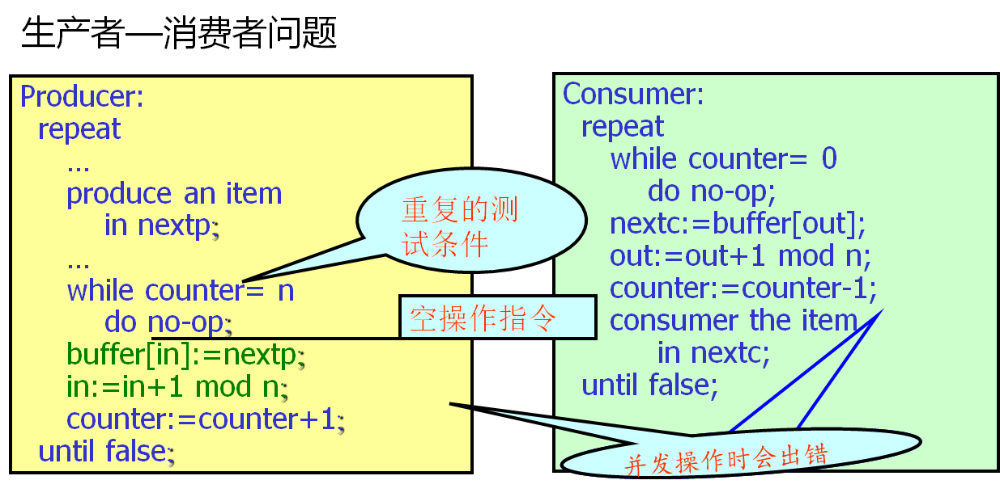

counter是共享数据 不安全啊


#### 3.临界区

临界区：进程中访问临界资源的那段代码

访问临界区的程序设计为：

- 对欲访问的临界资源进行检查，
- 若此刻未被访问，设正在访问的标志               ……进入区
- 访问临界资源                                                      ……临界区
- 将正在访问的标志恢复为未被访问的标志        ……退出区
- 其余部分                                                              ……剩余区

**进程互斥**：两进程不能同时进入同一临界区

`进程互斥`指当一个进程访问某临界资源时，另一个想要访问该`临界资源`的进程必须等待。当前访问临界资源的进程访问结束，释放该资源之后，另一个进程才能去访问临界资源。


#### 4.同步机制应遵循的规则 

- 空闲让进
- 忙则等待
- 有限等待
- 让权等待

### 二、信号量机制☆

**信号量（Semaphore）**：为实现进程同步而设置的特殊变量。

1965年荷兰Dijkstra提出的信号量（Semaphores）是一种卓有成效的进程同步工具，在长期的应用中，得到了很大的发展，从整型信号量经过记录型信号量，进而发展为“信号量集”机制。

- 信号量就是OS提供的管理公有资源的有效手段。
- 信号量代表可用资源实体的数量。

#### 1.整型信号量

定义：把整型信号量定义为一个用于表示资源数目的整型量S，除初始化外，仅能通过两个原子操作wait(S),signal(S)来访问


typedef int Semaphore; 

Semaphore s;

**注意：与一般变量不同的是，对于信号量除初始化外，仅能通过两个标准的原子操作wait(s)和signal(s)来访问，分别称为P操作和V操作。**

**信号量的三种操作：**

**（1）初始化**

根据实际资源数，对s进行初始化(s≥0为非负整数)

可描述为：

Semaphore s=5

**（2）P操作, wait(s)**

可描述为： 

wait(s){ 

​	while (s≤0) { };

​    s=s-1;

 }

**（3）V操作, signal(s)**

可描述为：

signal(s){

​	s=s+1;

}

**说明：**

- 仅能通过wait(s)和signal(s)来访问s。
- wait(s)和signal(s)是两个原子操作，在执行时不可中断。

**例如：**在上例中假设变量x初值为5。P1进程中有语句x=x+1；P2进程中有语句x=x-1；试利用整型信号量机制来解决进程间的并发，即在访问临界变量x时不出现错误，并进行分析。

解：变量x是临界资源，为保证对其访问的正确性定义整型信号量s，并初始化为1

Semophore s=1**;** 

| 将P1进程修改为： | 将P2进程修改为： |
| :--------------: | :--------------: |
|        ……        |        ……        |
|     wait(s);     |     wait(s);     |
|        ……        |        ……        |
|      x=x+1;      |      x=x-1;      |
|        ……        |        ……        |
|    signal(s);    |    signal(s);    |
|        ……        |        ……        |

P1，P2并发的一个实例为：

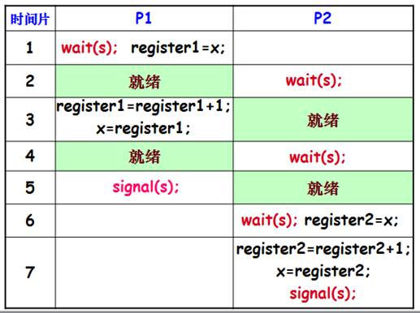

**注：整型信号量不遵循“让权等待”原则。**

#### 2.记录型信号量☆☆

引入整型变量value(代表资源数目)、进程链表L (链接所有等待进程)

记录型数据结构：

   type semaphore=record

​        value: integer;

​        L: list of process;

   end; 

Wait 操作：

- 申请资源，减量操作，S.value:=S.value-1
- 当S.value<0时，表示资源分配完，进行自我阻塞。

Signal操作：

- 释放资源，增量操作，S.value:=S.value+1
- 当S.value≤0，唤醒S.L链表中的等待进程。

进入区 P(S)

临界区

退出去 V(S) 

**正确使用时能实现同步和互斥**

含义：value>0时，代表可用资源的数量

value<0时，代表由于申请资源而阻塞的进程数量|value-1|

```
type  semaphore=record
	  value: integer;
      L: list  of  process;
end; 
S: semaphore;

wait(S)
   begin
       S.value:=S.value-1；
       if  S.value<0  then 
           block(S,L) //自我阻塞进入进程链表
   end
//临界区  （在此 可能有其他设备来申请）
signal(S)
    begin
    	S.value:=S.value+1;
        if  S.value<=0  then 
            wakeup(S,L) // 唤醒链表种的一个进程，会进入临界区
    end

```

```c++
记录型信号量采用记录型的数据结构，C语言描述为：
typedef struct{ 
    int value; 
    struct process_control_block *list; 
} Semaphore;
其中：
	value：表示资源个数
	list：等待该资源而阻塞的进程链表
    
（1）wait(s)的描述
wait(Semaphore &s)
{ 
  s.value=s.value-1;
  if (s.value＜0)
       block(s.list);//阻塞并插入到s.list阻塞队列
}
（2）signal(s)的描述
signal(Semaphore &s)
{
  s.value=s.value+1;
  if (s.value≤0)
       wakeup(s.list); //唤醒s.list队列中的第一个进程
}
说明：
	wait操作意味着请求一个单位的资源（进入区）。
	signal操作意味着释放一个单位的资源（退出区）。
	s.value＜0表示该类资源已经分配完毕，此时s.value的绝对值就是等待链表s.list中的进程个数
	若s.value的初值为1，则表示该资源为临界资源，此信号量成为互斥信号量。

```


#### 3.AND型信号量

引入：两个进程A和B，共享数据D和E，为其分别设置互斥信号量Dmutex和Emutex，初值均为1。

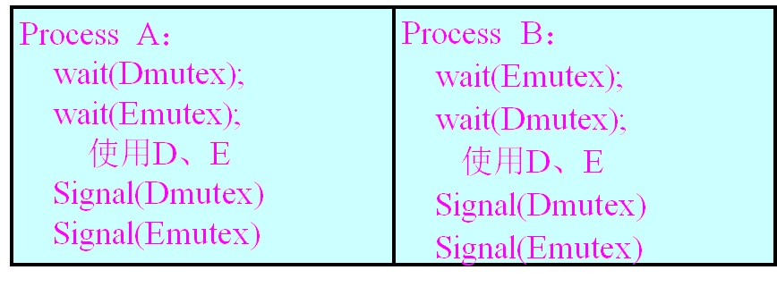

只有A申请上Dmutex同时申请上Emutex才能访问D、E；

只有B申请上Dmutex同时申请上Emutex才能访问D、E；

共享数据D和E，其实就是个临界资源

分时系统时


由此看出 会造成 死锁

**So 共享的资源越多，死锁的可能越大;**

**AND同步机制的基本思想**：

所有资源一次性分配，待使用完后再一次性释放。即对于进程所需资源，要么全部分配到进程，要么一个也不分配。

将进程在整个运行过程中需要的所有资源，**一次性**全部分配给进程，待进程使用完后再**一起**释放。只要尚有一个资源未能分配给进程，其他所有可能为之分配的资源，也不分配给它。即对临界资源的分配采取原子操作。称为同时wait操作即Swait();

一次性分配，一次性释放

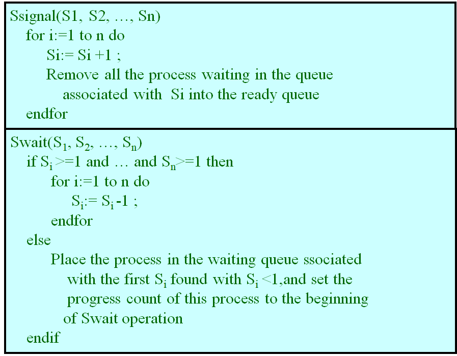

```c
（3）AND型同步信号量描述
假设进程P同时需要n类资源，为其所需资源分别分配信号量si,i=1…n，si为表示资源数量的整数。
Swait操作为：

Swait(s1,s2,…,sn){ 
    if(s1≥1)&&(s2≥1)&&…&&(sn≥1){    
        for(i=1;i<=n;i++)
            si=si-1;
    }
    else{ 
        ①该进程进入到由第一个未得到满足的资源Si所对应的阻塞队列；
    	②并将该进程的程序计数器指向Swait()的开始处，即该进程下一次执行时重新从Swait()开始。
    }
}

Ssignal操作为：
Ssignal(s1,s2,…,sn){
    for(i=1;i<=n;i++){ 
        si=si+1;
        将因等待资源Si而产生的阻塞队列中的所有进程全部转入就绪队列。
    }
}

```


#### 4.信号量集

记录型信号量机制：

- 每次只能获得或释放一个单位的资源，低效
- 每次分配前必须测试资源数量，看其是否大于其下界值

对AND信号量机制加以扩充

   S 为信号量；t 为下限值；d 为需求值

举列：举行一次活动，总共有10间教室，此次活动要申请5间教室来举办，如果教室剩余不够等情况，至少要借给我3间教室；

其中 10可看作为S信号量；5看作d需求值；3看作为t下限值

Swait(S, t, d)，

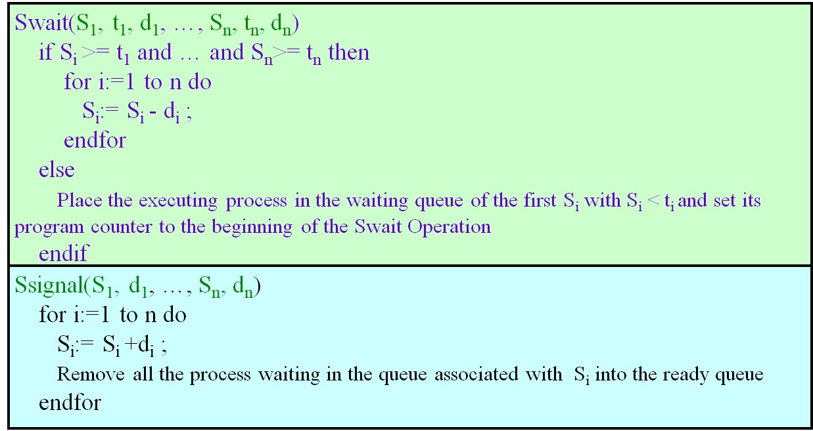

```c
(2) 信号量集的描述
    信号量集实际是对AND型信号量的扩充，对于某类资源i，除了为其设置信号量si表示资源数量，还设置di为每次的需求量，设置ti为分配是的下限值。
假设进程P同时需要n类资源，为其所需资源分别分配信号量si，需求量di，下限值ti,i=1…n。
    
Swait操作为：
Swait(s1,t1,d1,s2,t2,d2…,sn,tn,dn){
    if(s1≥t1)&&(s2≥t2)&&…&&(sn≥tn)
        for(i=1;i<=n;i++) si=si-di;
    else{
        ①该进程进入到由第一个未得到满足的资源Si所对应的阻塞队列； 
            ②并将该进程的程序计数器指向Swait()的开始处，即该进程下一次执行时重新从Swait()开始。
    }
}

Ssignal操作为：
Ssignal(s1,t1,d1,s2,t2,d2…,sn,tn,dn){ 
    for(i=1;i<=n;i++){
        si=si+di;
        将因等待资源i而产生的阻塞队列中的所有进程全部转入就绪队列。
    }
}

```

一般信号量集的几种特殊情况：

- Swait(S, d, d)，只有一个信号量S，允许每次申请d个资源，若现有资源数少于d，不予分配。
- Swait(S, 1, 1)，蜕化为一般的记录型信号量(S>1时)或互斥信号量(S=1时)。
- Swait(S, 1, 0)，这是一种很特殊且很有用的信号量操作。当S≥1时，允许多个进程进入某特定区；当S变为0后，将阻止任何进程进入特定区。换言之，它相当于一个可控开关。

### 三、信号量的应用

1. 利用信号量实现进程互斥（模式）

   ①选择合适的信号量机制，将信号量s初值设置为1； 

   ②在进程中的进入区使用P操作，在退出区使用V操作。

2. 利用信号量实现前驱关系（模式）

   ①创建进程，每个进程中分别包含对应的程序段或语句；

   ②为每个构成前趋关系的进程对都设置一个公用信号量s，且初值为0；

   ③设有Pi→Pj，则

    在前趋进程Pi中：语句或程序段; signal(s);

    在后继进程Pj中：wait(s);　语句或程序段;

3. 利用记录型信号量实现同步（模式）

**`以后 parbegin ... parend 中的程序时并发的`**

#### 1.利用信号量实现进程互斥（模式）

进程互斥是进程之间的**间接制约关系**。当一个进程进入临界区使用临界资源时，另一个进程必须等待，而不能同时使用。只有当使用临界资源的进程退出临界区后，这个进程才会解除阻塞状态。

为使多个进程互斥的访问某临界资源，须为该资源设置一互斥信号量mutex，并设其初始值为1，然后将各进程访问资源的临界区CS置于wait(mutex)和signal(mutex)之间即可。

mutex：互斥信号量；互斥模式资源是共享的；

注意事项： 1.临界区置于wait(mutex)和signal(mutex)之间

​					 2.wait()与signal() 必须成对出现

​					 3.初始值基本上是1；如只有一台打印机，mutex就是1；若2台打印机，mutex=2；

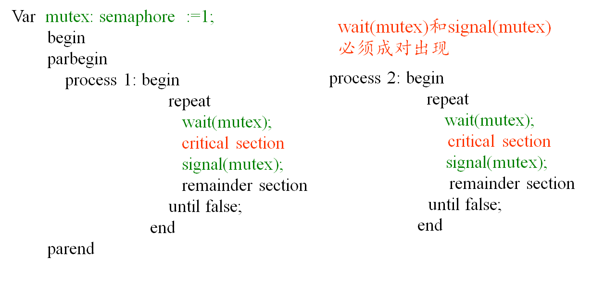

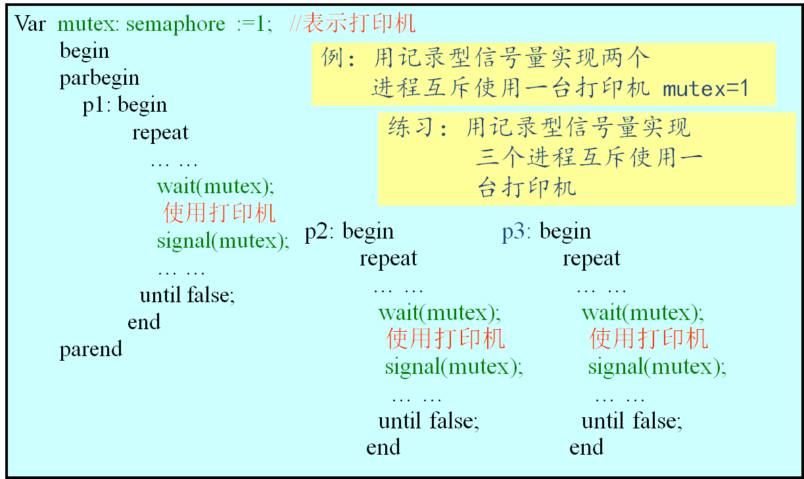

#### 2.利用信号量实现前驱关系（模式）

设有两个并发执行的进程P1和P2，P1中有语句S1，P2中有语句S2，希望在S1执行后再执行S2。

使进程P1和P2共享一个公用信号量S，并赋予其初值为0。

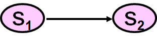

注意:  公用信号量 S=0；

​		   先执行S1，后执行S2

设计思路：如果要是上来先执行P2进程，那么必须先把它阻塞起来；

​					wait(S);

​					S2;

​					然后执行P1进程,后释放唤醒P2进程：

​					S1;

​					signal（S）;


首条语句后面必须更上signal；后面有几个节点先写wait(),然后写语句

多个语句程序

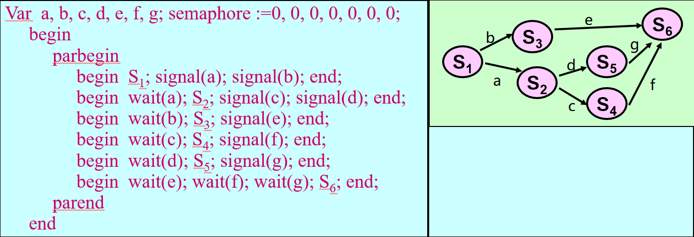

广度

思路：几个箭头===几个前驱关系，每一个关系设一个信号量，都初置为0

初始节点开始，读语句，有几个后继就写几个对应信号量的signal();

下一条语句起始，首先执行对应信号量的wait()，---其中有几个前驱就有几个wait()；然后操作语句；再然后跟着有几个后继就写几个对应信号量的signal();

重复上诉操作

此语句有几个前驱就有几个wait（），有几个后继就有几个signal

另外：


#### 3.利用记录型信号量实现同步（模式）

 进程同步也是进程之间**直接的制约**关系，是为完成某种任务而建立的两个或多个线程，这个线程需要在某些位置上协调他们的工作次序而等待、传递信息所产生的制约关系。进程间的直接制约关系来源于他们之间的合作。

P1，p2两进程因合作完成一项任务而共用一个变量x。

进程p2将处理结果送入x；进程P1将x的结果打印。

即：p2：x=处理结果；

​        p1：Print(x)；

两个资源信号量{ empty = 1;看看有没有空余位置存放 也不是固定的 此处1台打印机 

​					   	{ full   = 0  看看位置上还有没有东西可读

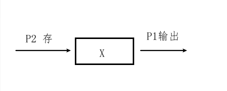

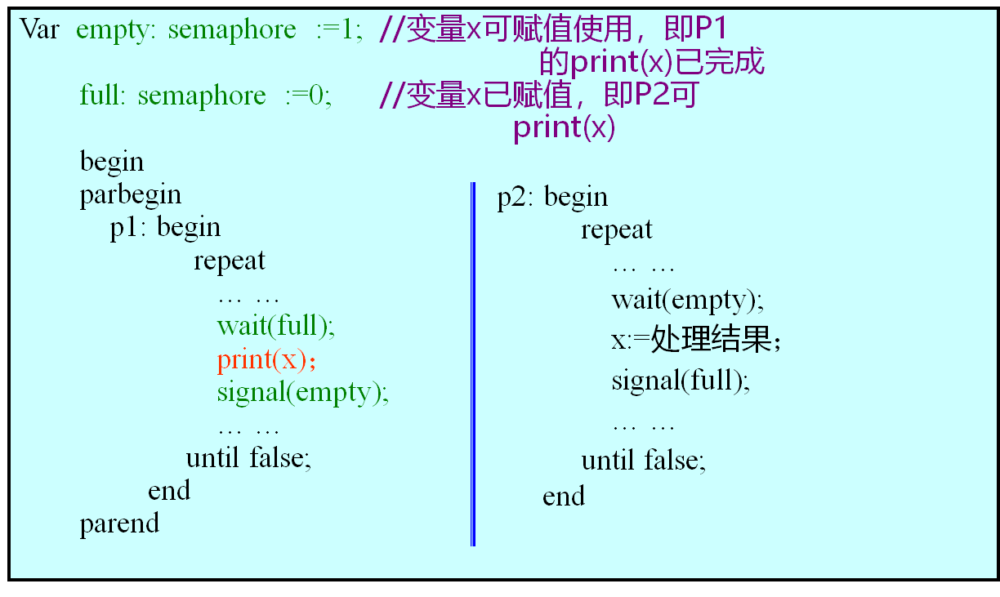

另一种方法

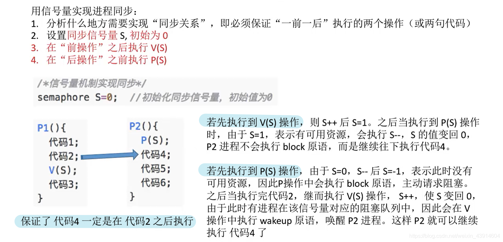

## 2.5 经典进程的同步问题

### 一、生产者--消费者问题

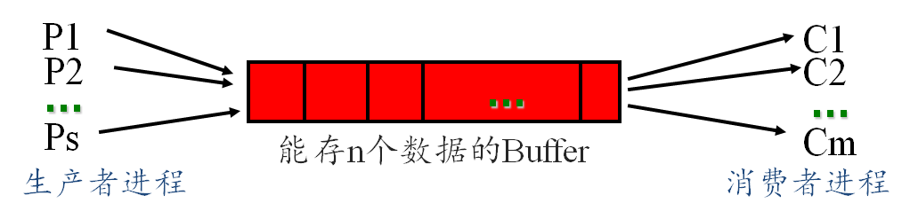

生产者进程和消费者进程都以异步方式运行，但它们之间必须保持同步。

分析：1.有几个进程；2.进程之间存在什么模式

​           2个进程，互斥：生产商品时，不能消费商品 反亦；

​                             同步：只有生产者存完商品，消费者才能够消费。

互斥信号量  mutex=1

资源信号量 empty= 1；full = 0;

#### 1.利用记录型信号量解决生产者--消费者问题

可利用互斥信号量mutex实现诸进程对缓冲池的互斥使用；

利用信号量empty和full分别表示缓冲池中空缓冲池和满缓冲池的数量。

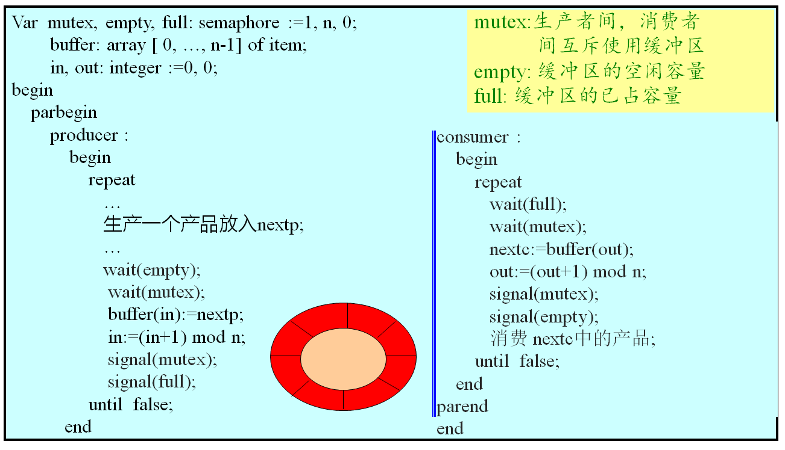

注意：

- 每个程序中用于实现互斥的wait(mutex)和signal(mutex)必须成对地出现。
- 对资源信号量empty和full的wait和signal操作，同样需要成对地出现，但处于不同的程序中。
- 在每个程序中的多个wait操作顺序不能颠倒。应先执行对资源信号量的wait操作，再执行对互斥信号量的wait操作，否则可能引起进程死锁

#### 2.利用AND信号量解决生产者--消费者问题

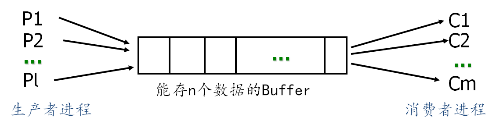

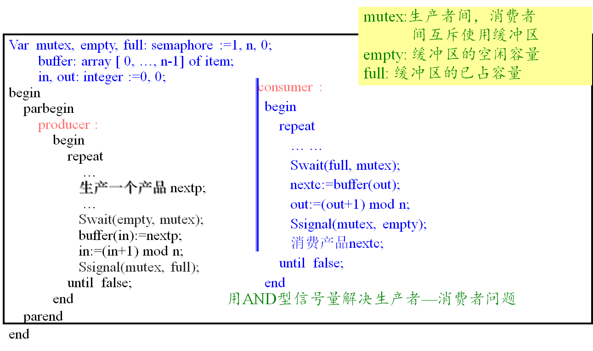

### 二、哲学家进餐问题

五个哲学家共用一张圆桌，分别坐在周围的五张椅子上，在桌子上有五只碗和五支筷子，他们的生活方式是交替地进行思考和进餐。平时，一个哲学家进行思考，饥饿时便试图取用其左右最靠近他的筷子，只有在他拿到两只筷子时才能进餐。进餐毕，放下筷子继续思考

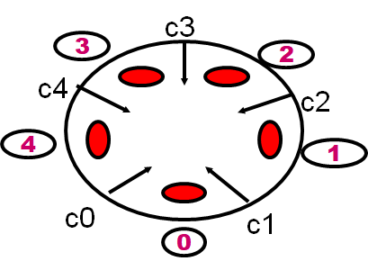

可见：相邻两位不能同时进餐；最多只能有两人同时进餐。

#### 1.利用记录型信号量解决哲学家进餐问题 

放在桌子上的筷子是临界资源，在一段时间内只允许一个哲学家使用。为实现对筷子的互斥使用，用一个信号量表示一只筷子，五个信号量构成信号量数组。

Var chopstick: array [0, …, 4] of semaphore:=1;

所有信号量均被初始化为1。

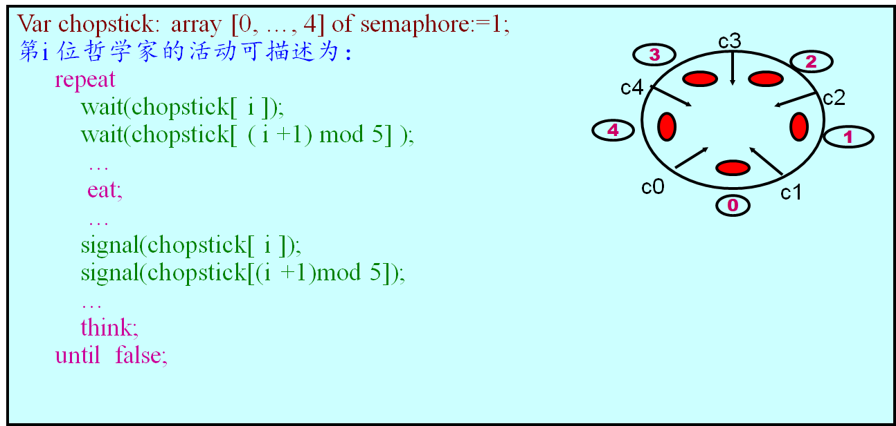

存在问题：

- 算法虽能保证相邻两位不会同时进餐，但有可能引起死锁。
- 假如五位哲学家同时饥饿而各自拿起左边的筷子时，就会使五个信号量chopstick均为0，当他们再试图去拿右边的筷子时，都将因无筷子可拿而无限等待

解决方法：

- 至多只允许有四位哲学家同时去拿左边的筷子，最终能保证至少有一位哲学家能够进餐，并在用毕后释放出他用过的两只筷子，从而使更多的哲学家能够进餐。
- 仅当哲学家的左右两只筷子均可用时，才允许他拿起筷子进餐。
- 规定奇数号哲学家先拿他左边的筷子，然后再去拿右边的筷子;偶数号哲学家则相反。

解决方法一：

​	可以至少保证一位哲学家进餐；

​	如果5位哲学家同时进餐，最多能够同时2位进餐，其他哲学家等待他俩进毕后再进餐；

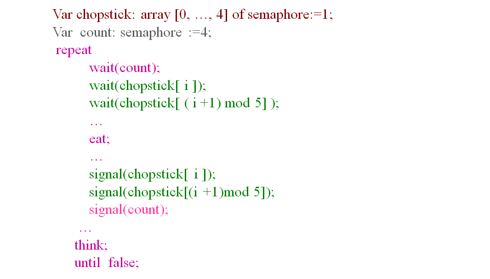

解决方法三：

​	奇数号哲学家先拿他左边的筷子，然后再去拿右边的筷子;偶数号哲学家则相反

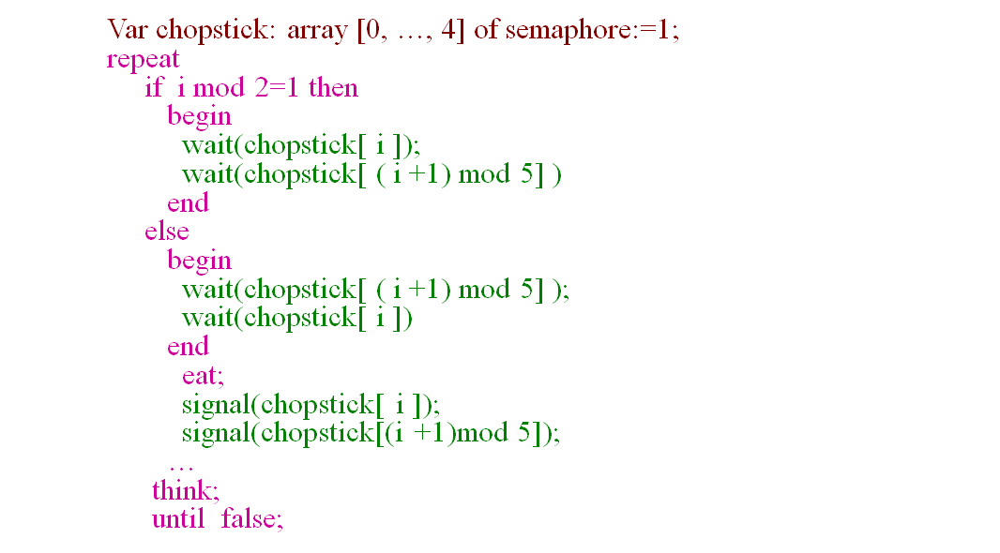

解决方法二：利用AND信号量机制解决哲学家进餐问题

#### 2.利用AND信号量机制解决哲学家进餐问题

在哲学家进餐问题中，要求每个哲学家先获得两个临界资源(筷子)后方能进餐。本质上是AND同步问题。

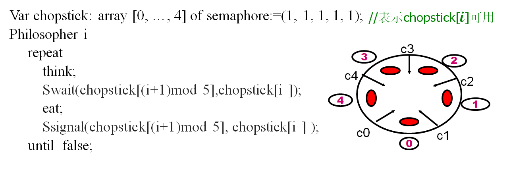

### 三、读者--写者问题

一个数据文件或记录可被多个进程共享。

- 只要求读文件的进程称为“Reader进程”，其它进程则称为“Writer进程”。
- 允许多个进程同时读一个共享对象，但不允许一个Writer进程和其他Reader进程或Writer进程同时访问共享对象

“读者--写者问题”是保证一个Writer进程必须与其他进程互斥地访问共享对象的同步问题。

- 读、读共享; 
- 写、写互斥; 
- 写、读互斥

#### 1.利用记录型信号量解决读者--写者问题

分析：

互斥信号量wmutex: 实现Reader与Writer进程间在读或写时的互斥，整型变量Readcount: 表示正在读的进程数目;

由于只要有一个Reader进程在读，便不允许Writer进程写。所以，仅当Readcount=0，即无Reader进程在读时，Reader才需要执行Wait(wmutex)操作。若Wait(wmutex)操作成功，Reader进程便可去读，相应地，做Readcount+1操作。

同理，仅当Reader进程在执行了Readcoi，unt减1操作后其值为0时，才需执行signal(wmutex)操作，以便让Write进程写

互斥信号量rmutex: Reader进程间互斥访问Readcount

**注意**：读的时候不能访问Readcount; Readcount也是个临界资源 注意 注意 注意！！！

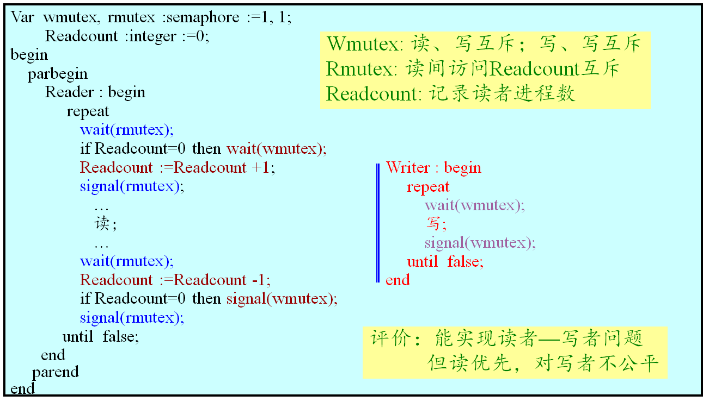

总结：

读：-----------》进入区

​		先申请读rmutex互斥信号量（锁上为了不让其他进程访问Readcount变量），

​		判断是否是第一个读进程———是：申请写 wmutex互斥信号量 （为了不让进行写操作）

​		-----不是第一个读进程：读进程加1

​		释放读rmutex互斥信号量（因为读读之间是共享，还有其他读进程进来读操作）

​		------------》临界区

​		读操作；

​		------------》退出区

​		先申请读rmutex互斥信号量（为了不让访问Readcount变量），

​		读进程-1

​		判断是不是最后一个进程，若是 则释放写wmutex（此时可以写操作了）

​		释放rmutex互斥信号量

`其实 进入区和退出区中又嵌套一个进入、临界、退出区，因为Readcount是一个临界资源。`

写：-----------》进入区

​		获取wmutex信号量

​		-----------》临界区

​		写操作

​		-----------》退出区

​		释放资源

#### 2.利用信号量集机制解决读者--写者问题

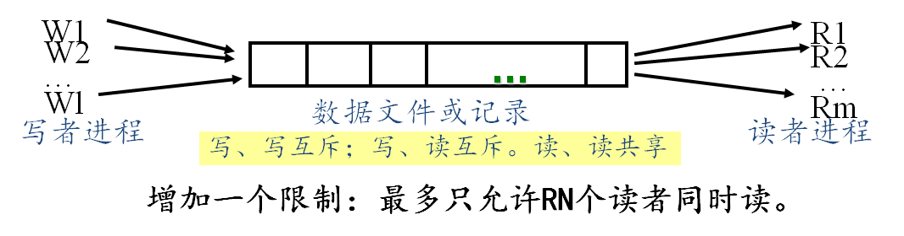

引入信号量L，并赋予其初值RN，通过执行Swait(L, 1, 1)操作，来控制读者的数目。

每当有一个读者进入时，就要先执行Swait(L, 1, 1)操作，使L的值减1。当有RN个读者进入读后，L便减为0，第RN +1个读者要进入读时，必然会因Swait(L, 1, 1)操作失败而阻塞。

一般信号量集的几种特殊情况：

- Swait(S, d, d)，只有一个信号量S，允许每次申请d个资源，若现有资源数少于d，不予分配。
- Swait(S, 1, 1)，蜕化为一般的记录型信号量(S>1时)或互斥信号量(S=1时)。
- Swait(S, 1, 0)，当S>=1时，允许多个进程进入某特定区，当S变为0后，阻止任何进程进入特定区，相当于可控开关。

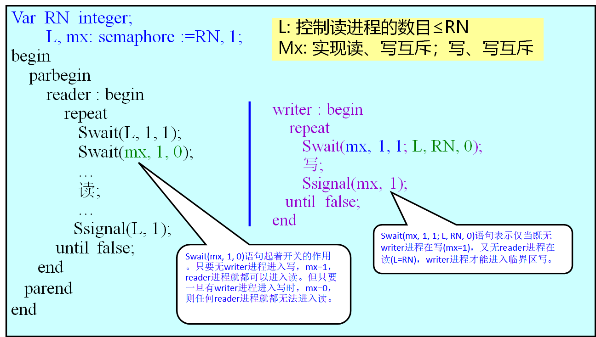

## 2.6 进程通信

进程通信，指进程间的信息交换。

- 低级通信：进程间仅交换一些状态和少量数据。
  - 如：进程之间的互斥和同步
  - 信号量机制作为通信工具的缺点：(1)效率低  (2)通信对用户不透明

- 高级通信：进程间可交换大量数据。
  - 用户可直接利用操作系统提供的一组通信命令，高效地传送大量数据的一种通信方式。
  - 操作系统隐藏了进程通信的细节，对用户透明，减少了通信程序编制上的复杂性。

### 一、进程通信的类型

#### 1. 共享存储器系统

共享存储器系统(Shared-Memory System) ：相互通信的进程间共享某些数据结构或共享存储区，通过这些空间进行通信。

1）基于共享数据结构的通信方式

进程公用某些数据结构，借以实现诸进程间的信息交换。

实现：公用数据结构的设置及对进程间同步的处理，都是程序员的职责。

​    操作系统--提供共享存储器

特点：低效。只适合传递相对少量的数据。

2）基于共享存储区的通信方式

在存储器中划出一块共享存储区，诸进程可通过对共享存储区中数据的读或写来实现通信。

#### 2、消息传递系统

Message passing system

进程间的数据交换，以格式化的消息为单位。

程序员直接利用系统提供的一组通信命令(原语)进行通信。

因其实现方式的不同而进一步分成直接通信方式和间接通信方式两种。

例：计算机网络：网络报文

#### 3、管道通信

所谓“管道”，是指用于连接一个读进程和一个写进程以实现他们之间通信的一个共享文件，又名pipe文件。

**注：管道文件存在于内存中，而非磁盘中。**

向管道(共享文件)提供输入的发送进程(即写进程)， 以字符流形式将大量的数据送入管道；而接受管道输出的接收进程(即读进程)，则从管道中接收(读)数据。

由于发送进程和接收进程是利用管道进行通信的，故又称为管道通信。


管道机制提供的协调能力：互斥；同步；确定对方是否存在

互斥：即当一个进程正在对pipe执行读/写操作时，其它(另一)进程必须等待。

同步：指当写(输入)进程把一定数量(如4 KB)的数据写入pipe，便去睡眠等待，直到读(输出)进程取走数据后，再把他唤醒。当读进程读一空pipe时，也应睡眠等待，直至写进程将数据写入管道后，才将之唤醒。

确定对方是否存在：只有确定了对方已存在时，才能进行通信。

### 二、消息传递通信的实现方法

进程间通信时，源进程可以直接或间接地将消息传送给目标进程，由此可将进程通信分为**直接通信**和**间接通信**。

#### 1.直接通信方式

发送进程利用OS提供的发送命令，直接把消息发送给目标进程。发送进程和接收进程都以显式方式提供对方的标识符。

1) 直接通信原语

**对称寻址方式**

收发双方必须以显式方式提供对方的标识符。

send(recever,message);

receive(sender,message);

**非对称寻址方式**

接收方可能要接收多个不确定的发送方发送的消息，如打印服务进程，此时接收原语不需指定发送方标识符。

send(recever,message);

receive(id,message);//id保存接收操作执行后的返回值。

#### 2.间接通信方式 -- 通过信箱通信

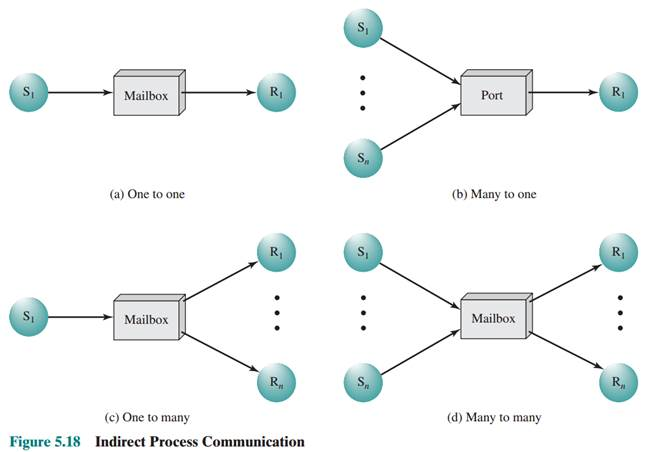

信箱用来暂存发送进程发送给目标进程的消息，接收进程则从信箱中取出发送给自己的消息。

消息在信箱中可安全保存，只允许核准的目标用户随时读取

利用信箱通信方式，既可实时通信，又可非实时通信。

**1) 信箱的结构**

信箱定义为一种数据结构。在逻辑上，可以将其分为两个部分：

　(1) 信箱头

　(2) 信箱体

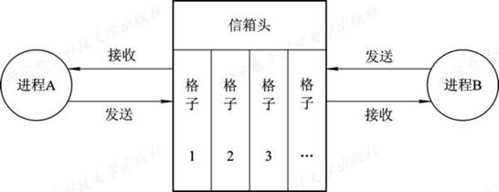

**2) 信箱通信原语**

系统为邮箱通信提供了若干条原语，分别用于：

邮箱的创建和撤消。

消息的发送和接收。

send(mailbox,message);

receive(mailbox,message);

**3)** **信箱的类型**

邮箱可由操作系统创建，也可由用户进程创建，创建者是邮箱的拥有者。据此，可把邮箱分为以下三类：

(1) 私用邮箱。 单向  由用户进程创建

(2) 公用邮箱。 双向  由操作系统创建

(3) 共享邮箱。  由某一进程创建

### 三、消息传递系统实现中的若干问题

#### 1. 通信链路

为使在发送进程和接收进程之间能进行通信，必须在两者之间建立一条通信链路。

(1)根据通信链路的建立方式：

- 显示连接：先用 “建立连接”命令(原语) 建立一条通信链路； 通信； 用显式方式拆除链路。——用于计算机网络
- 隐式连接：发送进程无须明确提出建立链路的要求，直接利用系统提供的发送命令(原语)，系统会自动地为之建立一条链路。——用于单机系统

(2)根据通信链路的连接方法

- 点--点连接通信链路
- 多点连接通信链路

(3)根据通信方式的不同

- 单向通信链路
- 双向链路

(4)根据通信链路容量的不同

- 无容量通信链路
- 有容量通信链路

#### 2. 消息的格式

- 单机系统环境：环境相同，消息格式简单
- 计算机网络环境：环境不同，消息的传输距离很远；消息格式比较复杂。

消息格式：

消息头：消息在传输时所需的控制信息

消息的正文：发送进程实际上所发送的数据

变长的消息格式：

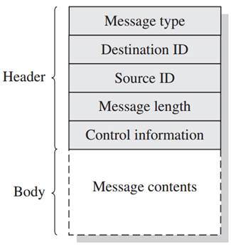

#### 3.进程同步方式

 在进程之间进行通信时，辅以进程同步机制，使诸进程间能协调通信。

 发送进程或接收进程在完成消息的发送或接收后，都存在两种可能性：进程或者继续发送(接收)或者阻塞。

- 发送进程阻塞、接收进程阻塞              紧密同步方式：发送进程与接收进程中间没有缓冲区
- 发送进程不阻塞、接收进程阻塞          一个发送方，多个接收方
- 发送进程和接收进程均不阻塞              有缓冲区

### 四、消息缓冲队列通信机制

发送进程利用Send原语，将消息直接发送给接收进程；接收进程利用Receive原语接收消息。用于本地进程间通信

#### 1.消息缓冲队列通信机制中的数据结构

   消息缓冲队列通信方式中，主要利用的数据结构是消息缓冲区

(1)消息缓冲区


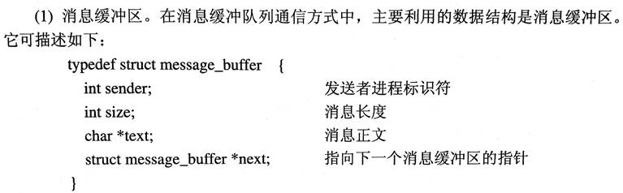

(2)PCB中有关通信的数据项

应该在进程的PCB中增加消息队列队首指针，用于对消息队列进行操作，以及用于实现同步的互斥信号量mutex和信号量sm


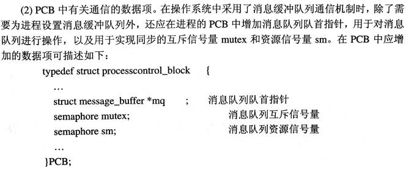

#### 2.发送原语

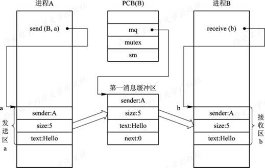

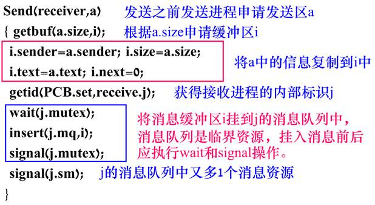

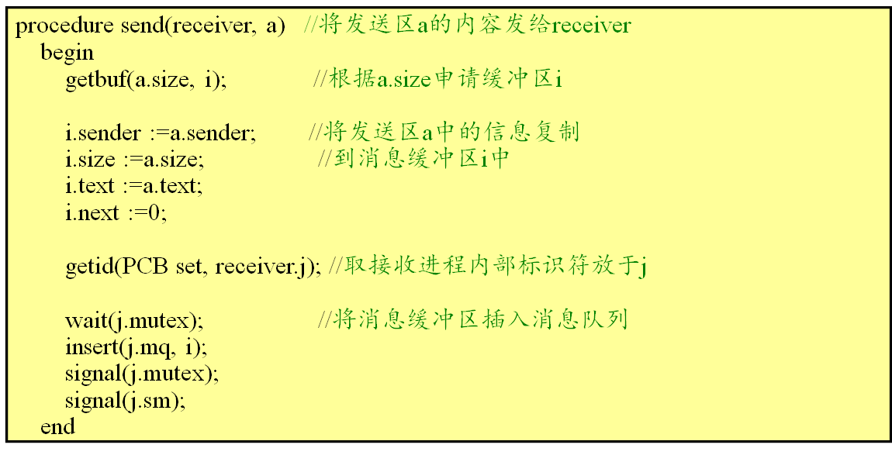

#### 3.接收原语

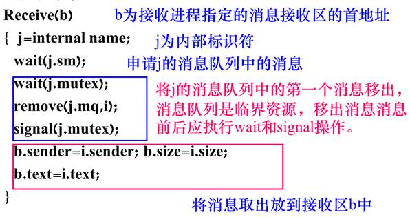

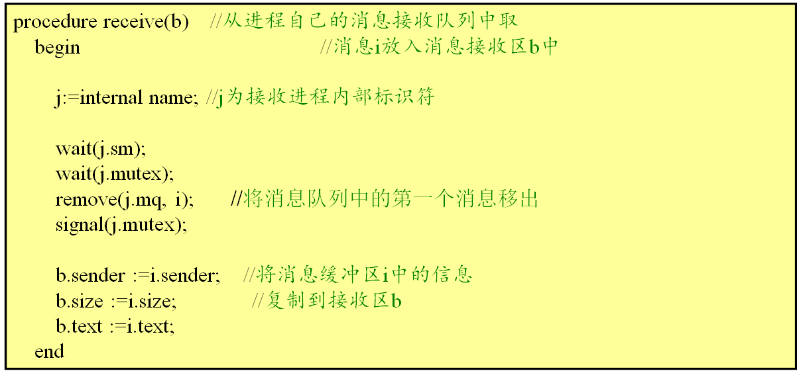

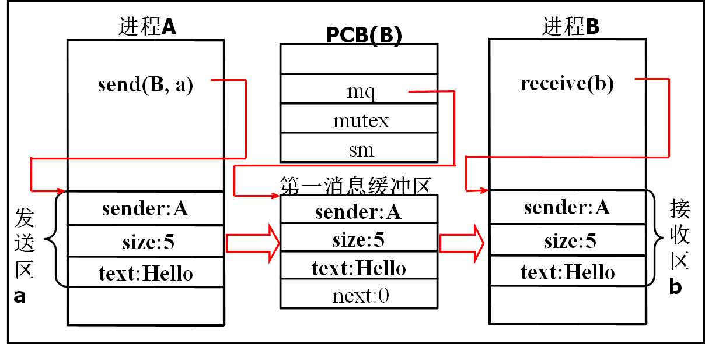

## 2.7 线程的基本概念

### 一、线程的引入

#### 1.进程的两个基本属性

  (1)进程是一个可以拥有资源的独立单位；

  (2)进程是一个可以独立调度和分派的基本单位；

   由此，是进程成为了能独立运行的基本单位，构成了进程并发执行的基础。

#### 2.程序并发执行所需付出的时空开销

进程拥有资源使进程的创建、撤销和调度付出较大的时空开销。这就限制了系统中所设置进程的数目，而且进程切换也不宜过于频繁，从而限制了并发程度的进一步提高。

因此，将进程的两个属性有系统分开处理，其中第(2)个属性由线程来实现。

#### 3.线程——作为调度和分配的基本单位

(1) 轻型实体。 

(2) 独立调度和分派的基本单位。 

(3) 可并发执行。 

(4) 共享进程资源。

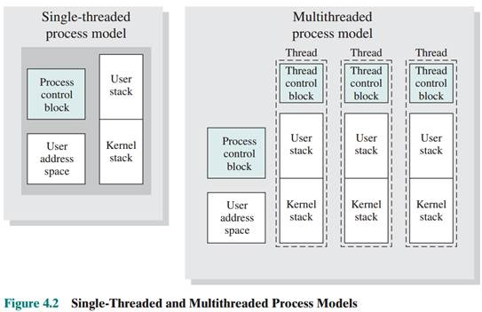

### 二、线程与进程的比较

线程具有许多传统进程所具有的特征，所以称之为轻型进程。

可通过以下几个方面对进程和线程进行比较：

1.调度的基本单位

2.并发性

3.拥有资源

4.独立性

5.系统开销

6.支持多处理机系统

### 三、线程的状态和线程控制块

#### 1. 线程运行的三个状态

线程在运行时也具有下述三种基本状态：

1.  执行状态
2.  就绪状态
3.  阻塞状态

#### 2. 线程控制块TCB

线程控制块TCB，用于记录所有用于控制和管理线程的信息。

#### 3. 多线程OS中的进程属性

多线程OS中的进程有以下属性：

　　(1) 进程是一个可拥有资源的基本单位。

　　(2) 多个线程可并发执行。

　　(3) 进程已不是可执行的实体。

# 三、处理机调度与死锁

重点：

1. 掌握处理机调度的基本概念和调度算法。
2. 掌握银行家算法避免死锁的方法。

## 3.1 处理机调度的基本概念

**作业和进程**

①**作业**是用户向计算机提交任务的**任务实体。**

​	**进程**是完成用户任务的**执行实体**，是资源分配的基本单位。没有作业任务，进程无事可干；没有进程，作业任务没法完成。

②**作业**建立完毕后，是放在外存等待运行。

​	**进程**一经创建，总由相应的部分存于内存。

③一个**作业**可由多个**进程**组成，且必须至少由一个进程组成，反之则不然。

④**作业**的概念更多地用在批处理系统中。

​	**进程**的概念几乎可以用在所有的多道程序系统中。

### 一、处理机调度的层次

#### 0.批处理系统中的作业

作业调度：使作业进入主存储器。

处于后备状态的作业在系统资源满足的前提下可以被作业调度选中进入内存计算。

进程调度：使作业进程占用处理器。

只有处于执行状态的作业才真正构成进程获得计算的机会。

一个批处理型作业，从进入系统并驻留在外存的后备队列上开始，直至作业运行完毕，可能要经历下述三级调度。

**(1)作业(Job)**

作业不仅包含通常的程序和数据，还应配有一份作业说明书，系统根据该说明书来对程序进行控制。批处理中，是以作业做为基本单位从外存调入内存的。

**(2)作业步(Job Step)**

在作业运行期间，每个作业都必须经过若干个相对独立有相互关联的顺序加工步骤才能得到结果。把其中的每一个加工步骤称为一个作业步。

各作业步之间存在着相互联系，往往上一个作业步的输出作为下一个作业步的输入。

**2.作业控制块(Job Control Block，JCB)**

为每个作业设置了一个作业控制块JCB，它是作业在系统中存在的标志，其中保存了系统对作业进行管理和调度所需的全部信息。

**3.作业运行的三个阶段和三种状态**

作业从进入系统到运行结束，通常需要经历收容、运行和完成三个阶段。相应的作业也就有“后备状态”、“运行状态”和“完成状态”。

(1) 收容阶段。

(2) 运行阶段。

(3) 完成阶段。

 #### 1.高级调度

高级调度(High Scheduling)  (外存 --> 内存)

高级调度又称为长程调度或作业调度，它调度的对象是作业。

**高级调度，就是按某种算法在外存中处于后备队列的作业中挑选一个(或多个)作业，给它分配内存等必要资源，并建立相应的进程(建立PCB)，以使它(们)获得竞争处理机的权利。**

**主要功能：**按照一定算法，决定把外存上处于后备队列中哪些作业调入内存，并为它们创建进程，分配所需资源，然后将它们放入就绪队列，准备执行。

对于用户来说，总希望自己作业的周转时间尽可能的少，而对于系统来说，则希望作业的平均周转时间尽可能少，这样有利于提高CPU的利用率和系统的吞吐量。


高级调度是外存与内存之间的调度。在这里，每个作业只调入一次，调出一次。作业调入时会建立相应的PCB，作业调出时才撤销PCB。高级调度主要是指调入的问题，因为只有调入的时机需要操作系统来确定，而调出的时机必然是作业运行结束后。
这种调度就好像刚刚的上厕所问题，厕所外的人处于后备队列，而高级调度的任务就类似把人从厕所外调入到厕所内。

在每次执行作业（高级）调度时，都须作出两个决定：

- 接纳多少作业--每次接纳多少作业进入内存，取决于多道程序度，也就是允许多少个作业同时在内存中运行。
- 接纳哪些作业--应接纳哪些作业从外存调入内存，取决于所采用的调度算法。如先来先服务，短作业优先等，后面章节会详细介绍。

在批处理系统中，因作业进入系统后先驻留在外存，故需要有作业调度。

在分时系统中为做到及时响应，命令或数据被直接送入内存，故不需作业调度。

在实时系统中，一般不需作业调度。

#### 2.低级调度

（Low Level Scheduling）

通常也称为进程调度或短程调度（Short-Term Scheduling），用来决定就绪队列中的哪个进程应获得处理机，然后再由分派程序把处理机分配给该进程。为最基本的一种调度，三种类型OS中都必须有进程调度。

低级调度又称为进程调度或短程调度，它的调度对象是进程。

**主要功能：**按某种算法决定就绪队列中哪个进程应获得处理机，然后再由分派程序执行把处理机分配给该进程的具体操作。

**低级调度的主要任务是按照某种规则从就绪队列中选取一个进程，将CPU分配给它。**低级调度是操作系统中最基本的一种调度，在一般的操作系统中都必须配置低级调度。而且低级调度的频率很高，一般几十毫秒一次。


##### 1.进程(低级)调度的功能

① 保存处理机的现场信息

② 按某种算法选取进程

③ 把处理机分配给进程

##### 2.进程调度中的三个基本机制

为了实现进程调度，应具有如下三个基本机制：

(1) 排队器。

(2) 分派器(分派程序)。

(3) 上下文切换机制。

##### 3.进程调度可采用下述两种调度方式

**1.非抢占方式（Non-preemptive Mode）**

一旦把处理机分配给某进程后，便让该进程一直执行，直至该进程完成或发生某事件而被阻塞时，才把处理机分配给其他进程，决不允许进程抢占已分配出去的处理机。

评价：实现简单、系统开销小；适用于大多数的批处理OS，但在要求比较严格的实时系统中，不宜采用这种调度方式

在采用非抢占调度方式时，可能引起进程调度的因素有：

1. 进程执行完毕，或因发生某事件而不能继续执行
2. 执行中的进程因提出I/O请求而暂停执行
3. 执行了某种原语操作：如P操作、Block原语

**2.抢占方式（Preemptive Mode）**

允许调度程序根据某种原则，去暂停某个正在执行的进程，将处理机重新分配给另一进程。

抢占的原则：

- 时间片原则：各进程按时间片运行，一个时间片用完时，停止该进程执行重新进行调度。
- 短作业（进程）优先原则：短作业（进程）可以抢占长作业（进程）的处理机。
- 优先权原则：优先权高的可以抢占优先权低的进程的处理机。

#### 3.中级调度

背景：在引入了虚拟存储技术之后，操作系统可将暂时不能运行的进程调至外存等待。等它重新具备了运行条件且内存稍有空闲时，操作系统再把它调回内存。
回顾一下，我们之前说过进程有几种状态，如 就绪态、阻塞态、运行态…，那被调到外存等待的进程处于什么状态呢？这些进程会处于挂起态。值得注意的，该进程的数据段和代码段会被调回外存，但PCB依旧会留在内存中的，并不会被调回外存，因为操作系统只有通过该进程的PCB，才能对其进行管理。被挂起进程的PCB会被操作系统放到挂起队列中。

中级调度又称内存调度，引入中级调度的**主要目的**是提高内存利用率和系统吞吐量。

**主要功能**：应使那些暂时不能运行的进程不再占用宝贵的内存资源，而将它们调到外存去等待，把此时的进程状态称为就绪驻外存状态或挂起状态。当这些进程又具备运行条件、且内存又稍有空闲时，由中级调度来决定把外存上的那些具备运行条件的就绪进程，重新调入内存，并修改其状态为就绪状态，挂在就绪队列上等待进程调度。

中级调度，就是决定将哪个挂起状态的进程从外存重新调回内存。
注意和高级调度区分，虽然同样是从外存调到内存，但高级调度是调入，中级调度是调回。
由于一个进程可能会被多次调出、调回内存，因此中级调度发生的频率要比高级调度的高。

中级调度实际上就是存储器管理中的对换功能


- 进程调度的运行频率最高，在分时系统中通常是10~100ms进行一次进程调度，因而进程调度算法不能太复杂，以免占用太多的CPU时间。
- 作业调度是发生在一个作业运行完毕，退出系统，而需要重新调度一个作业进入内存时，故作业调度的周期较长，大约几分钟一次。因而允许作业调度算法花费较多的时间。
- 中级调度的运行频率，介于进程调度和作业调度之间。

#### 补充：进程的挂起态与七状态模型

暂时调到外存等待的进程状态为挂起态。挂起态其实又可以进一步细分为就绪挂起、阻塞挂起两种状态，于是，五状态模型现在变成了七状态模型。


**注意：**

- **注意"挂起态"和"阻塞态"的区别，两种状态都是暂时不能获得CPU的服务，但挂起态是将进程实体(除PCB外)调到外存，而阻塞态的进程实体还留存在内存中。**
- **有的操作系统不只把挂起态分为阻塞挂起和就绪挂起，甚至会根据阻塞原因的不同把阻塞挂起态的进程进一步细分为多个队列。**

又是一个有味道的例子
故事背景：

现在有很多个人想上厕所，他们面前有一间厕所，厕所里面有三个马桶。
接下来，我们把厕所看作是内存，马桶看作是CPU，现在我们来看看这三种调度与这例子的类比。

- 高级调度：研究怎么让还没进入过厕所的人进入厕所。(厕所外 --> 厕所内，之前一直在厕所外)
- 中级调度：有的人进入了厕所，但是尿不出来，于是他们被赶了出去。中级调度就是研究怎么让这些被赶出去的人再次回到厕所。 (厕所外 --> 厕所内，之前进入过厕所)
- 低级调度：研究怎么给厕所内的人分配马桶。(厕所内 --> 马桶上)


### 二、调度队列模型

不论高级、中级或者低级调度，都涉及到进程队列，由此形成了三种类型的调度队列模型：

 1.仅有进程调度的调度队列模型

 2.具有高级和低级调度的调度队列模型

 3.同时具有三级调度的调度队列模型

#### 1.仅有进程调度的调度队列模型

在分时系统中就绪进程组织成FIFO队列形式，当创建一个新进程时，将它放入队列末尾。按时间片轮转方式运行。

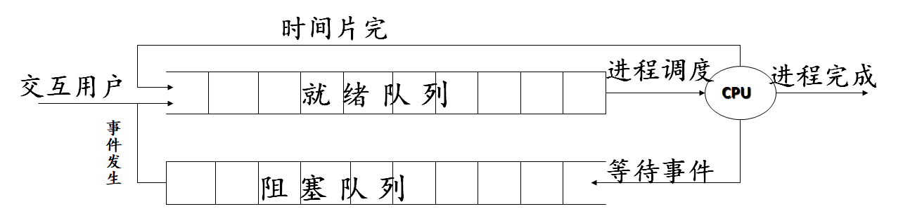

#### 2.具有高级和低级调度的调度队列模型

在批处理系统中，不仅需要进程调度，而且还需要作业调度，由作业调度按一定的调度算法，从外存的后备队列中选择一批作业调入内存，并为它们建立进程，送入就绪队列，然后才由进程调度算法按照一定的进程调度算法，选择一个进程，把处理机分配给该进程。

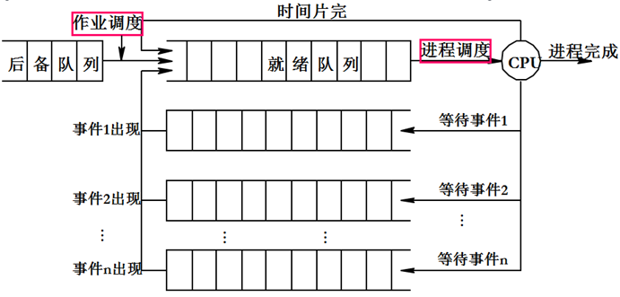


#### 3.同时具有三级调度的调度队列模型

当在OS中引入中级调度后，可以把进程的就绪状态分为内存就绪和外存就绪，把阻塞状态分为内存阻塞和外存阻塞两种状态。

在调出操作的作用下，可使进程状态由内存就绪转变为外存就绪，由内存阻塞转变为外存阻塞；在中级调度的作用下，又可使外存就绪转变为内存就绪。

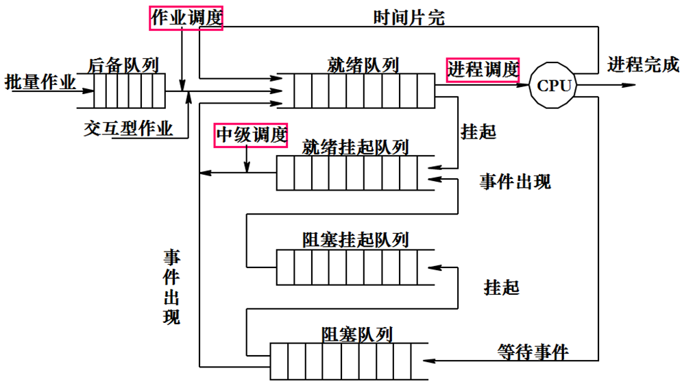

### 三、选择调度方式和调度算法的若干准则

在一个OS的设计中，应如何选择调度方式和算法，很大程度上取决于OS的类型和目标。

如在批处理系统、分时系统和实时系统中，通常都采用不同的调度方式和算法。选择的准则，有的是面向用户的，有的是面向系统的。

#### 1. 面向用户的准则

- 周转时间短（评价批处理系统的指标）
  - 周转时间；     平均周转时间
  - 带权周转时间；  平均带权周转时间
- 响应时间快：     响应时间（评价分时系统的指标）
- 截止时间的保证：  截止时间（评价实时系统的指标）
- 优先权准则

##### (1) 周转时间

是指从作业被提交给系统开始，到作业完成为止的这段时间间隔(称为作业周转时间)。

作业等待时间和运行时间之和

作业的周转时间＝作业完成时间－作业提交时间。

包括四部分时间：

- 作业在外存后备队列上等待(作业)调度的时间
- 进程在就绪队列上等待进程调度的时间
- 进程在CPU 上执行的时间，
- 以及进程等待I/O 操作完成的时间。

##### (2) 平均周转时间

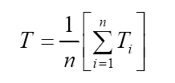

- 该值反映一批进程的总体周转时间的情况，其中*Ti*是第i个作业的周转时间。
- 实际上，周转时间*Ti*包含两部分：等待时间和服务时间，即*Ti=Twi+Tsi*
   *Twi*是总体的等待时间，*Tsi*为系统为第i个作业提供服务的时间，简称服务时间，它一般为估计的执行时间，是一种理想状态(无阻塞，无其它消耗)下的执行时间。
- 可以看出，只用周转时间*Ti*无法准确地表征进程的调度特性。

##### (3) 带权周转时间

作业的周转时间T与系统为它提供服务的时间Ts之比

​        W = T/Ts

作业的周转时间*Ti*与系统为它提供服务的时间*TSi*之比，称为带权周转时间。

##### (4)平均带权周转时间

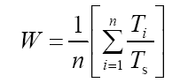

##### (5) 响应时间

分时系统的目标：**响应时间快**；**均衡性**

是从用户通过键盘提交一个请求开始，直至系统首次产生响应为止的时间间隔。

包括三部分时间：

- 从键盘输入的请求信息传送到处理机的时间
- 处理机对请求信息进行处理的时间
- 将所形成的响应信息回送到终端显示器的时间。

##### (6) 截止时间

实时系统的目标 **截止时间的保证**；**可预测性**

是指某任务必须开始执行的最迟时间，或必须完成的最迟时间。

对于严格的实时系统，其调度方式和调度算法必须能保证这一点，否则将可能造成难以预料的后果。

#### 2. 面向系统的准则

- 系统吞吐量高 （评价批处理系统的指标）
  - 吞吐量是指在单位时间内系统所完成的作业数，因而它与批处理作业的平均长度有关。
- 处理机利用率好
  - 调度方式和算法对处理机的利用率起着十分重要的作用。
- 各类资源的平衡利用

#### 3.处理机调度算法的共同目标

**(1)** **资源利用率**


**(2)** **公平性**

应使诸进程都获得合理的CPU时间，不会发生进程饥饿现象。

**(3)** **平衡性**

综合考虑计算型和I/O型作业，保持系统资源使用的平衡性。

**(4)** **策略强制执行**

对所制定的策略其中包括安全策略，只要需要，就必须予以准确的执行，即使会造成某些工作的延迟也要执行。


不同的CPU调度算法具有不同的属性，并可能对某些进程更有利，我们用用很多准则来比较特征对确定最佳算法是产生的影响。

（1）CPU利用率  当CPU的价格非常昂贵时，我们希望尽可能使它得到充分利用。通常，在一定的I/O等待时间百分比之下，运行程序道数越多，CPU空闲时间百分比越低。

（2）吞吐量 吞吐量是用来评估CPU工作量的，它表示单位时间内CPU完成的进程数量。

（3）周转时间 批处理系统中，从作业提交给系统到作业完成的时间间隔称为周转时间，批处理系统的调度性能主要用周转时间和带权周转时间衡量，时间越短，系统效率越高，作业吞吐量越大

（4）就绪等待时间：各种CPU调度算法仅影响进程在就绪队列中所花费的时间，因此更倾向于慨率进程在就绪队列中所花费的时间。

（5）响应时间：在交互系统中，提交第一个请求到产生第一个响应所用的时间，成为响应时间。

## 3.2 作业调度

在OS中调度的实质是一种资源分配，因而调度算法是指：根据系统的资源分配策略所规定的资源分配算法。

对于不同的系统和系统目标，通常采用不同的调度算法。

- 在批处理系统中为照顾为数众多的短作业，应采用短作业优先的调度算法；
- 在分时系统中，为了保证系统具有合理的响应时间，应采用时间片轮转法进行调度。

### 作业调度的主要任务

作业调度的主要任务是，根据JCB中的信息，检查系统中的资源能否满足作业对资源的需求，以及按照一定的调度算法，从外存的后备队列中选取某些作业调入内存，并为它们创建进程、分配必要的资源。然后再将新创建的进程排在就绪队列上等待调度。因此，也把作业调度称为接纳调度(Admission Scheduling)。

在每次执行作业调度时，都需做出以下两个决定： 

（1）接纳多少个作业
 （2）接纳哪些作业

### 一、先来先服务和短作业（进程）优先调度算法

#### 1、先来先服务调度算法（FCFS）

是一种最简单的调度算法，该算法**既可用于作业调度，也可用于进程调度**。

当**作业调度**采用FCFS算法时，每次调度都是从后备作业队列中选择**一个或多个**最先进入该队列的作业，将它们调入内存，为它们分配资源、创建进程，然后放入就绪队列。

在**进程调度**中采用FCFS算法时，则每次调度是从就绪队列中选择**一个**最先进入该队列的进程，为之分配处理机，使之投入运行。该进程一直运行到完成或发生某事件而阻塞后才放弃处理机。 

- FCFS算法比较有利于长作业（进程），而不利于短作业（进程）。  

**例如：**下表列出了A、B、C、D四个作业分别到达系统的时间、要求服务的时间、开始执行的时间及各自的完成时间，并计算出各自的周转时间和带权周转时间。 

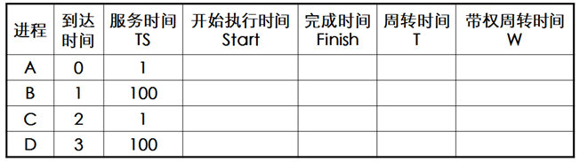

解答：

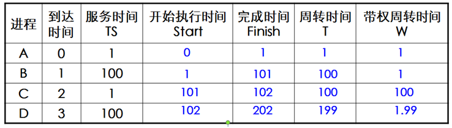

从表上可以看出，其中短作业C的带权周转时间竟高达100，这是不能容忍的；而长作业D的带权周转时间仅为1.99。FCFS调度算法有利于CPU繁忙型的作业，而不利于I/O繁忙型的作业（进程）

**①有利于长作业(进程)，不利于短作业(进程)**

**②有利于CPU繁忙型的作业(进程)，而不利于I/O繁忙型的作业(进程)**

补充：

CPU繁忙型作业：如通常的科学计算。

I/O繁忙型作业：指CPU进行处理时，需频繁的请求I/O

#### 2、短作业(进程)优先调度算法(SJF或SPF)

非抢占式

​		对短作业或短进程优先调度的算法。可以分别用于**作业调度**和**进程调度**。

- **短作业**优先（SJF）的调度算法：从后备队列中选择**一个或若干个**估计运行时间最短的作业，将它们调入内存运行。
- **短进程**优先（SPF）调度算法，是从就绪队列中选出**一个**估计运行时间最短的进程，将处理机分配给它，使它立即执行并一直执行到完成，或发生某事件而被阻塞放弃处理机时再重新调度。

例如：有五个进程A、B、C、D、E，它们到达的时间分别是0、1、2、3和4，所要求的服务时间分别是4、3、5、2和4。计算每个进程的周转时间、带权周转时间、平均周转时间和平均带权周转时间。

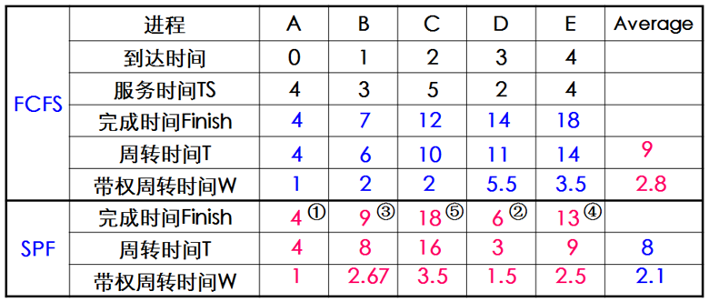

采用SJF算法后，不论是平均周转时间还是平均带权周转时间，都较FCFS调度算法有明显的改善，尤其是对短作业D。而平均带权周转时间从2.8降到了2.1。这说明SJF调度算法能有效的降低作业的平均等待时间，提高系统吞吐量。

**SJF调度算法的优缺点：**

优点：

​    有效降低作业的平均等待时间，提高系统吞吐量。

缺点：对长作业不利。

(1) **该算法对长作业不利**，如作业C的周转时间由10增至16，其带权周转时间由2增至3.5。更严重的是，如果有一长作业(进程)进入系统的后备队列(就绪队列)，由于调度程序总是优先调度那些(即使是后进来的)短作业(进程)，将导致长作业(进程)长期不被调度。

(2) **该算法完全未考虑作业的紧迫程度**，因而不能保证紧迫性作业(进程)会被及时处理。

(3) 由于作业(进程)的长短只是根据用户所提供的估计执行时间而定的，而用户又可能会有意或无意地缩短其作业的估计运行时间，致使**该算法不一定能真正做到短作业优先调度。**

抢占式

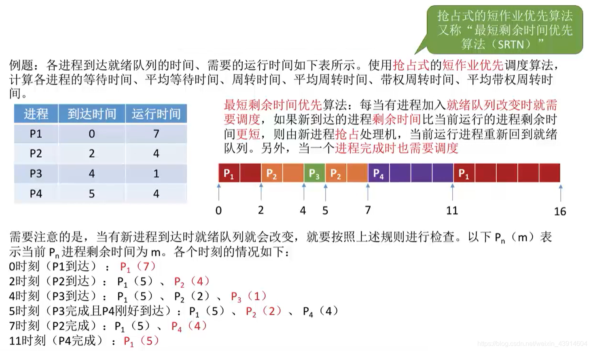

### 二、高优先权优先调度算法

为照顾紧迫性作业，使之在进入系统后便获得优先处理，引入了最高优先权优先（FPF）调度算法。

此算法常用于批处理系统中，作为作业调度算法，也作为多种操作系统中的进程调度算法，还可用于实时系统中。

当用于进程调度时（见进程调度），它分为两种：

   1、非抢占式优先权算法

   2、抢占式优先权调度算法

1、优先权的类型

对于最高优先权优先调度算法，关键在于：使用静态优先权、动态优先权；如何确定进程的优先权。

- **静态优先权**：在创建进程时确定的，在进程的整个运行期间保持不变。利用某一范围的整数来表示（0～7），又称为优先数。
- **动态优先权**：在创建进程时所赋予的优先权可以随进程的推进或随其等待时间的增加而改变。

2、确定进程优先权的依据有如下三个方面：

- **进程类型**：一般来说系统进程高于用户进程。
- **进程对资源的需求**：如进程的估计运行时间及内存需要量的多少，对要求少的进程赋予较高优先权。
- **用户要求**：由用户进程的紧迫程度及用户所付费用的多少来确定优先权的。

#### 优先权调度算法

每个作业（进程）赋予一个优先级，系统根据各作业（进程）的优先级，按由高到低的顺序调度。

**注：FCFS可理解为按到达先后顺序赋予优先级，SPF可理解为按作业运行时间长短赋予优先级。**

#### 高响应比优先调度算法

在批处理系统中，短作业优先算法是一种比较好的算法，其主要不足是长作业的运行得不到保证。我们为每个作业引入**动态**优先权，并使作业的优先级随着等待时间的增加而以速率 a 提高，则可解决问题。见下式：


由于等待时间与服务时间之和就是系统的响应时间，故上式又表示为：


**分析：**

(1)  如果作业的等待时间相同，则要求服务的时间愈短，其优先权愈高，因而该算法有利于短作业。

(2)  当要求服务的时间相同时，作业的优先权决定于其等待时间，等待时间愈长，其优先权愈高，因而它实现的是先来先服务。

(3)  对于长作业，作业的优先级可以随等待时间的增加而提高，当其等待时间足够长时，其优先级便可升到很高， 从而也可获得处理机。

**例：**有五个进程A、B、C、D、E，它们到达的时间分别是0、1、2、3和4，所要求的服务时间分别是4、3、5、2和4。试利用HRRN算法计算每个进程的周转时间、带权周转时间、平均周转时间和平均带权周转时间。

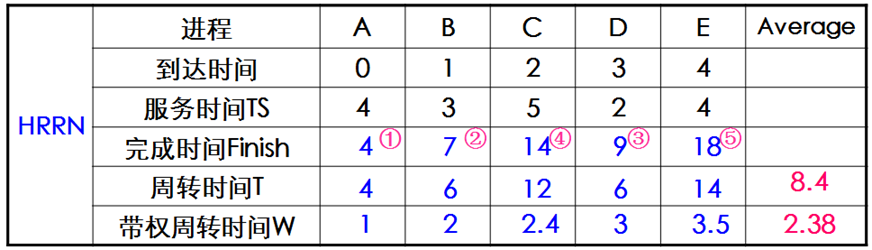

### 三、基于时间片的轮转调度算法

见进程调度算法

## 3.3 进程调度

### 一、进程调度的任务、机制和方式

#### 1. 进程调度的任务

进程调度的任务主要有三个：

　(1) 保存处理机的现场信息。

　(2) 按某种算法选取进程。

　(3) 把处理器分配给进程。

#### 2. 进程调度机制

　　为了实现进程调度，在进程调度机制中，应具有如下三个基本部分。

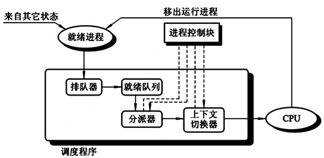

**(1)** **排队器**

每当有一个进程转变为就绪状态时，排队器就负责将其安装优先级顺序插入到就绪队列。

**(2)** **分派器**

将进程调度程序所选定的进程从就绪队列取出，然后进行上下文切换，将处理机分配给该进程。

**(3)** **上下文切换器**

负责进行上下文切换。

#### 3. 进程调度方式

##### 1)非抢占式优先权算法

一旦分配，直至完成或阻塞才可重新分配CPU使用权。

采用非抢占调度，可能**引起进程调度的因素**可归结为：

(1)  正在执行的进程运行完毕，或因发生某事件而使其无法再继续运行。

(2)  正在执行的进程因提出I/O请求而暂停执行。

(3)  进程通信或同步过程中，执行了某种原语操作，如Block原语。

**非抢占式调度的特点：**

(1)  实现简单、系统开销小，适用于大多数的批处理系统。

(2)  不能用于分时系统或实时系统。

##### 2)抢占式优先权调度算法

更高优先权的进程可以抢占当前进程的CPU使用权。

现在的系统一般采用抢占方式。

“抢占”必须遵循一定的原则。主要原则有：优先权原则、短进程优先原则、时间片原则。

**抢占式调度的特点：**

(1)  系统开销大。

(2)  适用于分时系统或实时系统。

### 二、轮转调度算法（时间片轮转法）

系统将所有的就绪进程按先来先服务的原则排成一个队列，每次调度时，把CPU分配给首进程，并令其执行一个时间片。

时间片的大小从几ms到几百ms。当执行的时间片用完时，停止该进程的执行并将其送往就绪队列的末尾。这样就可以保证就绪队列中所有进程在一定时间内均能获得一时间片的处理机执行时间，系统能在给定的时间内响应所有用户的请求。

#### 1. 轮转法的基本原理

在轮转(RR)法中，系统将所有的就绪进程按FCFS策略排成一个就绪队列。就绪队列各进程轮流获得一个时间片的cpu使用权。

#### 2. 进程切换时机

① 若一个时间片尚未用完，正在运行的进程便已经完成。

② 在一个时间片用完时。

#### 3. 时间片大小的确定

**时间片太小：**有利于短进程，但系统开销较大。

**时间片太大：**可能退化为FCFS，无法满足短作业和交互需求。

**一般做法：**时间片大小略大于一次典型交互所需的时间。

在时间片轮转算法中，时间片的大小对系统性能有很大的影响。不能太短也不能太长，一个比较可取的大小是，时间片略大于一次典型的交互所需要的时间。

### 三、优先级调度算法


#### 1. 优先级调度算法的类型

(1) 非抢占式优先级调度算法。


(2) 抢占式优先级调度算法。


#### 2. 优先级的类型

**1)** **静态优先级**

优先级在创建进程时确定的，在进程的整个运行期间保持不变。

优先级是利用某一范围内的一个整数来表示的，例如0～255中的某一整数，又把该整数称为优先数。

确定进程优先级大小的依据有如下三个：

(1) 进程类型。

(2) 进程对资源的需求。

(3) 用户要求。

**2)** **动态优先级**

在创建进程之初，先赋予其一个优先级，然后其值随进程的推进或等待时间的增加而改变，以便获得更好的调度性能。

### 四、多队列调度算法

设置多个就绪队列，将不同类型或性质的进程分配在不同的就绪队列中，不同的就绪队列可采用不同的调度算法。

**优点：**

1. 满足系统中不同用户对进程调度策略的不同要求。
2. 在多处理机系统中，为每个处理机分配不同的就绪队列。

### 五、多级反馈队列调度算法 

多级反馈队列调度算法是目前公认的较好的进程调度算法

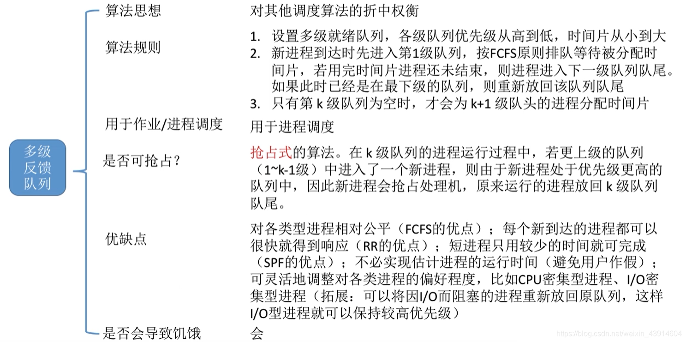

#### 1. 调度机制

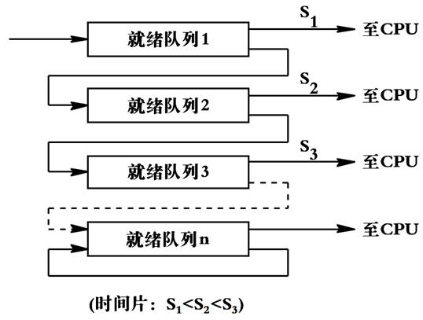

（1）设置多个就绪队列并为各个队列赋予不同的优先级，第一个最高，依次降低。各个队列中进程执行时间片的大小设置为：优先权越高，时间片越短。如第一个队列时间片为1ms,第二个队列的时间片为2ms, ……

（2）当一个新进程进入内存后，首先将它放入第一个队列的末尾，按FCFS原则排队等待调度。当轮到该进程执行时，如它能在该时间片内完成，便可撤离系统；如果它在一个时间片结束时尚未完成，调度程序便将该进程转入第二队列的末尾，在同样地按FCFS原则等待调度执行；如果它在第二队列中运行一个时间片后仍未完成，再依次将它放入第三队列，……如此下去，当一个长作业（进程）从第一队列依次降到第n队列后，在第n队列中便采取按时间片轮转的方式运行。

（3）仅当第一队列空闲时，调度程序才调度第二队列中的进程运行，仅当第1～(i-1)队列均空时，才会调度第i队列中的进程运行。

  采用抢占式调度
 如果处理机正在第i队列中为某进程服务时，又有新进程进入优先权较高的队列(第1~(i-1)中的任何一个队列)，则此时新进程将抢占正在运行进程的处理机。

#### 2. 调度算法的性能

在多级反馈队列调度算法中，如果规定第一个队列的时间片略大于多数人机交互所需之处理时间时，便能较好地满足各种类型用户的需要。

1. 终端型用户。

   大多属于较小的交互性作业，只要能使作业在第一队列的时间片内完成，便可令用户满意。

2.  短批处理作业用户。

   周转时间仍然较短，至多在第二到三队列即可完成。

3. 长批处理作业用户。

   将依次在1～n级队列中轮转执行，不必担心作业长期得不到处理。

### 六、基于公平原则的调度算法

#### 1. 保证调度算法

向用户所做出的保证并不是优先运行，而是明确的性能保证，该算法可以做到调度的公平性。

一种比较容易实现的性能保证是处理机分配的公平性。

如果在系统中有n个相同类型的进程同时运行，为公平起见，须保证每个进程都获得相同的处理机时间1/n。

#### 2. 公平分享调度算法

分配给每个进程相同的处理机时间，显然，这对诸进程而言，是体现了一定程度的公平，但如果各个用户所拥有的进程数不同，就会发生对用户的不公平问题。

## 3.4 实时调度

由于在实时系统中都存在着若干个实时进程或任务，它们用来反应或控制某个（些）外部事件，往往带有某种程度的紧迫性，因而对实时系统中的调度提出了某些特殊要求，前面所介绍的多种调度算法，并不能很好的满足实时系统对调度的要求，为此，需要引入一种新的调度，即实时调度。

实时系统中包含两种任务：

- 硬实时任务指必须满足最后期限的限制，否则会给系统带来不可接受的破坏或者致命错误。
- 软实时任务也有一个与之关联的最后期限，并希望能满足这个期限的要求，但这并不是强制的，即使超过了最后期限，调度和完成这个任务仍然是有意义的。 

### 一、实现实时调度的基本条件

在实时系统中，硬实时任务和软实时任务都联系着一个截止时间。为保证系统能正常工作，实时调度必须满足实时任务对截止时间的要求，为此，实现实时调度应具备下列4个条件：

  1、提供必要的信息

  2、系统处理能力强

  3、采用抢占式调度机制

  4、具有快速切换机制

#### 1、提供必要的信息

为了实现实时调度，系统应向调度程序提供有关任务的下述信息：

- 就绪时间：该任务成为就绪状态的时间。
- 开始截止时间、完成截止时间。只需知道一个。
- 处理时间：从开始执行到完成所需时间。
- 资源要求：任务执行时所需的一组资源。
- 优先级：根据任务性质赋予不同优先级。

#### 2、系统处理能力强

在实时系统中，通常都有多个任务，若处理机的能力不够强，则可能会出现某些实时任务不能得到及时处理导致发生难以预料的后果。

假如系统中有M个周期性的硬实时任务，处理时间为Ci，周期时间表示为Pi ,则单机系统中必须满足条件：

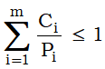

例如：两个实时任务，周期均为50ms，每个任务的处理时间均为30ms，则：

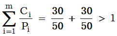

所以，系统处理能力无法满足这两个实时任务。

N处理机的限制条件：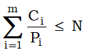

如：系统中有6个硬实时任务，他们的周期时间都是50ms，每次的处理时间是10ms.则可以算出系统是不可调度的。

解决方法有二个：

- 增强单机系统的处理能力
- 采用多处理机系统（则限制条件为∑（ Ci / Pi ）≤N，N为处理机数）。

#### 3、采用抢占式调度机制

在含有硬实时任务的实时系统中，广泛采用抢占机制。

当一个优先权更高的任务到达时，允许将当前任务暂时挂起，令高优先权任务立即投入运行，这样可满足该硬实时任务对截止时间的要求。但此种机制较复杂。

#### 4、具有快速切换机制

为保证要求较高的硬实时任务能及时运行，在实时系统中还应具有快速切换机制，以保证任务的快速切换。需要以下两种能力：

- 对外部中断的快速响应能力。要求系统具有快速硬件中断机构，使可在紧迫的外部事件请求中断时及时响应。
- 快速的任务分派能力。在完成任务调度后，便应进行任务切换，为提高速度，应使系统中的运行功能单位适当的小，以减少任务切换的时间开销。

### 二、实时调度算法的分类

可按照不同方式对实时调度算法加以分类：

- 根据实时任务性质的不同，分为硬实时调度算法和软实时调度算法；
- 按调度方式的不同，分为非抢占调度算法和抢占调度算法；
- 根据调度程序调度时间的不同，分为静态调度算法和动态调度算法。
- 多处理机环境下，可分为集中式调度和分布式调度两种算法。

#### 1、非抢占调度算法

该算法较简单，用于一些小型实时系统或要求不太严格的实时系统中。又可分为两种：

##### 非抢占式轮转调度算法

常用于工业生产的群控系统中，要求不太严格（响应时间约为数秒）

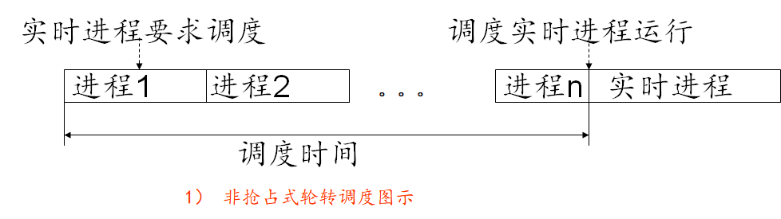

##### 非抢占式优先调度算法。

要求较为严格，根据任务的优先级安排等待位置。可用于有一定要求的实时控制系统中。（响应时间约为数百ms）

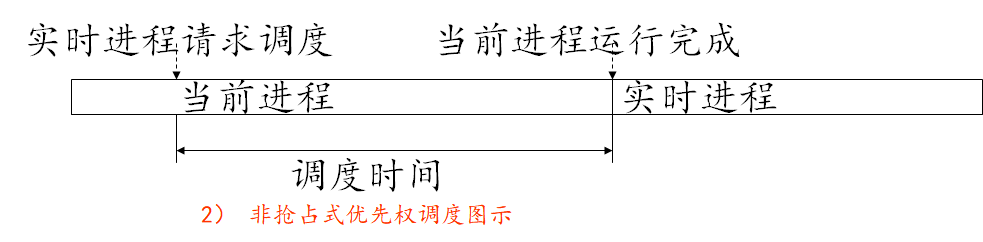

#### 2、抢占调度算法

用于要求较严格的实时系统中，（t约为数十ms），采用抢占式优先权调度算法。根据抢占发生时间的不同可分为两种：

##### 1、基于时钟中断的抢占式优先权调度算法

某高优先级任务到达后并不立即抢占，而等下一个时钟中断时抢占。（延时几十毫秒到几毫秒）

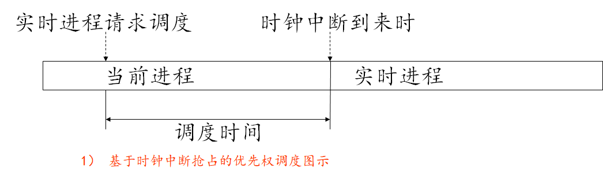

##### 2、立即抢占的优先权调度算法

一旦出现外部中断，只要当前任务未处于临界区，就立即抢占处理机。 （延时几毫秒到100微秒）

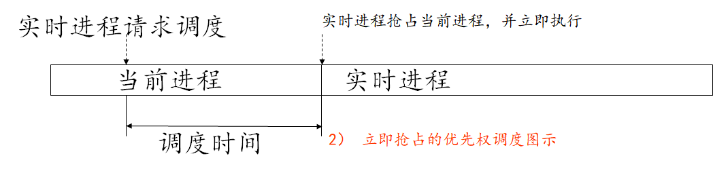

### 三、常用的几种实时调度算法

目前有许多实时调度算法：

- 最早截止时间优先EDF（Earliest Deadline First）算法
- 最低松弛度优先LLF（Least Laxity First）算法

#### 1.最早截止时间优先算法EDF（Earliest Deadline First）

根据任务的截止时间来确定任务的优先级。截止时间越早，其优先级越高。

该算法要求在系统中保持一个实时任务就绪队列，该队列按各任务截止时间的早晚排序，调度程序在选择任务时总是选择就绪队列中的第一个任务，为之分配处理机，使之投入运行。

- EDF算法既可以用于抢占式调度，也可用于非抢占式调度。

##### 1)非抢占式调度方式用于非周期实时任务

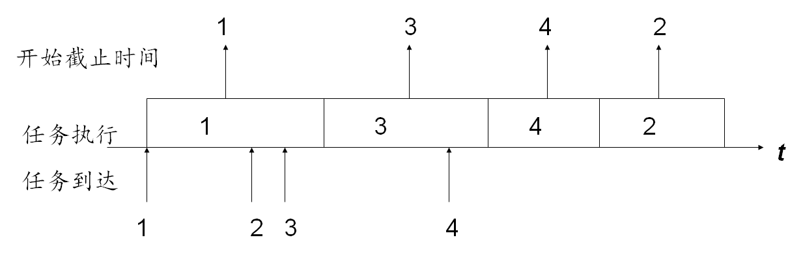

- 任务1最先到达最先开始执行
- 任务1执行过程中任务2、任务3到达，由于任务3截止时间更早，其优先级愈高，所以执行完任务1后执行任务3
- 任务3执行过程中任务4到达，由于任务4截止时间更早优先级愈高，任务3执行完后执行任务4,
- 最后执行任务2

##### 2)抢占式调度方式用于周期实时任务

下图中有两个周期性任务，任务A的周期时间为20ms，每个周期的处理时间为10ms；任务B的周期时间为50ms，每个周期的处理时间为25ms

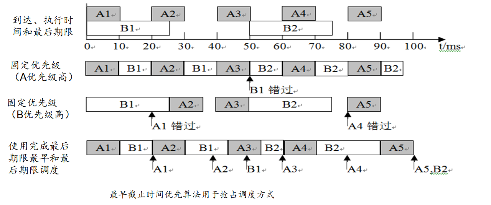

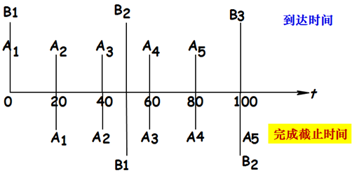

周期任务A，周期时间20ms，处理时间10ms

周期任务B，周期时间50ms，处理时间25ms

为了说明通常的优先级调度不能适用于实时系统，该图增加了固定优先级调度的第二行和第三行

- 第二行中

  - 固定A，B优先级，且优先级A>B；
  - 先执行A1，A1执行完后执行B1；
  - B1执行了10ms后被A2抢占；
  - A2执行完后继续执行B2；
  - B2执行10ms后被A3抢占；
  - A3执行完后已经到达B2的截止时间了，但B2总共执行了20ms，很明显低于所需处理时间25ms。

- 第三行中

  - 固定A，B优先级，且优先级B>A；
  - 先执行B1，B1执行完后已经过了A1的截止时间，可知A1根本就没能执行到。

- 第四行中

  - A1截止时间早于B1截止时间，先执行A1；

  - A1执行完执行B1，B1执行10ms后A2到达；

  - A2截止时间早于B1截止时间，先执行A2；

  - A2执行完执行B1，B1执行10ms后A3到达；

  - B1截止时间早于A3截止时间，继续执行B3；

  - 以此类推，每个任务有序无错过进行，能满足系统的要求。

> 在t=0时，A1和B1同时到达，由于A1的截止时间比B1早，所以调度A1执行；
>
> 在t=10时，A1完成，又调度B1执行；
>
> 在t=20时A2到达，由于A2的截止时间比B1早，故B1被中断而调度A2执行；
>
> 在t=30时，A2执行完成，又重新调度B1执行；
>
> 在t=40时A3又到达了，但B1的截止时间要比A3早，仍应让B1继续执行，直到完成（t=45）,然后再调度A3执行；
>
> 在t=55时，A3完成，又调度B2执行。

#### 2.最低松弛度优先LLF（Least Laxity First）算法

##### 1. 松弛度

根据任务紧急(或松弛)的程度，来确定任务的优先级。任务的紧急程度愈高(松弛度越低)，为该任务所赋予的优先级就愈高， 以使之优先执行。

- 该算法主要用于抢占调度方式中。

松弛度=最迟开始时间-当前时间

​           =完成截止时间-处理时间-当前时间

例如：某任务完成截止时间为100，处理时间为40，当前时间为30，则该任务的松弛度为100-40-30=30。

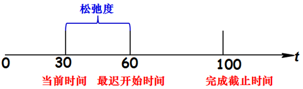

说明：

(1) 松弛度越低，当前时间距最迟开始时间就越近，任务就越紧急。

(2) 最低松弛度优先算法主要用于抢占式调度。

##### 2. 最低松弛度优先算法举例

例如：在一个实时系统中，有两个周期性实时任务A和B，任务A要求每20ms执行一次，执行时间为10ms；任务B只要求每50 ms执行一次，执行时间为25ms。请按最低松弛度优先算法画出0~150ms的任务调度顺序。

求出各任务的最迟开始时间：

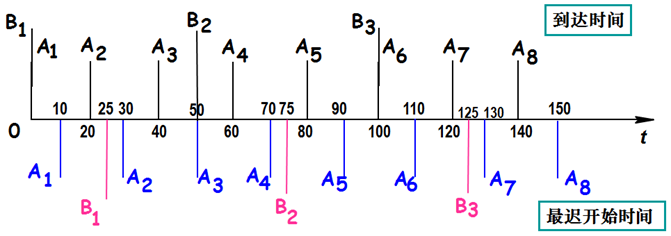

任务调度顺序：

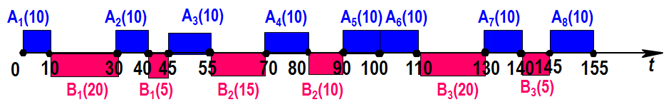

松弛度=必须完成时间-本身的运行时间-当前时间

**调度方法:** 

(1) 找已到达但未完成的任务(已完成的则删去到达时间和最迟开始时间)

(2) 找上述任务中松弛度最低(当前时间距最迟开始时间最近)的执行。若松弛度相同，先到的先执行。

(3) 若执行过程中到达了另一任务的最迟开始时间，则进行抢占。

T0:A1、B1同时来到，A1的松弛度=20-10-0=10;B1的松弛度=50-25-0=25;先执行A1
A1从TO执行到T10 A1就执行完了。因为这时A2还没有来，所以接下来执行B1,当B1执行到T20时（先执行10MS),A2来了，最低松弛度算法发生任务切换只有2种情况:1、当前这个任务执行完了吗?B1还未执行完。2、新来的任务的松弛度=0吗?这时A2的松弛度=40-10-20=10不等于0。必须要满足这两种情况之一才会发生切换，所以在T20继续执行B1,从T20-T30又执行了10MS，但这时A2的松弛度=40-10-30=0了，换句话说如果在T30的时候再不去执行A2的话，A2就会被错过了。所以在T30时候发生任务切换，从T30-T40将任务A2处理完。在T40时，A3来了，而之前的B1还差5MS，所以这时算一下松弛度:Bl的松弛度=50-5-40=5;A3的松弛度=60-10-40=10;所以在T40时候，B1的级别高，所以从T40-T45，B1就执行完了。在T45时，B2还没有来，所以T45执行3,当A3从T45-T50时，这时B来了因为A3还差5MS，另外B2的松弛度=100-25-50=25不等于0，所以不发生切换，从T50-T55继续执行A3的剩下的5MS，所以T55时候，A3执行完，A4还没有来，所以接任来执行B2....

## 3.5产生死锁的原因和必要条件

 在多道程序系统中，虽借助于多个进程的并发执行，改善了系统的资源利用率，提高了系统的吞吐量，但可能发生一种危险--死锁。

死锁（Deadlock）：是指多个进程在运行过程中因争夺资源而造成的一种僵局，当进程处于这种状态时，若无外力作用，它们都将无法再向前推进。

### 一、产生死锁的原因

#### 1、竞争资源

当系统中供多个进程共享的资源如打印机、公用队列等，其数目不足以满足诸进程的需要时，会引起诸进程对资源的竞争而产生死锁。

可把系统中的资源分为两类：

a.可剥夺性资源：资源分配给进程后可以被高优先级的进程剥夺。如CPU、主存。

b.不可剥夺性资源：分配给进程后只能在进程用完后才释放的资源。如磁带机、打印机等。

- 竞争不可剥夺性资源引起死锁

  在系统中配置的非剥夺性资源，由于数量不足，会使进程在运行过程中，因争夺这些资源而陷入僵局。

  如，打印机R1,磁带机R2，可供进程P1和P2共享，假定P1已占用R1，P2已占用R2，此时P2又要求R1，因得不到进入阻塞状态，P1又要求R2，也得不到而进入阻塞状态，产生死锁。

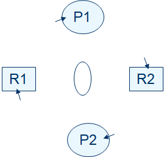

- 竞争临时性资源引起死锁

  打印机之类的资源属于可顺序重复使用型资源，称为永久性资源。与之相对的是临时性资源，是指由一个进程产生，被另一进程使用一短暂时间后便无用的资源，也称为消耗性资源，它也可能引起死锁。

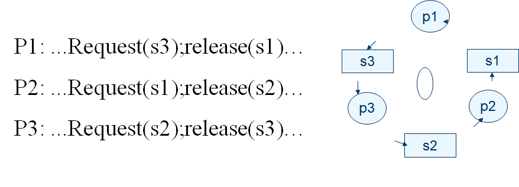

#### 2、进程间推进顺序非法

进程在运行过程中，请求和释放资源的顺序不当，也同样会导致产生死锁。

由于进程在运行中具有异步性特征，这就可能使上述P1和P2两个进程按下述两种顺序向前推进。

- 进程推进顺序合法
- 进程推进顺序非法

### 二、产生死锁的必要条件

1、互斥条件：排他性的使用资源

进程访问的是临界资源，即在一段时间内某资源只由一个进程占用。如果此时还有其他进程请求该资源，则请求者只能等待，直至占有该资源的进程用完释放。

2、请求和保持条件：已经持有一定的资源，再次申请新资源，申请不到阻塞但不释放已获得的资源。

一进程在请求新的资源的同时，保持对已分配资源的占有。

3、不剥夺条件：已经获得的资源，在未使用完之前，不能被抢占，只有使用完后由自己释放。

指进程已获得的资源，在未使用完之前，不能被剥夺，只能在使用完时由自己释放。

4、环路等待条件：死锁时，必然存在一个进程-资源环型链。

指在发生死锁时，必然存在一个进程--资源的环形链。

即进程集合{P0,P1,P2,…,Pn}中的P0正在等待一个P1占用的资源；P1正在等待一个P2占用的资源，……，Pn正在等待一个已被P0占用的资源。

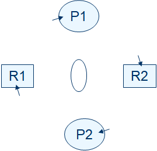

### 三、处理死锁的基本方法

在系统中已经出现死锁后，则应及时检测到死锁的发生，并采取适当措施来解除死锁。

目前处理死锁的方法可归结为四种：

#### 1、预防死锁

是一种较简单和直观的事先预防方法。该方法是通过设置某些限制条件，去破坏产生死锁的四个必要条件的一个或几个，来预防发生死锁。

预防死锁是一种较易实现的方法，已被广泛使用。但由于所施加的限制条件往往太严格，可能会导致系统资源利用率和系统吞吐量降低。

#### 2、避免死锁

该方法同样是属于事先预防的策略，这种方法不是预先加上各种限制条件以预防产生死锁的可能性，而是用某种方法去防止系统进入不安全状态，使死锁不致于最终发生。

- 这种方法只须事先加以较弱的限制条件，便可获得较高的资源利用率及系统吞吐量，但在实现上有一定的难度。
- 目前在较完善的系统中，常用此方法来避免发生死锁。

#### 3、检测死锁

这种方法并不须事先采取任何限制性措施，也不必检查系统是否已经进入不安全区。

此方法允许系统在运行过程中发生死锁，但可通过系统所设置的检测机构，及时的检测出死锁的发生，并精确的确定与死锁有关的进程和资源；然后采取适当的措施，从系统中将已发生的死锁清除掉。

#### 4、解除死锁

是与死锁检测相配套的一种措施。当检测到系统中已发生死锁时，须将进程从死锁状态中解脱出来。

- 常用的实施方法是撤销或挂起一些进程，以便回收一些资源，再将这些资源分配给已处于阻塞状态的进程，使之转为就绪状态，以继续运行。
- 死锁的检测与解除措施，有可能使系统获得较好的资源利用率和吞吐量，但在实现上难度也最大。

## 3.6 预防死锁

预防死锁和避免死锁这两种方法，实质上都是通过施加某些限制条件，来预防发生死锁。

两者的主要区别在于：

- 预防死锁：施加的限制条件较严格，往往会影响进程的并发执行。
- 避免死锁：施加的限制条件则较宽松，这给进程的运行提供了较为宽松的环境，有利于进程的并发执行。

预防死锁的方法是使四个必要条件中的第2、3、4条件之一不能成立，来避免发生死锁。

- 必要条件1，互斥条件为资源的固有属性，无法破坏。因为它是由设备的固有条件所决定的，不仅不能改变，还应加以保证。

### 破坏“请求和保持”条件

不允许进程在已经保持某些资源的情况下去申请新的资源。

#### 第一种协议

在开始运行之前，一次申请全部资源 

**优点：**简单、易行、安全

**缺点：**

(1)资源被严重浪费，严重恶化了资源的利用率；

(2)使进程经常会发生饥饿现象。

#### 第二种协议

该协议是对第一种协议的改进，它允许一个进程只获得运行初期所需的资源后，便开始运行，等到已经获得的资源使用完毕释放后，再去申请后期运行需要的资源。

### 破坏“不可抢占”条件

当一个已经保持了某些不可被抢占资源的进程，提出新的资源请求而不能得到满足时，它必须释放已经保持的所有资源，待以后需要时再重新申请。这意味着进程已占有的资源会被暂时地释放，或者说是被抢占了，从而破坏了“不可抢占”条件。

- 某一进程已经占有的资源，在运行过程中会被暂时释放掉，认为是被剥夺了。
- 实现起来比较复杂且付出很大代价。可能会前功尽弃，反复申请和释放等情况，延长了周转时间，增加系统开销。降低系统吞吐量。

### 破坏“循环等待”条件

系统将所有资源按类型进行线性排队，并赋予不同的序号。所有进程对资源的请求必须严格按照资源序号递增的次序提出，这样在所形成的资源分配图中，不可能会出现环路，因而摒弃了“环路等待”条件。

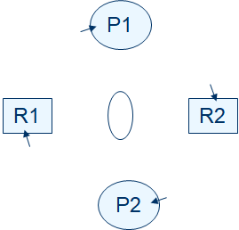

与前两种策略比较，资源利用率和系统吞吐量都有较明显的改善。但也存在严重问题：

1. 为资源编号限制新设备的增加；
2. 进程使用设备顺序与申请顺序不同，浪费资源；
3. 限制用户编程自由。

## 3.7 避免死锁

### 系统安全状态

在预防死锁的几种方法中，都施加了较强的限制条件；在避免死锁的方法中，所施加的限制条件较弱，又能获得令人满意的系统性能。

- 在该方法中把系统的状态分为**安全状态**和**不安全状态**，只要能使系统始终都处于安全状态，便可避免发生死锁。
- 思路：允许进程动态地申请资源，但在资源分配前，应先计算资源分配的安全性，若此次分配不会导致系统进入不安全状态，则将资源分配给进程，否则，令进程等待。

#### 安全状态

在该方法中，允许进程动态地申请资源，但系统在进行资源分配之前，先计算此次资源分配的安全性：若此次分配不会导致系统进入不安全状态，才可将资源分配给进程；否则，令进程等待。 

所谓**安全状态**，是指系统能按某种进程顺序(Pm, Pk,…,Pn)(称〈Pm, Pk, …, Pn〉序列为安全序列)，来为每个进程分配其所需资源，直至满足每个进程对资源的最大需求，使每个进程都可顺利地完成。

如果系统无法找到这样一个安全序列，则称系统处于**不安全状态**。

- 虽然并不是所有的不安全状态都是死锁状态，但当系统进入不安全状态后，便可能进入死锁状态；反之只要处于安全状态就不会死锁。
- 避免死锁的实质是：系统在进行资源分配时，设法使系统不进入不安全状态。

#### 安全状态之例

假定系统中有三个进程A、B和C，共有12台磁带机。进程A总共要求10台，B和C分别要求4台和9台。假设在T0时刻，进程A、B和C已分别获得5台、2台和2台，尚有3台未分配，如下表所示：

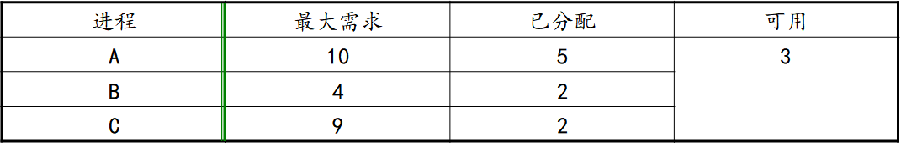

1. T0时刻系统的安全性？

   在T0时刻存在安全序列<PB,PA,PC>，该时刻是安全的。

   ​    是否能够找到一个进程推进执行的顺序，从而满足每一个进程的资源最大需求，如能则系统安全，否则系统是不安全的。
   T0时刻:可用的有3台，所以从3台中拿出2台分配给B，那么B就可以运行了，当B执行完，要回收给她分配的资源，所以这个时候系统可用的资源的数量=2+3=5台;然后从5台中拿出5台给A用，A就可以执行了，执行完后回收给它的资源，那么A执行完后系统的资源数量=5=5=10台
   最后再从10台中拿出7台给C用，c也可以顺利执行完，执行完后系统可用的资源数量=3+9=12台
   l
   所以系统存在一个合理的进程执行的推进顺序:B-A-C

2. T0时刻以后，C又请求1 台磁带机，是否可以分配？

   T0以后，假设把c申请的1台给她，之前已经分配了2台了，那么加上这1台，就一共给她分配了3台了，那么系统可用的还有=12-5-2-3=2把2台先给B，那么让B先执行完，执行完后系统资源数量=2+2=4台，这4台既不满足A(还需5台)也不满足C(还需要6台
   所以A和C无法运行
   所以TO以后，系统找不到一个安全的进程推进的执行序列，所以不可以把那1台分配给C.

避免死锁的基本思想：确保系统始终处于安全状态。

### 利用银行家算法避免死锁

银行家算法是最有代表性的避免死锁的算法。

由于该算法能用于银行系统现金贷款的发放而得名的。

#### 1、银行家算法中的数据结构

**(1)可利用资源向量Available** ：含有m个元素的数组

数组中每个元素代表一类可利用的资源的数目。

  Available[j]=K 系统中现有Rj类资源K个

元素的初值为系统中所配置的该类全部可用资源的数目，而且它的值会随着资源的分配或回收而不断地发生变化。

**(2)最大需求矩阵Max**：n*m的矩阵

定义了系统中n个进程中的每一个进程对m类资源的最大需求。

   Max[i,j]=K  进程i需要Rj类资源最大数目为K个

**(3)分配矩阵Allocation**：n*m的矩阵

定义了系统中每一类资源当前已分配给每一个进程的资源数。

  Allocation[i,j]=K  进程i当前已分得Rj类资源K个

**(4)需求矩阵Need**：n*m的矩阵

表示每一个进程尚需的各类资源数目

   Need[i,j]=K  进程i还需要Rj类资源K个

三个矩阵间的关系：Need[i,j]=Max[i,j]-Allocation[i,j]

#### 2、银行家算法的处理步骤

```
设Requesti[j]是进程Pi的请求资源Rj的个数，当进程Pi发出请求后，系统按以下步骤进行检查：

(1) if(Requesti[j]<= Need[i,j]) go (2)

   else ERROR;

(2) if(Requesti[j]<=Avaliable[i,j]) go (3)

  else { ERROR; Pi wait;}

(3) 系统试探着将资源分配给进程Pi ,修改下面的值：

 Available[j]=Available[j] - Requesti[j];

 Allocation[i,j]= Allocation[i] + Requesti[j];

 Need[i,j]= Need[i,j] - Requesti[j];

(4)系统执行安全性算法，检查按此次试分配后系统是否安全。

 if safe 

    正式给Pi分配资源；

 else 

  {

   本次试探性分配作废，恢复原来的资源分配状态；

   Pi等待；

  }
```

#### 3、安全性算法

```
(1)设置两个量

  ①工作向量Work，它含有m个元素，表示系统目前可提供给进程继续运行的各类资源数目，初值为系统的Available值; 

  ②数组Finish[n]，其中Finish[i]标识系统是否有足够的资源分配给i进程，使之运行完成。

   开始时Finish[i]=false; 当有足够资源分配给进程使之完成时,则令Finish[i]=true。

(2)从进程集合中找到一个能满足下述条件的进程： 

  if ( (Finish[i]==false)&&(Need[i,j]<=Work[j]) )

     go (3)

  else

     go (4)

(3)当Pi获得资源后，可以顺利执行直至完成，并释放它的资源。

  Work[j]= Work[j]+Allocation[i,j];

   Finish[i]=ture;

   go (2);

(4)如果所有进程的Finish[i]==true，则表示系统处于安全状态；否则，系统处于不安全状态。

  for(num=0,i=0;i<n;i++)

    if (Finish[i])

       num++;

    else

       break;

    if(num<n)

       NO_SAFE;

    else 

       SAFE;
```

#### 4. 银行家算法之例

假定系统中有五个进程{P0，P1，P2，P3，P4}和三类资源{A，B，C}，各种资源的数量分别为10、5、7，在T0时刻的资源分配情况如下所示。 

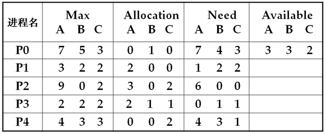


**求解: (1) 判断T0时刻的安全性**

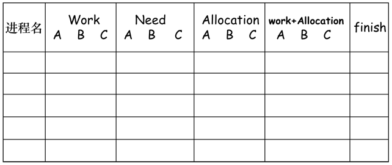


(1) work[0,1,2]=Available[0,1,2]={3,3,2};

(2) 从进程集合中找到一个能满足下述条件的进程 :

Need[i] [0,1,2]<=work[0,1,2] && finish[i]=false;

①则P1、P3满足i=1或3,假若让P1先执行；go (3)

②则P3、P4满足，假若让P3执行；go (3)

③则P0、P2、P4满足，假若让P4执行；go(3)

④则P0、P2满足，假若让P0执行；go(3)

⑤则P2满足，让P2执行；go(3)

⑥没有满足的条件，go(4)

直到不满足条件执行step(4)

(3)分配资源，顺利执行完毕，回收资源

work[0,1,2] = work[0,1,2]+Allocation[0,1,2] = {5,3,2}

go to step(2)

(4)判断Finish[i]==true 是否都为true

存在安全队列{P1,P3,P4,P0,P2}，所以该时刻安全。

安全队列不唯一；

| 进程名 | Work<br />A   B   C | Need<br />A   B   C | Allocation<br />A   B   C | Work+Allocation<br />A   B   C | finish |
| :----: | :-----------------: | :-----------------: | :-----------------------: | :----------------------------: | :----: |
|   P1   |      3   3   2      |      1   2   2      |         2   0   0         |           5   3   2            |  true  |
|   P3   |      5   3   2      |      0   1   1      |         2   1   1         |           7   4   3            |  true  |
|   P4   |      7   4   3      |      4   3   1      |         0   0   2         |           7   4   5            |  true  |
|   P0   |      7   4   5      |      7   4   3      |         0   1   0         |           7   5   5            |  true  |
|   P2   |      7   5   5      |      6   0   0      |         3   0   2         |           10   5   7           |  true  |

**求解：(2) T0时刻时P1请求资源发出请求向量Requset1(1,0,2)，系统能否分配给它？**

利用银行家算法：

（1）Request1[0,1,2] <= Need[1] [0,1,2]

​			Request1(1,0,2) <=  Need(1,2,2)

​			满足，下一步

（2）Request1[0,1,2] <=Available[0,1,2] ?

​			Request1(1,0,2) <= Available(3,3,2)

​			满足，下一步

（3）分配资源

​			Available[0,1,2] = Available[0,1,2] -  Request[0,1,2] = {3,3,2} - {1,0,2}={2,3,0}

​			Allocation[1] [0,1,2]=Allocation[1] [0,1,2]+Request[0,1,2]={2,0,0}+{1,0,2}={3,0,2}

​			Need[1] [0,1,2]=Need[1] [0,1,2] - Request[0,1,2]={1,2,2} - {1,0,2}={0,2,0}

则资源变化为如下表。

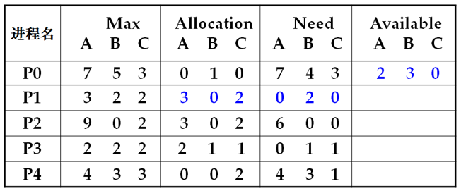

（4）再利用安全性算法检查此时系统是否安全。

​			work[0,1,2] = Available[0,1,2] = {2,3,0}

​			finish[i] = false;

​	（1）Need[i] [0,1,2] <= work[0,1,2] && finish[i]  = false

​		①P1满足 执行步骤2

​		②P3、P4满足，P3先执行，执行步骤2

​		③P0、P2、P4满足，P4先执行，执行步骤2

​		④P0、P2满足，P0先执行，执行步骤2

​		⑤P2满足 执行步骤2

​		⑥没有满足的条件，执行步骤3

​	（2）顺利执行，回收资源

​		①work[1] [0,1,2]  = work[1] [0,1,2]  +Allocation[1] [0,1,2]={5,3,2}  执行步骤1

​		②work[3] [0,1,2]  = work[3] [0,1,2]  +Allocation[3] [0,1,2]={7,4,3}  执行步骤1

​		③work[4] [0,1,2]  = work[4] [0,1,2]  +Allocation[4] [0,1,2]={7,4,5}  执行步骤1

​		④work[0] [0,1,2]  = work[0] [0,1,2]  +Allocation[0] [0,1,2]={7,5,5}  执行步骤1

​		⑤work[2] [0,1,2]  = work[2] [0,1,2]  +Allocation[2] [0,1,2]={10,5,7}  执行步骤1

​	（3）判断finish[i]是否都等于true

| 进程名 | Work<br />A   B   C | Need<br />A   B   C | Allocation<br />A   B   C | Work+Allocation<br />A   B   C | finish |
| :----: | :-----------------: | :-----------------: | :-----------------------: | :----------------------------: | :----: |
|   P1   |      2   3   0      |      0   2   0      |            3   0   2            |              5   3   2              |  true  |
|   P3   |      5   3   2      |       0   1   1       |            2   1   1            |              7   4   3              |  true  |
|   P4   |      7   4   3      |       4   3   1       |            0   0   2            |              7   4   5              |  true  |
|   P0   |      7   4   5      |       7   4   3       |            0   1   0            |              7   5   5              |  true  |
|   P2   |      7   5   5      |      6   0   0      |            3   0   2            |             10   5   7             |  true  |

存在安全队列{P1,P3,P4,P0,P2}，所以该时刻安全，可以立即将P1所申请的资源分配给它。

**求解：(3)此时，P4请求资源发出请求向量Requset4(3,3,0)，系统能否分配给它？**

利用银行家算法：

（1）Request4[0,1,2] <= Need[4] [0,1,2]

​			Request4(3,3,0) <=  Need(4,3,1)

​			满足，下一步

（2）Request4[0,1,2] <=Available[0,1,2] ?

​			Request4(3,3,0) <= Available(2,3,0)

​			不满足，P4应该等待

**求解：(4) 此时，P0请求资源发出请求向量Requset0(0,2,0)，系统能否分配给它？**

利用银行家算法：

（1）Request0[0,1,2] <= Need[0] [0,1,2]

​			Request0(0,2,0) <=  Need(7,4,3)

​			满足，下一步

（2）Request0[0,1,2] <=Available[0,1,2] ?

​			Request0(0,2,0) <= Available(2,3,0)

​			满足，下一步

（3）试探分配，修改相关值

 		 Avaliable= (2,3,0)-(0,2,0)=(2,1,0)

​		  Allocation0=(0,1,0)+(0,2,0)=(0,3,0)

​		  Need0=(7,4,3)-(0,2,0)=(7,2,3)

（4）再利用安全性算法检查此时系统是否安全。

​		很容易看出，可用资源Available(2,1,0)已无法满足任一进程的需求，试探作废，不分给P0资源，P0等待。

#### 5. 银行家算法总结:

(1)  首先判断当前时刻的安全性；(安全性算法)

(2)  若安全，当某进程提出资源申请Requesti时，尝试进行预分配(两个比较，并修改相关值)；

(3)  判断预分配后的安全性；(安全性算法)

(4)  若仍安全，则实施预分配；否则，该进程等待。

#### 6. 练习

在银行家算法中，若出现下述资源分配情况：

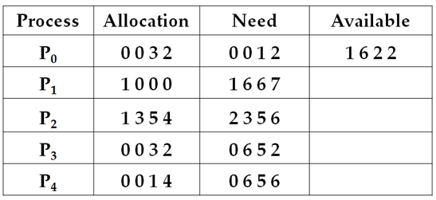

试问：

（1）该状态是否安全？

（2）若进程P2提出请求Request(1,2,2,2)后，系统能否将资源分配给它？

 

解（1）：利用安全性算法对此时刻的资源分配情况进行分析:

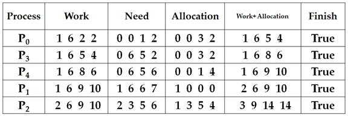

可知，在此刻存在一个安全序列 { P0 ，P3，P1，P2，P4}，故系统是安全的。

 

解（2）：P2发出请求向量（1,2,2,2）后，系统按银行家算法进行检查：

①Request1(1,2,2,2)<Need1(2,3,5,6)

②Request1(1,2,2,2)<Available1(1,6,2,2)

③系统先假定可以为P2分配资源，并修改Available，Allocation2和Need2值

 Available＝(0,4,0,0) 

 Allocation2＝(2,5,7,6) 

 Need2＝(1,1,3,4)

由此形成的资源变化情况图如表所示：

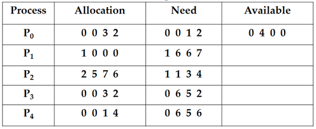

④再利用安全性算法检查此时系统是否安全。

因为可利用资源Available(0,4,0,0)已不能满足任何进程的需求，故系统进入不安全状态，此时系统不分配资源。

## 3.8 死锁的检测与解除

### 一、死锁的检测

当系统为进程分配资源时，若未采取任何限制性措施，则系统必须提供检测和解除死锁的手段，为此系统必须：

1、保存有关资源的请求和分配信息；

2、提供一种算法，以利用这些信息来检测系统是否已进入死锁状态。

#### 1、资源分配图

系统死锁可利用资源分配图来描述。

该图由表示进程的圆圈和表示一类资源的方框组成，其中方框中的一个点代表一个该类资源，请求边是由

进程指向方框中的rj，而分配边则应始于方框中的一个点。

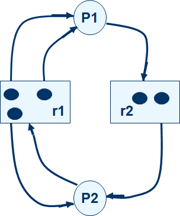

圆圈表示进程，矩形表示资源

P→R：P请求资源R，请求边

R→P：P分配得到资源R，分配边

#### 2、死锁定理

我们可以利用资源分配图加以简化的方法，来

检测系统处于某状态时是否为死锁状态。简化方法如下：

1. 在资源分配图中找出一个既不阻塞又非独立的进程结点Pi，在顺利的情况下运行完毕，释放其占有的全部资源。

2. 由于释放了资源，这样能使其它被阻塞的进程获得资源继续运行。

3. 在经过一系列简化后若能消去图中的所有的边，使所有进程结点都孤立，则称该图是可完全简化的，反之是不可完全简化的。

可以证明：S状态为死锁状态的充分条件是当且仅当S状态的资源分配图是不可完全简化的。<死锁定理>

### 二、死锁的解除

当发现进程死锁时，便应立即把它们从死锁状态中解脱出来。常采用的方法是：

1、剥夺资源：从其他进程剥夺足够数量的资源给死锁进程以解除死锁状态。

2、撤销进程：最简单的是让全部进程都死掉；温和一点的是按照某种顺序逐个撤销进程，直至有足够的资源可用，使死锁状态消除为止。

# 四、存储器管理

存储器是计算机系统的重要组成部分之一。对存储器加以有效管理，不仅直接影响存储器的利用率，而且对系统性能有重大影响。存储器管理的主要对象是内存，对外存的管理在文件管理中。

## 4.1 存储器的层次结构

### 4.1.1 多层结构的存储器系统 

#### **1. 存储器的多层结构**

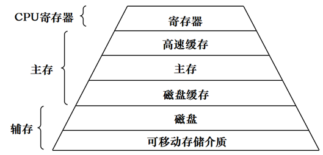

#### **2. 可执行存储器**

在计算机系统的存储层次中，寄存器和主存储器又被称为可执行存储器。

### 4.1.2 主存储器与寄存器

#### 1. 主存储器

  CPU只能从主存储器中取得指令和数据。

  但运行速度远低于CPU执行指令的速度。

主存储器(简称内存或主存)是计算机系统中一个主要部件，用于保存进程运行时的程序和数据。


#### 2．寄存器

  访问速度最快，但价格昂贵。

寄存器访问速度最快，完全能与CPU协调工作，但价格却十分昂贵，因此容量不可能做得很大。

寄存器的长度一般以字(word)为单位。寄存器的数目，对于当前的微机系统和大中型机，可能有几十个甚至上百个；而嵌入式计算机系统一般仅有几个到几十个。

### 4.1.3 高速缓存和磁盘缓存

#### 1．高速缓存

容量远大于寄存器，但比主存小两三个数量级。

高速缓存是现代计算机结构中的一个重要部件，其容量大于或远大于寄存器，而比内存约小两到三个数量级左右，从几十KB到几MB，访问速度快于主存储器。

根据程序执行的局部性原理，将主存中一些经常访问的信息存放在高速缓存中，减少访问主存储器的次数，可大幅度提高程序执行速度。

#### 2．磁盘缓存

利用主存中的存储空间。

由于目前磁盘的I/O速度远低于对主存的访问速度，因此将频繁使用的一部分磁盘数据和信息，暂时存放在磁盘缓存中，可减少访问磁盘的次数。

磁盘缓存本身并不是一种实际存在的存储介质，而是利用主存中的部分存储空间，来暂存从磁盘中读出(或写入)的信息。主存也可以看做是辅存的高速缓存，因为，辅存中的数据必须复制到主存方能使用；反之，数据也必须先存在主存中，才能输出到辅存。 

## 4.2 程序的装入和链接

在多道程序环境下，要使程序运行，必须为之先建立进程。创建进程的第一件事是将程序和数据装入内存。

  将用户源程序变为可在内存中执行的程序的步骤：

  1、编译：由编译程序将用户源代码编译成若干个目标模块

  2、链接：由链接程序将编译后形成的一组目标模块，以及它们所需要的库函数链接在一起，形成一个完整的装入模块

  3、装入：由装入程序将装入模块装入内存

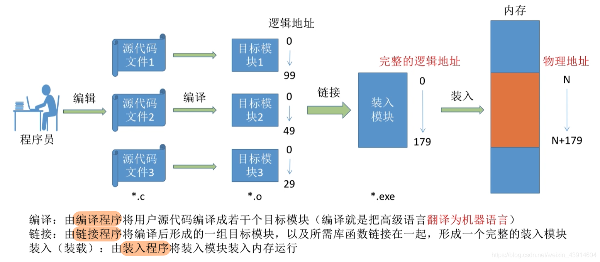

### 一、程序的装入

将一个装入模块装入内存时，按装入时物理地址的确定时机不同而分成3种。 

- 绝对装入方式
- 可重定位装入方式
- 动态运行时装入方式

#### 绝对装入方式

直接将目标模块装入事先已知的内存物理地址。 

在编译时，如果知道程序驻留在内存的什么位置，那么编译程序将产生绝对地址的目标代码。

装入模块装入内存后，程序中的逻辑地址与实际内存地址完全相同，不须对程序和数据的地址进行修改。

- 程序中所使用的绝对地址，可在编译或汇编时给出，也可由程序员赋予。
- 只适合于单道程序环境

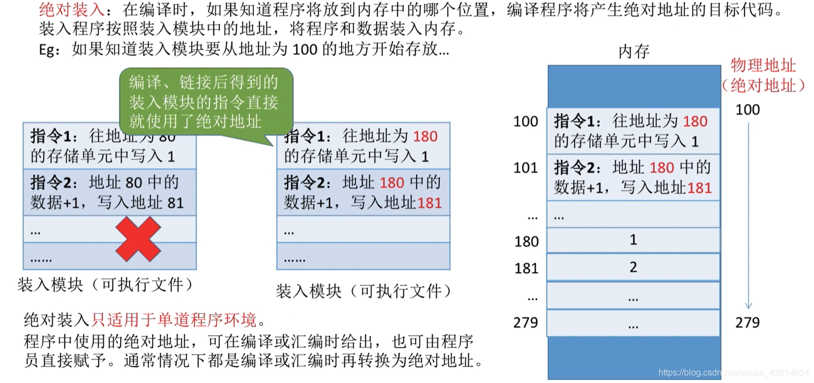

#### 可重定位装入方式

在多道程序环境下，目标模块的起始地址通常从0开始，程序中的其他地址都是相对于起始地址计算的。因此应采用可重定位装入方式，根据内存的当前情况，将装入模块装入到内存的适当位置。

注意：在采用可重定位装入方式将装入模块装入内存后，会使装入模块中的所有逻辑地址与实际装入内存的物理地址不同。

装入时进行地址变换而确定其物理地址。

(1)目标模块的起始地址从0开始；

(2)在要调度到内存时，根据内存情况，装入到适当位置。 

**说明：**

- 目标模块中所用逻辑地址与实际装入内存的物理地址不同。

- 把装入时对目标程序中指令和数据的修改过程成为重定位。

- 物理(绝对)地址=逻辑(相对)地址+内存起始地址

- 地址变换在装入时一次完成，以后不再改变，称为静态重定位。

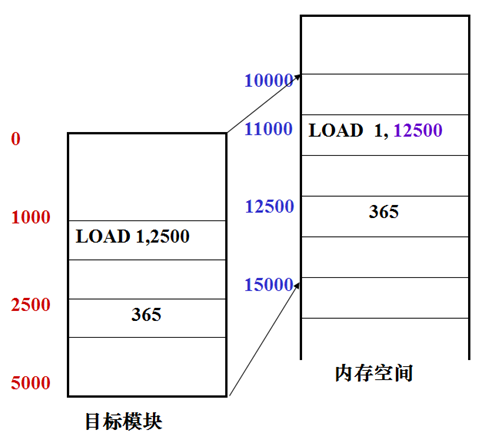


#### 动态运行时装入方式

在把装入模块装入内存后，并不立即把装入模块中的相对地址转换为绝对地址，而是把这种地址转换推迟到程序**真正要执行时**才进行。

- 装入内存后的所有地址都仍是相对地址。
- 为使地址转换不影响指令的执行速度，应设置一个重定位寄存器。


### 二、程序的链接

程序经过编译后得到一组目标模块，再利用链接程序将目标模块链接，形成装入模块。根据链接时间的不同，把链接分成三种：

  1、静态链接：在程序运行前，将目标模块及所需的库函数链接成一个完整的装配模块，以后不再拆开。

  2、装入时动态链接：指将用户源程序编译后所得的一组目标模块，在装入内存时，采用边装入边链接的链接方式。

  3、运行时动态链接：指对某些目标模块的链接，是在程序执行中需要该目标模块时，才对它进行链接。

#### 静态链接方式

事先进行链接，后不再拆开


将目标模块装配成装入模块时需解决的两个问题：

(1) 对相对地址进行修改

(2) 变换外部调用符号

#### 装入时动态链接

装入内存时，边装入边链接。

用户源程序经编译后所得的目标模块，是在装入内存时，边装入边链接的，即在装入一个目标模块时，若发生一个外部模块调用事件，将引起装入程序去找出相应的外部目标模块，并将它装入内存，还要修改目标模块中的相对地址。


优点：

- 便于修改和更新
- 便于实现对目标模块的共享

#### 运行时动态链接

程序运行时需要该模块时，才进行链接。

运行时动态链接是将对某些模块的链接**推迟到执行时**才执行，即在执行过程中，当发现一个被调用模块尚未装入内存时，立即由OS去找到该模块并将之装入内存，把它链接到调用者模块上。

凡执行过程中未被用到的目标模块，不会调入内存和链接，这样不仅加快程序的装入过程，而且节省大量的内存空间。

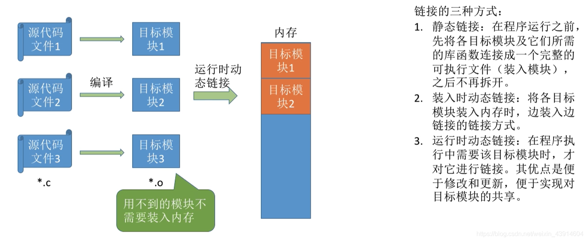

## 4.3 连续分配方式

内存连续分配方式：指为一个用户程序分配一个连续的内存空间。

### 一、单一连续分配

**单道程序环境下**，内存分为**系统区和用户区**两部分，系统区仅提供给OS使用，通常是放在内存的低址部分；用户区是指除系统区以外的全部内存空间，提供给用户使用。

**单一连续分配方式：**将用户区全部分配给一个程序，即整个内存的用户区由该程序独占。

这是最简单的一种存储管理方式，但只能用于**单用户、单任务**的操作系统中。

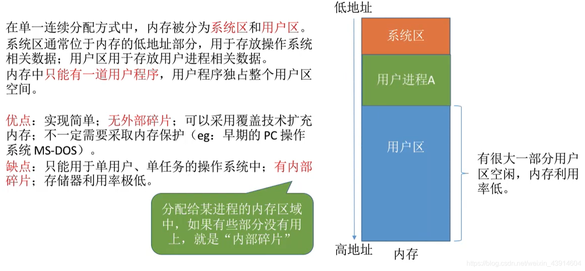

例：一个容量为256KB的内存，操作系统占用32KB，剩下224KB全部分配给用户作业，如果一个作业仅需64KB，那么就有160KB的存储空间被浪费。

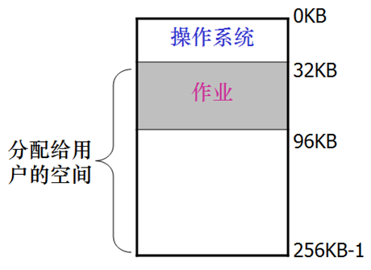

### 二、固定分区分配

1、原理

将内存用户空间划分为若干个固定大小的区域，在每个分区中只装入一道作业，便可以有多道作业并发执行。当有一空闲分区时，便可以再从外存的后备作业队列中，选择一个适当大小的作业装入该分区，当该作业结束时，可再从后备作业队列中找出另一作业调入该分区。

2、划分分区的方法

  (1) 分区大小相等

​     所有的内存分区大小相等，缺乏灵活性

  (2) 分区大小不等

 把内存区划分成含有多个较小的分区、适量的中等分区及少量的大分区。

3、内存分配 

- 按大小将分区排队，建立分区表，包括分区号，大小，起址，状态。
- 当有一用户程序要装入时，由内存分配程序检索该表，从中找出一个能满足要求的、尚未分配的分区将其分配给该程序；若未找到合适的，则拒绝为给用户程序分配内存。
- 当程序执行完毕，释放占用的分区，管理程序将修改说明表中相应分区的状态为未分配，实现内存资源的回收。

例如：内存用户区的分区情况如下表所示，有程序P1（30K）、P2（8K）、P3（32K）要求进入内存，试画出它们进入内存后的空间分配情况，并说明主存浪费多大？

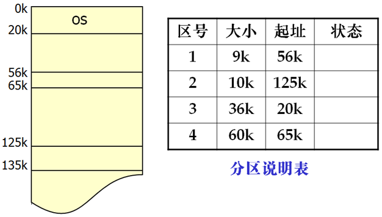

为程序P1（30K）、P2（8K）、P3（32K）分配后，情况如下：

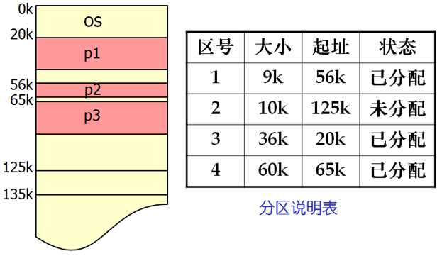

主存浪费空间=(36-30)+(9-8)+(60-32) =35(k)

内部碎片

### 三、动态分区分配

动态分区分配是根据进程的实际需要，动态地为之分配内存空间。作业装入内存时，把可用内存分出一个连续区域给作业，且分区的大小正好适合作业大小的需要。

- 分区的大小和个数依装入作业的需要而定。

#### 1. 分区分配中的数据结构 

(1)空闲分区表示

- 空闲分区表：记录每个空闲分区的情况。每个空闲分区占一个表目。

  - 每一空闲分区对应一条表目，包括分区号、分区起址、分区大小和状态等。

    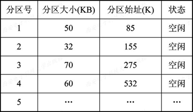

- 空闲分区链：在每个分区的起始部分，设置一些用于控制分区分配的信息，以及用于链接各分区所用的前向指针；在分区尾部则设置一后向指针,将所有的空闲分区链接成一个双向链。

  - **每个空闲分区用一个结点表示。**

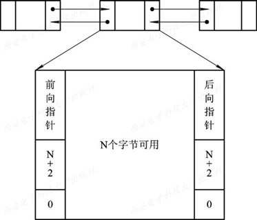

（2）已占分区说明表

​    结构：作业号；起始地址；大小


#### 2. 分区分配算法

为把一个新作业装入内存，需按照一定的分配算法，从空闲分区表或空闲分区链中选出一分区分配给该作业。

常用的分配算法：

  **(1) 首次适应算法**

FF算法要求空闲分区表以地址递增的次序排列。在分配内存时，从表首开始顺序查找，直至找到一个大小能满足要求的空闲分区为止；然后按照作业的大小，从该分区中划出一块内存空间分配给请求者，余下的空闲分区仍留在空闲分区表中。若从头到尾不存在满足要求的分区，则分配失败。

- 优点：优先利用内存低址部分的内存空间,保留了高址部分的大空闲区。
- 缺点：低址部分不断划分，产生小碎片（内存碎块、零头）；每次查找从低址部分开始，增加了查找的开销

  **(2) 循环首次适应算法**

在分配内存空间时，从上次找到的空闲分区的下一个空闲分区开始查找，直到找到一个能满足要求的空闲分区，从中划出一块与请求大小相等的内存空间分配给作业。

为实现算法，需要：

1. 设置一起始查寻指针
2. 采用循环查找方式

- 优点：使内存空闲分区分布均匀，减少查找的开销
- 缺点：缺乏大的空闲分区

  **(3) 最佳适应算法**

所谓“最佳”是指每次为作业分配内存时，总是把能满足要求、又是最小的空闲分区分配给作业，避免“大材小用”。

要求将所有的空闲分区按其容量以从小到大的顺序形成一空闲分区链。

- 缺点：产生许多难以利用的小空闲区

  **(4) 最坏适应算法**

最坏适应算法(worst fit)

最坏适应分配算法要扫描整个空闲分区表或链表，总是挑选一个最大的空闲区分割给作业使用。该算法要求将所有的空闲分区按其容量以从大到小的顺序形成一空闲分区链，查找时只要看第一个分区能否满足作业要求。

- 优点：剩下的空闲区还可以利用，同时查找效率很高。
- 缺点：缺乏大的空闲分区。

  **(5) 快速适应算法**

该算法又称为分类搜索法，是将空闲分区根据其容量大小进行分类，对于每一类具有相同容量的所有空闲分区，单独设立一个空闲分区链表，系统中存在多个空闲分区链表，同时在内存中设立一张管理索引表，该表的每一个表项对应了一种空闲分区类型，并记录了该类型空闲分区链表表头的指针。

- 优点
  - 查找效率高，仅需要根据进程的长度，寻找到能容纳它的最小空闲区链表，并取下第一块进行分配即可。
  - 在进行空闲分区分配时，不会对任何分区产生分割，所以能保留大的分区，满足对大空间的需求，也不会产生内存碎片。

- 缺点：
  - 在分区归还主存时算法复杂，系统开销较大。
  - 浪费空间，空闲分区划分越细，浪费则越严重。

#### 3. 分区分配及回收操作

- 分配内存

利用某种分配算法，从空闲分区链(表)中找到所需大小的分区。设请求的分区大小为u.size，表中每个空闲分区的大小表示为m.size，若m.size- u.size£size(规定的不再切割的分区大小)，将整个分区分配给请求者，否则从分区中按请求的大小划出一块内存空间分配出去，余下部分留在空闲链中，将分配区首址返回给调用者。

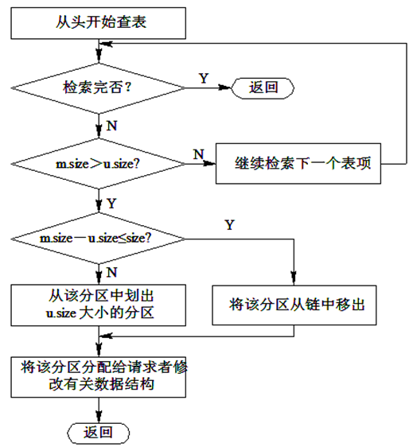

- 回收内存

当进程运行完毕释放内存时，系统根据回收区首址，在空闲分区链(表)中找到相应插入点，可能有四种情况：

1. 回收区与插入点的前一个分区F1邻接
2. 回收区与插入点的后一个分区F2邻接
3. 回收区与插入点的前后两个分区F1、F2邻接
4. 回收区既不与F1邻接，又不与F2邻接

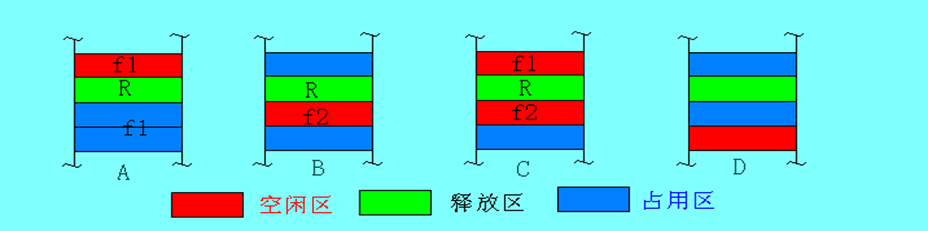

#### 4. 基于顺序搜索的动态分区分配算法

##### 1.首次适应算法（First Fit，FF）

(1)空闲分区(链)按地址递增的次序排列。

(2)在进行内存分配时,从空闲分区表(链)首开始顺序查找，直到找到第一个满足其大小要求的空闲分区为止。

(3)然后再按照作业大小，从该分区中划出一块内存空间分配给请求者，余下的空闲分区仍留在空闲分区表(链)中。

例：系统中的空闲分区表如下，现有三个作业分配申请内存空间100K、30K及7K。给出按首次适应算法的内存分配情况及分配后空闲分区表。


解：按首次适应算法，

  **申请作业100k**，分配3号分区，剩下分区为20k，起始地址160K ；

  **申请作业30k**， 分配1号分区，剩下分区为2k，起始地址50K ；

  **申请作业7k**，  分配2号分区，剩下分区为1k，起始地址59K ；

其内存分配图及分配后空闲分区表如下：

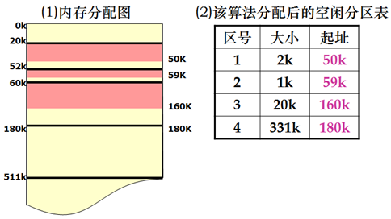

**首次适应算法的特点：**

- 优先利用内存低地址部分的空闲分区,从而保留了高地址部分的大空闲区。
- 低地址端留下许多难以利用的很小的空闲分区(碎片或零头),而每次查找又都是从低地址部分开始,这无疑增加了查找可用空闲分区的开销。

##### 2. 循环首次适应算法(Next Fit，NF)

循环首次适应算法又称为下次适应算法，由首次适应算法演变而来。

(1)在为作业分配内存空间时,从上次找到的空闲分区的下一个空闲分区开始查找,直到找到第一个能满足其大小要求的空闲分区为止。

(2)然后，再按照作业大小，从该分区中划出一块内存空间分配给请求者，余下的空闲分区仍留在空闲分区表(链)中。

例 ：系统中的空闲分区表如下，现有三个作业分配申请内存空间100K、30K及7K。给出按循环首次适应算法的内存分配情况及分配后空闲分区表。


解：按循环首次适应算法，

  **申请作业100k**，分配3号分区，剩下分区为20k，起始地址160K；

  **申请作业30k**， 分配4号分区，剩下分区为301k，起始地址210K ；

  **申请作业7k**，  分配1号分区，剩下分区为25k，起始地址27K ；

其内存分配图及分配后空闲分区表如下:

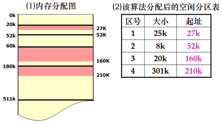

**算法特点：**

- 使存储空间的利用更加均衡，不致使小的空闲区集中在存储区的一端;

- 但这会导致缺乏大的空闲分区。

##### 3.最佳适应算法(Best Fit，BF)

**(1)**    空闲分区表(链)按容量大小递增的次序排列。

**(2)**    在进行内存分配时，从空闲分区表(链)的首开始顺序查找，直到找到第一个满足其大小要求的空闲分区为止。

按这种方式为作业分配内存，就能把既满足作业要求又与作业大小最接近的空闲分区分配给作业。

例 ：系统中的空闲分区表如下，现有三个作业分配申请内存空间100K、30K及7K。给出按最佳适应算法的内存分配情况及分配后空闲分区表。

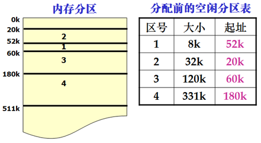

解： 申请作业100k，分配3号分区，剩下分区为20k，起始地址160K  

其内存分配图及分配后空闲分区表如下:

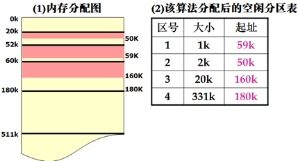

**算法特点：**

- 保留了大的空闲分区。
- 往往使剩下的空闲区非常小,从而在存储器中留下许多难以利用的小空闲区（碎片或零头）。

##### 4. 最坏适应算法(Worst Fit，WF)

(1)   空闲分区表/链按容量大小递减的次序排列。

(2)   在进行内存分配时，从空闲分区表/链首开始顺序查找，直到找到第一个比之大的空闲分区为止。剩下的空闲仍留在空闲分区表/链中。

例 ：系统中的空闲分区表如下，现有三个作业分配申请内存空间100K、30K及7K。给出按最坏适应算法的内存分配情况及分配后空闲分区表。


解：按最坏适应算法，分配前的空闲分区表如上表。

  申请作业100k，分配1号分区，剩下分区为231k,起始地址280K；

  申请作业30k， 分配1号分区，剩下分区为201k，起始地址310K ；

  申请作业7k，  分配1号分区，剩下分区为194k，起始地址317K ；

其内存分配图及分配后空闲分区表如下：


**算法特点：**

- 总是挑选满足作业要求的最大的分区分配给作业。使得剩下的空闲分区也较大，可装下其它作业。
- 当有大作业到来时，其存储空间的申请往往会得不到满足。

#### 5. 基于索引搜索的动态分区分配算法

1. 快速适应（quick fit）算法

2. 伙伴系统(buddy system)

3. 哈希算法

### 四、可重定位分区分配

#### 1. 动态重定位的引入

在连续分配方式中，必须把系统或用户程序装入一连续的内存空间。如果在系统中只有若干个小分区，即使它们的容量总和大于要装入的程序，但由于这些分区不相邻，也无法将程序装入内存。

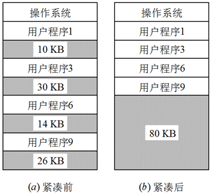

(1)移动内存中作业的位置，把原来多个分散的小空闲分区拼接成一个空闲大分区，称为“拼接”或“紧凑”。

(2)每次紧凑后，对移动了的程序或数据进行重定位(进行地址变换)。

#### 2. 动态重定位的实现

到程序指令真正执行时，才对其进行地址变换。

(1)重定位寄存器，存放程序(数据)在内存中起始地址；

(2)地址变换，即用重定位寄存器中的地址与相对地址相加；

(3)“紧凑”后，不需修改程序(数据)的相对地址，只需修改重定位寄存器中的起始地址。

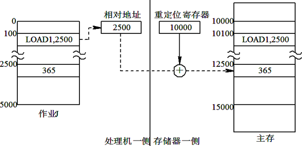

#### 3. 动态重定位分区分配算法 

动态重定位分区分配算法与动态分区分配算法基本相同，差别在于增加了紧凑的功能。

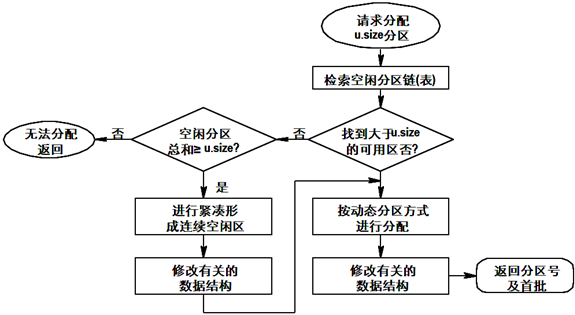

## 4.4 对换

### 多道程序环境下的对换技术 

#### 1. 对换的引入 

所谓“对换”，是指把内存中暂时不能运行的进程或者暂时不用的程序和数据，调出到外存上，以便腾出足够的内存空间，再把已具备运行条件的进程或进程所需要的程序和数据，调入内存。

对换是提高内存利用率的有效措施。

#### 2. 对换的类型 

对换包括“换出”和“换进”两个过程；在每次对换时，都是将一定数量的程序或数据换入或换出内存。根据每次对换时所对换的数量，可将对换分为如下两类：

**(1)整体对换。**

以整个进程为对换单位，叫整体对换或进程对换；

为实现进程对换，系统必须能实现三方面的功能：对换空间的管理、进程的换入和进程的换出。

**(2)页面(分段)对换。**

以“页”或“段”为对换单位，分别称“页面对换”和“分段对换”。

### 对换空间的管理

#### 1.对换空间管理的主要目标

具有对换功能的OS中，通常把外存分为文件区和对换区。

|        | 存储内容         | 驻留时间 | 主要目标                 | 分配方式 |
| ------ | ---------------- | -------- | ------------------------ | -------- |
| 文件区 | 文件             | 较长久   | 提高文件存储空间的利用率 | 离散     |
| 对换区 | 从内存换出的进程 | 短暂     | 提高进程换入和换出的速度 | 连续     |

**(1)文件区空间管理的主要目标**

- 文件区占用磁盘空间的大部分，主要用于存放各类文件。
- 对文件区的管理目标是提高文件存储空间的利用率，然后才是提高对文件的访问速度。
- 文件区的管理采用离散分配的方式。 

**(2)对换区空间管理的主要目标**

- 对换区只占用磁盘空间的小部分，用于存放从内存换出的进程。
- 对换区空间管理的主要目标是提高进程换入和换出的速度，然后才是提高空间的利用率。
- 对换区的管理采用的是连续分配方式。 

#### 2.对换区空闲盘块管理中的数据结构

用空闲分区表或空闲分区链。

每个表目中应包含两项，即对换区的首址及其大小，分别用盘块号和盘块数表示。

#### 3. 对换空间的分配与回收

对换区的分配采用的是连续分配方式，因而对换空间的分配与回收，与动态分区方式的内存分配与回收方法雷同，算法也类似。 

### 进程的换出与换入

#### 1.进程的换出

每当一进程由于创建子进程而需要更多的内存空间，但又无足够的内存空间等情况发生时，系统应将某进程换出。 

 其过程是：

**(1)选择被换出的进程。**

系统检查所有驻留内存中进程，首先选择处于阻塞状态且优先级最低的进程作为换出进程。如果系统中已无阻塞进程，则选择优先级最低的就绪进程换出。

**(2)进程换出过程。**

进程换出时，先申请对换空间，若申请成功，就启动盘块，将该进程的费非共享程序和数据传送到磁盘的对换区上。若传送过程未出现错误，便可回收该进程所占用的内存空间，并对该进程的进程控制块做相应的修改。 

#### 2.进程的换入

 系统会定时执行换入操作，具体过程：

**(1)选择换入进程。**

系统首先查看PCB表中所有进程的状态，从中找出“就绪”状态且已换出的进程，将其中换出时间(换出到磁盘上)最久的进程作为换入进程

**(2)进程的换入过程。**

为换入进程申请内存，如果申请成功，可直接将进程从外存调入内存；如果失败，则需现将内存中的某些进程换出，腾出足够的内存空间后，再将内存调入。

## 4.5 基本分页存储管理方式

连续分配方式要求把进程放在一个连续的存储区中，因而会产生许多碎片，而拼凑技术代价较高。

**离散分配方式**----允许将进程离散放到多个不相邻接的分区中。

基于这一思想产生了以下的离散分配方式：

- 分页式存储管理：离散分配的基本单位是页
- 分段式存储管理：离散分配的基本单位是段
- 段页式存储管理：离散分配的基本单位是段、页

基本的分页存储管理方式(或纯分页存储管理方式)：不具备页面对换功能，不具有支持实现虚拟存储器的功能，要求把每个作业全部装入内存后方能运行。

### 一、分页存储管理的基本方法

#### 1. 页面和物理块

**(1)页面**

将一个用户进程的地址空间(逻辑空间)划分成若干个大小相等的区域(片)，称为页或页面,并为各页从0开始编号。

**(2)物理块**

内存空间也分成若干个与页大小相等的区域(存储块)，称为(存储、物理)块或页框(frame)，同样从0开始编号。

**(3)内存分配**

在为进程分配内存时，以块为单位,将进程中若干页装入到多个可以不相邻的物理块中。

`页内碎片：最后一页常装不满一块而形成的不可利用的碎片。`

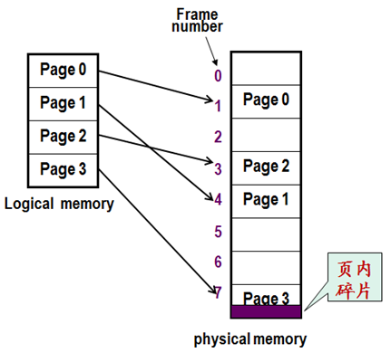

- 基本分页式存储管理（简单页式存储管理）的原理

  系统若能满足一个作业所要求的全部块数，此作业才能被装入内存，否则不为它分配任何内存。

- 请求分页式存储管理的原理

  运行一个作业时，并不要求把该作业的全部程序和数据都装入内存，可以只把目前要执行的几页调入内存的空闲块中，其余的仍保存在外存中，以后根据作业运行的需要再调入内存。

**(4)页面大小 (即每页包含的字节数)**

由机器的地址结构所决定的，即由硬件所决定

某一种机器只能采用一种大小的页面。

- 若页面较小：
  - 内碎片小，内存利用率高，但页面数目多，使页表过长，占大量内存，管理开销大

- 若页面较大：
  - 每个进程页面数减少，页表长度减少，占用内存就较小。页面换进换出速度将提高。但会增加页内碎片不利于提高内存利用率。

- 页面大小 -- 选择适中，通常为2的幂，一般在1KB-8KB之间。

#### 2. 地址结构

如果每个页面大小为2^k^B,那么末尾K位表示页内偏移量，其余部分代表页号，k代表了页内地址空间/页内内存块的数量

假设该逻辑空间地址为8位(即用8位二进制数表示)，页面大小为4B。

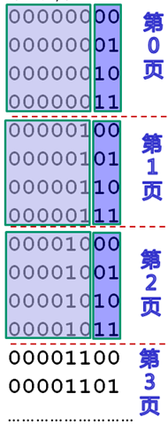

由此可知，分页后逻辑地址结构为：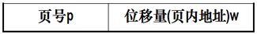

​	对于地址空间为8位，0~1表示位移量，2 ~ 7表示页号；

​	求得 总共大小=2^8^ = 4KB；位移量=2^2^=4B；页号 = 4KB/4B=1K

对应的，内存空间按照分页大小进行分块，分块后的物理地址结构为：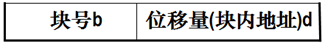


**例如：**设给定的一个逻辑地址空间中的地址A，页面大小为L。A对应的页号p和页内地址w是多少？


解：

(1) 先看A应该在哪一页中：p=int(A/L)

(2) 在看A在页内的位置：w=A mod L

假设A=2170，页面大小为1KB，则A所属页号为2，页内地址为122。

**思考：**设有一页式存储管理系统，向用户提供的逻辑地址空间最大为16页，每页2048B，内存总共有512个存储块，试问逻辑地址至少应为多少位？内存空间有多大？

解:

(1)页式存储管理系统的逻辑地址为：


其中页内地址表示每页的大小即 2048B=2*1024B=2^11^B，所以页内地址为11位。

其中页号表最多允许的页数即16页=2^4^页，所以页号为4位。

故逻辑地址至少应为15位。 

(2)物理地址为：


 其中块内地址表每块的大小与页大小相等，所以块内地址也为11位。

 其中块号表内存空间最多允许的块数即 512块=2^9^块，所以块号为9位。

 故内存空间应为20位，即内存空间大小2^20^ =1MB


#### 3. 页表

系统为每个进程建立一张从页号到物理块号的映射表，简称页表，如图。


注：

- 页表一般存放在内存中
- 常在页表中设置一存取控制字段
- 页表实现了从页号到物理块号的地址映射。

#### 对页表项大小的进一步讨论


### 二、地址变换机构

实现逻辑地址向物理地址的转换。

由于页内地址与物理地址是一 一对应的，因此，地址变换机构的任务是借助于页表，将逻辑地址中的页号转换为内存中的物理块号。

页表项用来将逻辑地址转化为物理地址，具体实现步骤为:

- 用逻辑地址高位的页号去页表项内索引，得到对应的物理帧(跟页一个概念)号
- 将物理帧号与逻辑地址地位的偏移量相加得到实际的物理地址

#### 1. 基本的地址变换机构

页表的功能可以由一组专门的寄存器来实现，一个页表项用一个寄存器。但寄存器成本高，系统页表可能很大，所以页表大多常驻内存。

在系统中只设置一个页表寄存器PTR，在其中存放页表在内存中的始址和页表的长度。平时，进程没有执行时，页表的始址和页表长度存放在进程的PCB中，当调度到进程时，才将这两个数据装入到页表寄存器中。


基本地址变换机构可以借助进程的页表将逻辑地址转换为物理地址。
通常会在系统中设置一个页表寄存器（PTR)，存放页表在内存中的起始地址F和页表长度M。进程未执行时，页表的始址和页表长度放在进程控制块（PCB）中，当进程被调度时，操作系统内核会把它们放到页表寄存器中。

注意:**页面大小是2的整数幂**

设页面大小为L，逻辑地址A到物理地址E的变换过程如下:

①计算页号Р和页内偏移量w（如果用十进制数手算，则P=A/L,
W=A%L;但是在计算机实际
运行时，逻辑地址结构是固定不变的，因此计算机硬件可以更快地得到二进制表示的页号、页内偏移量)

②比较页号P和页表长度M，若P>=M，则产生越界中断，否则继续执行。(注意:页号是从0开始的，而页表长度至少是1，因此**P=M时也会越界**)

③页表中页号P对应的**页表项地址=页表起始地址F + 页号P * 页表项长度**，取出该页表项内容b，即为内存块号。（注意区分**页表项长度、页表长度、页面大小**的区别。**页表长度**指的是这个页表中总共有几个页表项，即总共有几个页;**页表项长度**指的是每个页表项占多大的存储空间;**页面大小**指的是一个页面占多大的存储空间)

④计算E= b*L+W，用得到的物理地址E去访存。（如果内存块号、页面偏移量是用二进制表示的，那么把二者拼接起来就是最终的物理地址了)


**例1**：若在一分页存储管理系统中，某作业的页表如表所示，已知页面大小为1024B，试将逻辑地址1011，2148，5012转化为相应的物理地址？画出其地址转换图。


解：(1)

逻辑地址1011(十进制)的二进制表示为：

00**1111110011**

由此可知逻辑地址1011的页号0，查页表知该页放在第2物理块中，其物理地址的二进制表示为：

010**1111110011**

所以逻辑地址1011对应的物理地址为0BF3H。其地址转换图如下所示。

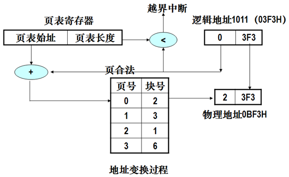

**例题加深印象：**

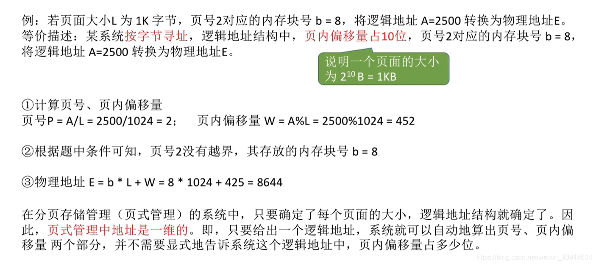

#### 2.快表的地址变换机构

**快表**，又称**联想寄存器(TLB）**，是一种**访问速度比内存快很多**的**高速缓冲存储器**，用来存放当前访问的若干页表项，以加速地址变换的过程。与此对应，内存中的页表常称为**慢表**。


**引入快表后，地址变换的过程的文字描述：**

①CPU给出逻辑地址，由某个硬件算得页号、页内偏移量，将页号与快表中的所有页号进行比较。

②如果找到匹配的页号，说明要访问的页表项在快表中有副本，则直接从中取出该页对应的内存块号，再将内存块号与页内偏移量拼接形成物理地址，最后，**访问**该物理地址对应的**内存单元**。因此，若**快表命**中，则访问某个逻辑地址仅需**一次访存**即可。

③如果没有找到匹配的页号，则需要**访问内存中的页表**，找到对应页表项，得到页面存放的内存块号，再将内存块号与页内偏移量拼接形成物理地址，最后，**访问**该物理地址对应的**内存单元**。因此，若**快表未命中**，则访问某个逻辑地址需要两次访存（**注意:在找到页表项后，应同时将其存入快表**，以便后面可能的再次访问。但若快表已满，则必须按照一定的算法对旧的页表项进行替换)

由于查询快表的速度比查询页表的速度快很多，因此只要快表命中，就可以节省很多时间。因为局部性原理，一般来说快表的命中率可以达到90%以上。

例:某系统使用基本分页存储管理，并采用了具有快表的地址变换机构。访问一次快表耗时1us，访问一次内存耗时100us。若快表的命中率为90%，那么访问一个逻辑地址的平均耗时是多少?

(1+100)* 0.9+ (1+100+100)* 0.1=111 us

有的系统支持快表和慢表同时查找，如果是这样，平均耗时应该是

(1+100)* 0.9+(100+100)*0.1=110.9 us

若未采用快表机制，则访问一个逻辑地址需要100+100 = 20ous

显然，引入快表机制后，访问一个逻辑地址的速度快多了。

#### 3.基本地址变换与快表地址变换的比较


### 三、两级和多级页表

**因为单级页表存在一些问题，所以引入二级页表和多级页表，有两个问题：**


根据局部性原理可知，很多时候，进程在一段时间内只需要访问某几个页面就可以正常运行了。因此没有必要让整个页表都常驻内存。

**上面提到了这两个问题，那么总结一下，并提出解决思想，引入二级页表的概念。**


#### 1、二级页表的原理和地址结构


- 二级页表的地址结构及对应关系

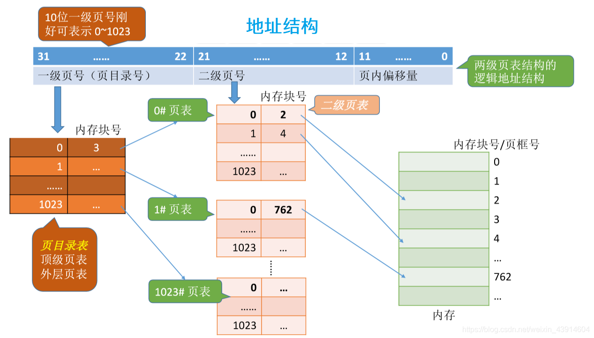

#### 2、如何实现二级页表的地址变换？


解决问题2

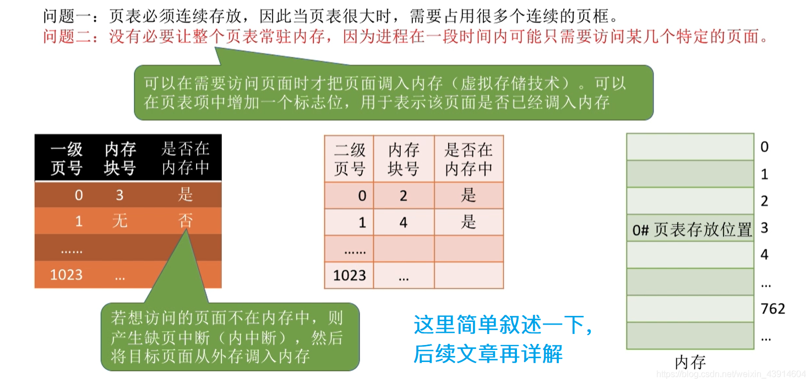

#### 3、细节

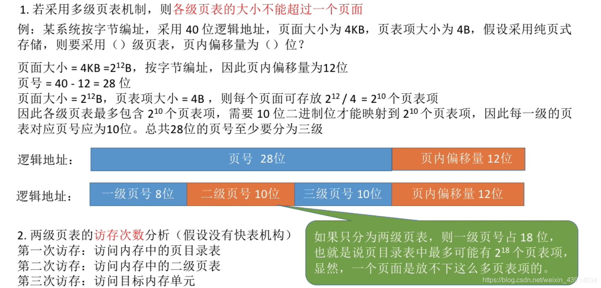

#### 4.多级页表

将外层页表再进行分页，也将各外层页表页面离散地存放在不同的物理块中，再利用第2级的外层页表来记录它们之间的对应的关系。

**逻辑地址：**


##　4.6 基本分段存储管理方式

分页存储管理方式——提高内存利用率，系统的需要

分段存储管理方式——方便用户操作，用户的需要

### 一、分段存储管理方式的引入

1.方便编程

通常，用户把自己的作业按照逻辑关系划分为若干个段，每个段都从0开始编址，并有自己的名字和长度。

逻辑地址是由段名(段号)和段内偏移量(段内地址)决定的，这不仅可以方便程序员编程，也可使程序非常直观，更具可读性。

例如，下述的两条指令便使用段名和段内地址：

MOV AX,ES:[0002H];

ADD BX,DS:[0002H];

2.信息共享

在实现对程序和数据的共享时，是以信息的逻辑单位为基础的。因此，分段存储管理方式更利于信息共享。

比如，为了共享某个过程、函数或文件。分页系统中的“页”只是存放信息的物理单位(块)，并无完整的逻辑意义，这样，一个可被共享的过程往往可能需要占用数十个页面，这为实现共享增加了困难。

3.信息保护

信息保护同样是以信息的逻辑单位为基础的，而且经常是以一个过程、函数或文件为基本单位进行保护的。因此，分段存储管理方式更利于信息共享。

比如，函数A仅允许进程执行，而不允许读，更不允许写，只需在包含函数A的这个段上标上只执行标志即可。

4.动态增长

在实际应用中，往往存在着一些段，尤其是数据段，在它们的使用过程中，由于数据量的不断增加，而使数据段动态增长，相应地它所需要的存储空间也会动态增加。然而，对于数据段究竟会增长到多大，事先又很难确切地知道。对此，很难采取预先多分配的方法进行解决。

5.动态链接

动态链接要求的是以目标程序(段)作为链接的基本单位的，因此，分段存储管理方式是非常适合动态链接的。

### 二、分段系统的基本原理

#### 1. 分段

进程的地址空间:按照程序**自身的逻辑**关系**划分为若干个段**，每个段都有一个段名（在低级语言中，程序员使用段名来编程)，**每段从0开始编址**

内存分配规则:以段为单位进行分配，**每个段在内存中占据连续空间**，但**各段之间可以不相邻**。

(1)**段号**：每段的名字

(2)**段内地址**：从0开始，一段连续的地址空间

(3)**段长度**：由各自的逻辑信息组的长度决定，各段长度不等

(4)**分段地址的结构**：整个作业的地址空间由于是分成多个段，因而是二维的，亦即，其逻辑地址由段号(段名)和段内地址所组成。 

##### 分段的逻辑地址结构

分段系统的逻辑地址结构由段号（段名）和段内地址（段内偏移量）所组成。


#### 2.段表

为每个段分配一个连续的分区，而进程中的各个段可以离散地移入内存中不同的分区中。

从物理内存中找出每个逻辑段所对应的位置，在系统中为每个进程建立一张段映射表，简称“段表”。

(1)每个段在表中占有一个表项，其中记录了该段在内存中的**起始地址**(又称为“基址”)和**段的长度**；

(2)段表常驻内存

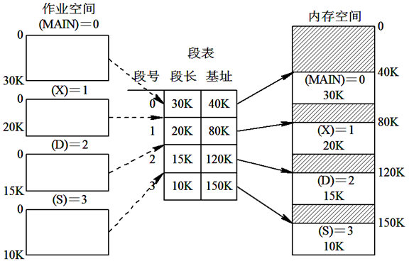

各个段表项的长度是相同的。例如:某系统按字节寻址，采用分段存储管理，逻辑地址结构为（段号16位,段内地址16位)，因此用16位即可表示最大段长。物理内存大小为4GB(可用32位表示整个物理内存地址空间）。因此，可以让每个段表项占16+32= 48位，即6B。由于段表项长度相同，因此段号可以是隐含的，不占存储空间。若段表存放的起始地址为M，则K号段对应的段表项存放的地址为M+K*6

#### 3.地址变换

分段式存储管理系统中，为了实现从进程的逻辑地址到物理地址的变换功能。

设置段表寄存器，用于存放段表始址和段表长度TL。

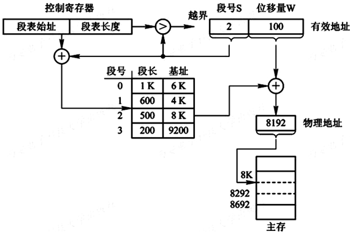

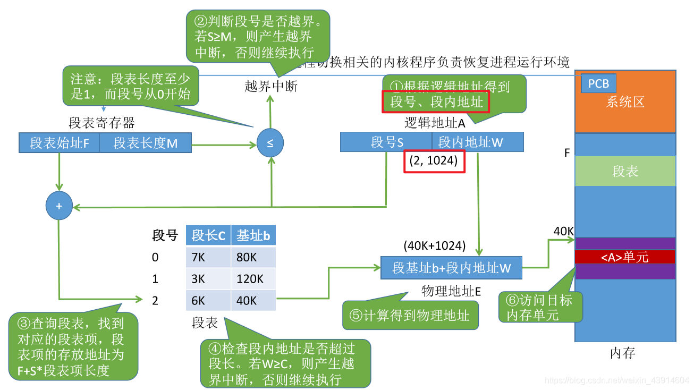

#### 4. 分页和分段的主要区别


### 三、信息共享

分段系统的一个突出优点，是易于实现段的共享，即允许若干个进程共享一个或多个分段，且对段的保护也十分简单易行。

例如，有一个多用户系统，可同时接纳40个用户，他们都执行一个文本编辑程序(Text Editor)。已知文本编辑程序有160 KB的代码和另外各用户所需40 KB的数据区。

无论是在分页系统还是在分段系统中，该代码都能被共享，在内存中只需保留一份文本编辑程序的副本，此时所需的内存空间仅为1760 KB(40×40+160)，而不是8000 KB。

#### 1. 分页系统中的程序和数据共享

假设每页的大小为4k，则分页系统的共享如图：

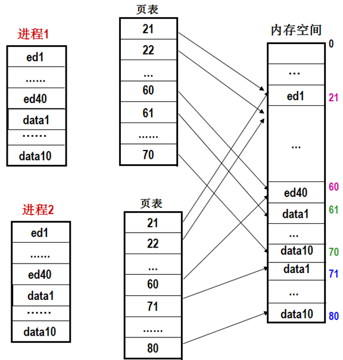

#### 2. 分段系统中的程序和数据共享

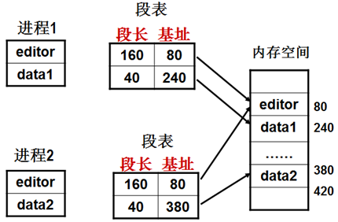

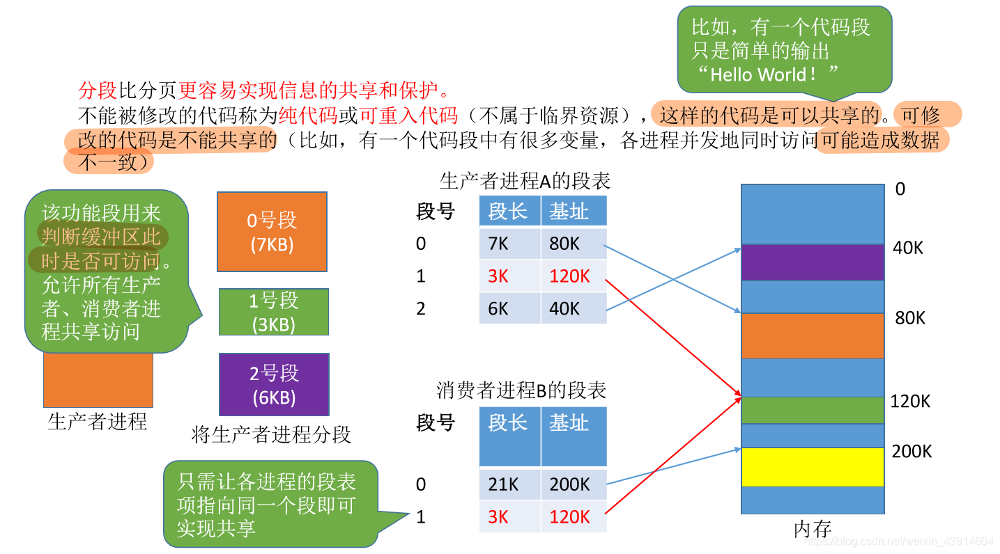

#### 为什么分页不方便实现信息共享和保护？

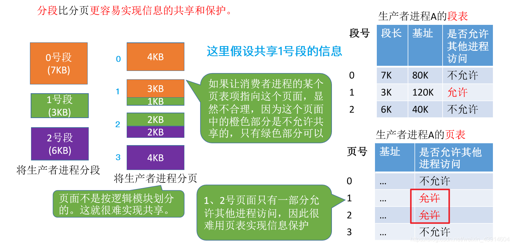

## 4.7 段页式存储管理方式

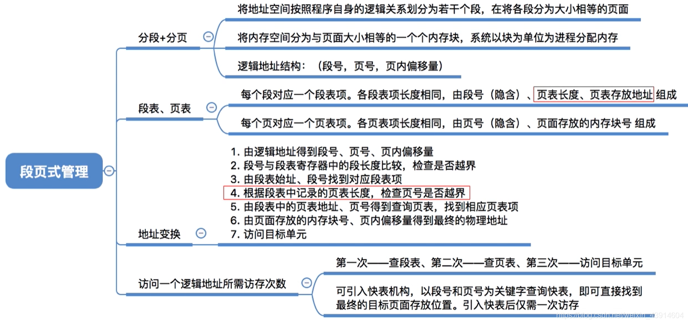

### 1.分页、分段的优缺点分析

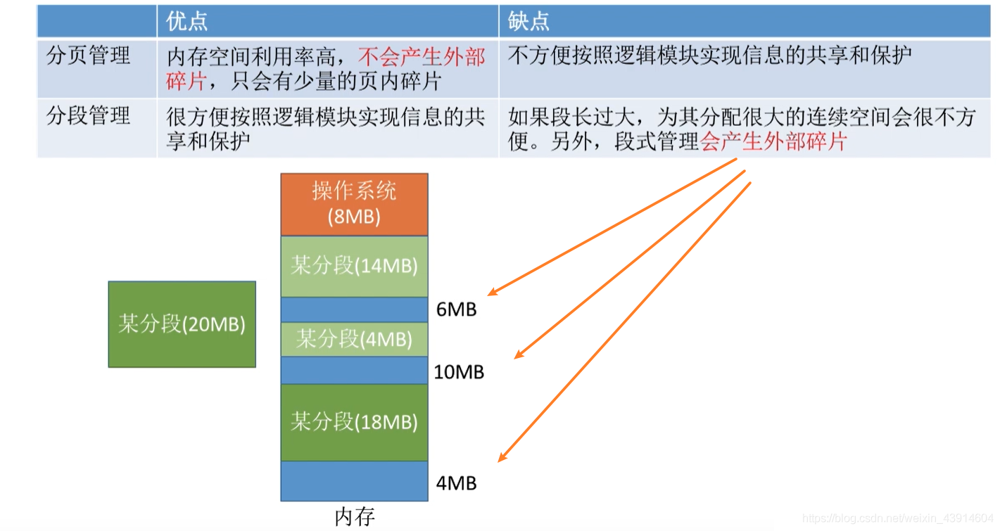

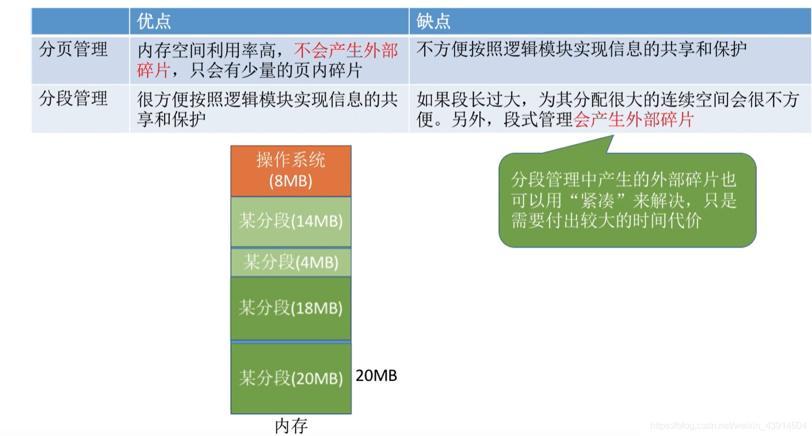

### 2.分段+分页=段页式管理


#### 段页式管理的逻辑地址结构


#### 段页式存储的段表、页表


### 3.段页式管理的地址转换过程


## 4.8 虚拟存储器概述

**常规存储管理方式的共同点：**要求一个作业全部装入内存后方能运行。

**问题：**

(1)有的作业很大,所需内存空间大于内存总容量,使作业无法运行。

(2)有大量作业要求运行，但内存容量不足以容纳下所有作业，只能让一部分先运行，其它在外存等待。

**解决方法：**

（1）增加内存容量。

（2）从逻辑上扩充内存容量

​		----对换

​		----虚拟存储器

### 一、常规存储管理方式的特征和局部性原理

#### 1.常规存储器管理方式的特征


#### 2.局部性原理


#### 3.虚拟存储器的概念

- 基于局部性原理，程序在运行之前，没有必要全部装入内存，仅须将当前要运行的页(段)装入内存即可。
- 运行时，如访问的页(段)在内存中，则继续执行，如访问的页未在内存中(缺页或缺段)，则利用OS的请求调页(段)功能，将该页(段)调入内存。
- 如内存已满，则利用OS的页(段)置换功能，按某种置换算法将内存中的某页(段)调至外存，从而调入需访问的页。

### 二、虚拟存储器的定义和特征

#### 1、虚拟存储器的定义

- 虚拟存储器是指仅把作业的一部分装入内存便可运行作业的存储管理系统，它具有**请求调入功能**和**置换功能**，能从逻辑上对内存容量进行扩充的一种存储器系统。

- 其逻辑容量由外存容量和内存容量之和决定，其运行速度接近于内存，成本接近于外存。

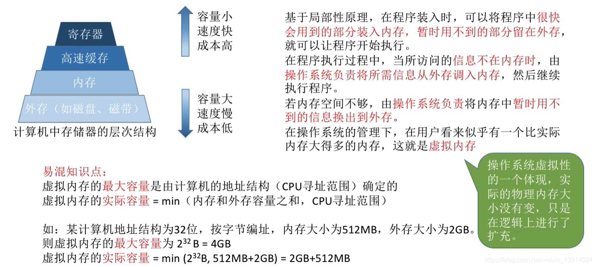

#### 2、虚拟存储器的特征

虚拟内存有一下三个主要特征:

- 多次性:无需在作业运行时一次性全部装入内存，而是允许被分成多次调入内存。（一个作业的程序和数据分多次装入内存）

- 对换性:在作业运行时无需一直常驻内存，而是允许在作业运行过程中，将作业换入、换出。

  也就是（一个作业的程序和数据在运行过程中允许进行换进换出）

- 虚拟性:从逻辑上扩充了内存的容量，使用户看到的内存容量，远大于实际的容量。

#### 3、如何实现虚拟内存技术


##### 1. 分页请求系统

在分页系统的基础上，增加了请求调页功能、页面置换功能所形成的页式虚拟存储器系统。

它允许只装入若干页的用户程序和数据，便可启动运行，在硬件支持下通过调页功能和置换页功能，陆续将要运行的页面调入内存，同时把暂不运行的页面换到外存上，置换时以页面为单位。

**软硬件支持：**

（1）硬件支持：请求分页的页表机制、缺页中断机构和地址变换机构。

（2）软件：请求调页功能和页置换功能的软件。

##### 2. 分段请求系统

在分段系统的基础上，增加了请求调段功能及分段置换功能，所形成的段式虚拟存储器系统。

它允许只装入若干段的用户程序和数据，便可启动运行，在硬件支持下通过请求调段功能和分段置换功能，陆续将要运行的段调入内存，同时把暂不运行的段换到外存上，置换时以段为单位。

**软硬件支持：**

（1）硬件支持：请求分段的段表机制、缺段中断机构和地址变换机构

（2）软件：请求调段功能和段置换功能的软件

## 4.9 OS之请求分页管理方式


### 一、请求分页中的硬件支持

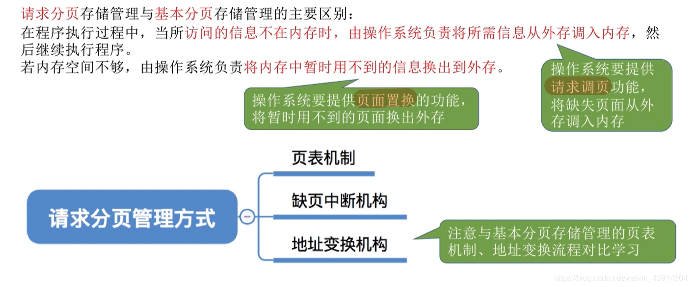

#### 1.请求页表机制

**请求页表与基本页表的区别**

与基本分页管理相比，请求分页管理中，为了实现“请求调页”，操作系统需要知道每个页面是否已经调入内存;如果还没调入，那么也需要知道该页面在外存中存放的位置。

当内存空间不够时，要实现“页面置换”，操作系统需要通过某些指标来决定到底换出哪个页面;有的页面没有被修改过，就不用再浪费时间写回外存。有的页面修改过，就需要将外存中的旧数据覆盖，因此，操作系统也需要记录各个页面是否被修改的信息。


（1）**状态位 P**：指示该页是否已调入内存。供程序访问时参考。

（2）**访问字段 A**：记录本页在一段时间内被访问的次数或最近未被访问的时间。供选择换出页面时参考。

（3）**修改位 M**：表示该页在调入内存后是否被修改过。若修改过，则换出时需重写至外存。供置换页面时参考。

（4）**外存地址**：指出该页在外存上的地址。供调入该页时参考。


#### 2.缺页中断机构

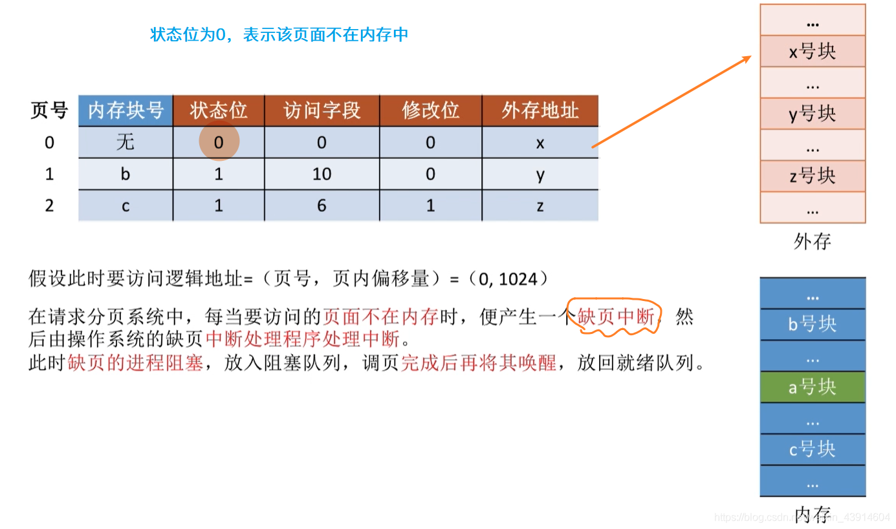


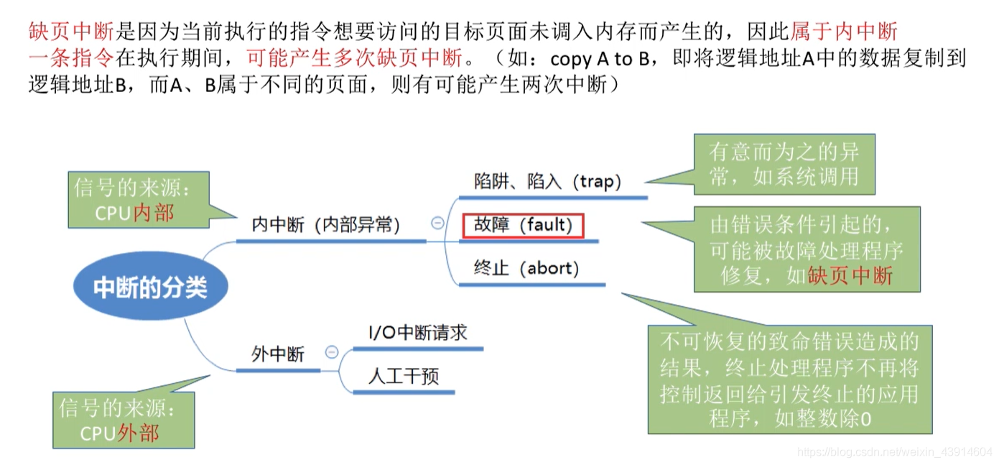

#### 3.地址变换机构


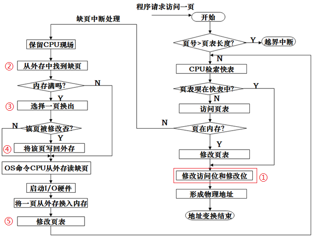

补充细节:

①只有“写指令”才需要修改“修改位”。并且，一般来说只需修改快表中的数据，只有要将快表项删除时才需要写回内存中的慢表。这样可以减少访存次数。

②和普通的中断处理一样，缺页中断处理依然需要保留CPU现场。

③需要用某种“页面置换算法”来决定一个换出页面（下节内容)

④换入/换出页面都需要启动慢
速的I/O操作，可见，如果换入/换出太频繁，会有很大的开销。

⑤页面调入内存后，需要修改慢表，同时也需要将表项复制到快表中。

在具有快表机构的请求分页系统中，访问一个逻辑地址时，若发生缺页，则地址变换步骤是:
查快表(未命中)――查慢表(发现未调入内存)―一调页(调入的页面对应的表项会直接加入快表)――查快表(命中)—―访问目标内存单元

**地址变换例题**

某虚拟存储器的用户空间共有32个页面，每页1KB，主存16KB。假定某时刻系统为用户的第0、1、2、3页分别分配的物理块号为5、10、4、7，试将虚拟地址0A5C和093C变换为物理地址。

**解：**

逻辑地址结构为：

页号（2^5^=32）5位 

页内位移（2^10^=1024）10位

物理地址结构为：

物理块号（2^4^=16）4位 块内位移（2^10^=1024）10位

虚拟地址0A5C对应的二进制为：

00010 1001011100

即虚拟地址0A5C的页号为2，页内位移为1001011100，由题意知对应的物理地址为：0100 1001011100即125C

同理求093C。

### 二、请求分页中的内存分配

在请求分页系统中，为进程分配内存时将涉及以下三个问题：

#### 1.最小物理块数的确定

最小物理块数指能保证进程正常运行所需的最小的物理块数，与计算机的硬件结构有关，取决于指令的格式、功能和寻址方式。

#### 2.内存分配策略

**（1）固定分配局部置换：**

为每个进程分配固定数目n的物理块，在整个运行中都不改变。如出现缺页，只能从该进程的页面中选中一页换出，再调入所需页。

**（2）可变分配全局置换：**

分配固定数目的物理块，但OS自留一空闲块队列，若发现缺页，则从空闲块队列中分配一空闲块与该进程，并调入缺面于其中。当空闲块队列用完时，OS才从内存中任选一页置换。

**（3）可变分配局部置换：**

分配一定数目的物理块，若发现缺页，则从该进程的页面中置换一页，根据该进程缺页率高低，则可增加或减少分配给该进程的物理块。


#### 3.物理块分配算法

在采用固定分配策略时，将系统中可供分配的所有物理块分配给各个进程，可采用以下几种算法：

**（1）平均分配算法**：平均分配给各个进程。

**（2）按比例分配算法**：根据进程的大小按比例分配给各个进程。

**（3）考虑优先权的分配算法**：将系统提供的物理块一部分根据进程大小先按比例分配给各个进程，另一部分再根据各进程的优先权适当增加物理块数。

### 三、页面调入策略

调入策略决定什么时候将一个页面由外存调入内存，从何处将页面调入内存。

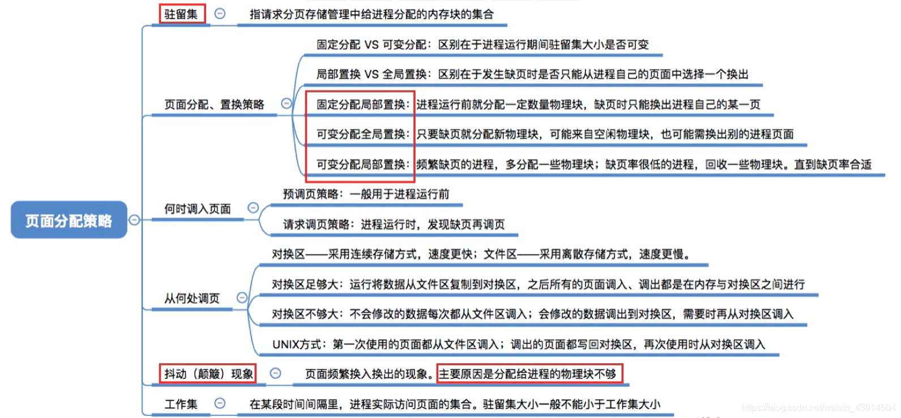

#### 1.何时调入页面 

为了确定系统将进程运行时所缺页面调入内存的时机，可采取预调页策略或请求调页策略。

**（1）预调页策略：**

采用以预测为基础的预调页策略，将那些预计在不久之后便会被访问的页面，预先调入内存。

 主要用于进程的首次调入时，由程序员指出应该先调入哪些页。

- 这是一种基于局部性原理的预测。
- 若预调入的页面在以后很少被访问，则造成浪费，故这种方式常用于程序的首次调入。

**（2）请求调页策略：**

当进程运行中访问的页出现缺页时，则发出缺页中断，提出请求调页，由OS将所需页调入内存。这种策略实现简单，应用于目前的虚拟存储器中，但易产生较多的缺页中断，且每次调一页，系统开销较大，容易产生抖动现象。


优点：由请求调页策略所确定调入的页，一定会被访问；请求调页策略比较容易实现。

缺点：每次仅调入一页，需花费较大的系统开销，增加了磁盘 I/O的启动频率。


#### 2.从何处调入页面 

通常将请求分页系统中的外存分为文件区和对换区，文件区按离散分配方式存放文件，对换区按连续分配方式存放对换页。

每当发生缺页时，系统应从何处将缺页调入内存，可分为：

- 系统拥有足够的对换区空间：可以全部从对换区调入所需页面，以提高调页速度。

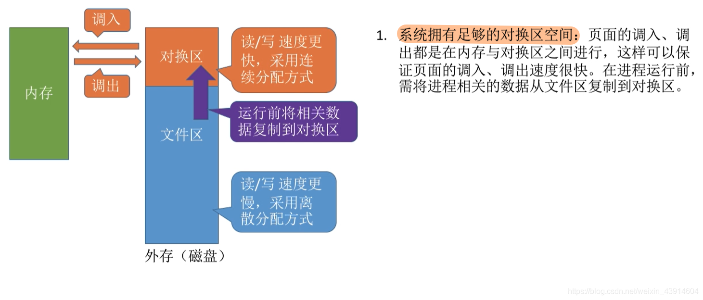

- 系统缺少足够的对换区空间：凡不会被修改的文件，直接从文件区调入；当换出这些页面时，因为未修改不用换出，再调入时仍从文件区调入。可能被修改的部分，换出时需调到对换区，换入时从对换区调入。

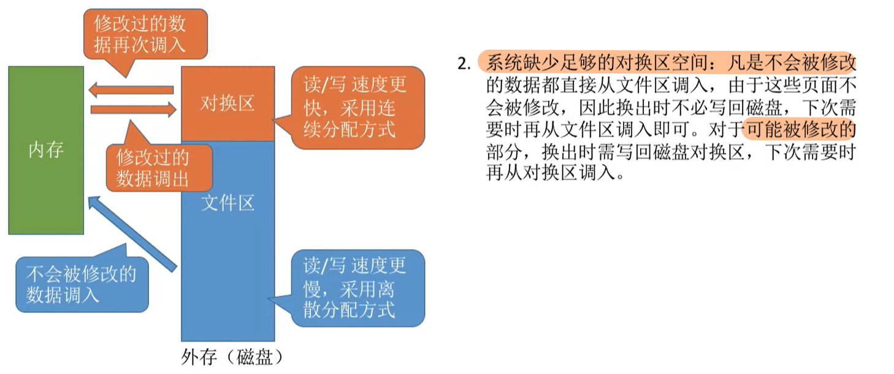

- UNIX方式：与进程有关的文件放在文件区，故未运行的页面应从文件区调入。曾经运行但又被换出的页面被放在对换区，下次调入应从对换区调入。进程请求的共享页面可能已被其他进程调入，无需再从对换区调入。


#### 3.页面调入过程

（1）每当程序所要访问的页面未在内存时，便向CPU发出一缺页中断，中断处理程序首先保护CPU环境，分析中断原因后，转入缺页中断处理程序。

（2）程序通过查找页表，得到该页在外存上的物理块后，如果此时内存能容纳新页，则启动磁盘I/O将所缺之页调入内存，然后修改页表。

（3）如果内存已满，则需按照某种置换算法从内存中选出一页准备换出；如果该页未被修改过，可不必写回磁盘；但如果此页已被修改，则必须将它写回磁盘，然后把所缺的页调入内存，并修改页表中的相应表项，置其存在位为“1”，并将此页表项写入快表。

（4）在缺页调入内存后，利用修改后的页表，形成所要访问的物理地址，再去访问内存数据。整个页面调入过程对用户是透明的

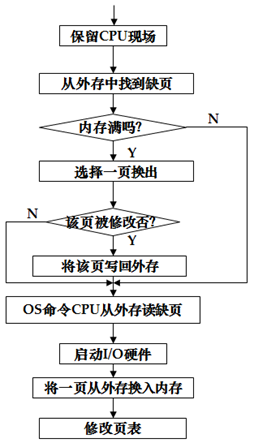

#### 4.缺页率

假设一个进程的逻辑空间为n页，系统为其分配的内存物理块数为m(m≤n)。如果在进程的运行过程中，访问页面成功(即所访问页面在内存中)的次数为S，访问页面失败(即所访问页面不在内存中，需要从外存调入)的次数为F，则该进程总的页面访问次数为A=S+F，那么该进程在其运行过程中的缺页率即为：
$$
f=\frac FA
$$
缺页率受到以下几个因素的影响：

(1)页面大小

(2)进程所分配物理块数目

(3)程序固有特性

## 4.10 页面置换算法

在进程运行过程中，若其访问的页面不在内存而需将其调入，但内存已无空闲空间时，需从内存中调出一页程序或数据，送入磁盘的对换区。但应将哪个页面调出，需根据一定的算法来确定。把选择换出页面的算法称为页面置换算法，其好坏直接影响系统的性能。

一个好的置换算法应具有较低的页面更换频率。从理论上讲，应将那些以后不会再访问的页面换出，或者把那些在较长时间内不会再访问的页面换出。

### 一、最佳置换算法—OPT

最佳置换算法是一种理想化的算法，具有最好的性能，但难于实现。先进先出置换算法最直观，但可能性能最差，故应用极少。

其所选择的**被淘汰页面**，将是**以后永不再用的**，或许是**在最长(未来)时间内不再被访问的**页面。

优点：保证获得最低的缺页率

缺点：无法预知一个进程在内存的若干个页面，哪个在未来最长时间内不再被访问。

**算法无法实现，但可评价其他算法。**

**例:**假设系统为某进程分配了三个内存块，并考虑到有一下页面号引用串（会依次访问这些页面):

7,0,1,2,0,3,0,4,2,3,0,3,2,1,2,0,1,7,0,1

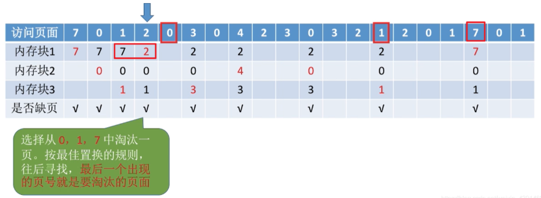

整个过程缺页中断发生了9次，页面置换发生了6次。

注意:缺页时未必发生页面置换。若还有可用的空闲内存块，就不用进行页面置换。

缺页率=9/20= 45%


### 二、先进先出置换算法—FIFO

算法总是**淘汰最先进入内存的页面**，即选择在内存中驻留时间最久的页面予以淘汰。

**算法实现**简单：把调入内存的页面根据调入的先后顺序排成一个队列，需要换出页面时选择队头页面即可。

算法与进程的实际运行规律不相适应，因为进程中的某些页面经常被访问，但先进先出置换算法不能保证这些页面不被淘汰。

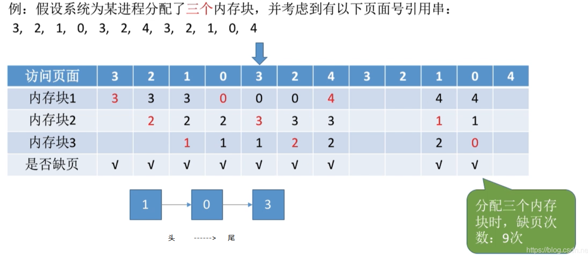

#### Belady现象

如果对—个进程未分配它所要求的全部页面，有时就会出现分配的页面数增多但缺页率反而提高的异常现象。发生在FIFO（先进先出）置换算法。

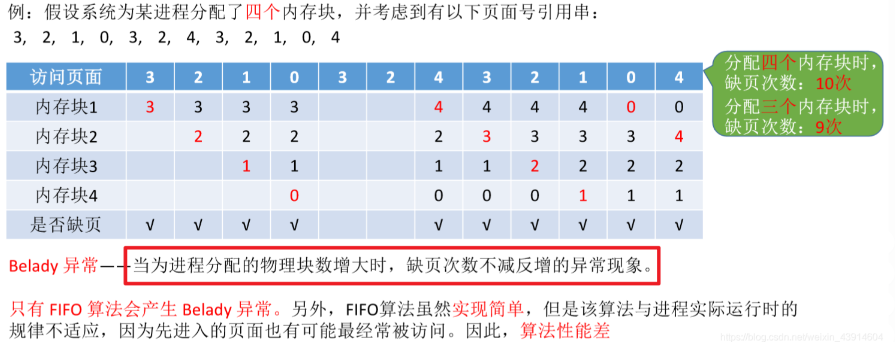

**练习：**

在一个请求分页系统中，采用FIFO页面置换算法时，假如一个作业的页面访问顺序为4，3，2，1，4，3，5，4，3，2，1，5，当分配给该作业的物理块数M分别为3和4时，试计算访问过程中所发生的缺页次数(包含初始装入次数) A 和 B ，缺页率分别为A/C和B/C，其中 C 为访问次数。比较所得的结果为 D  。

A=9；B=10；C=12；D=存在奇异现象（Bleady），即存储块增加，缺页次数反而增加

### 三、最近最久未使用置换算法—LRU

算法根据页面调入内存后的使用情况进行决策。由于无法预测各页面将来的使用情况，只能利用“最近的过去”作为“最近的将来”的近似，因此，LRU置换算法是选择最近最久未使用的页面予以淘汰。

每次**淘汰的页面**是**最近最久没有使用的页面**

**实现方法：该算法赋予每个页面一个访问字段，用来记录一个页面****自上次被访问以来所经历的时间t**，当需淘汰一个页面时，选择现有页面中其**t值最大**的，即最近最久未使用的页面予以淘汰。

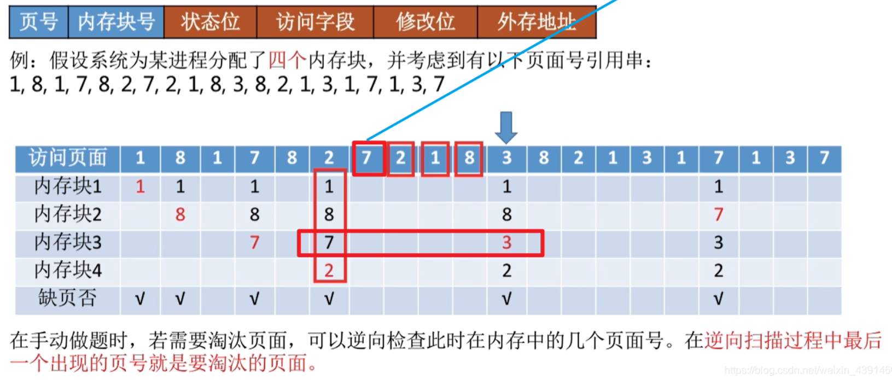

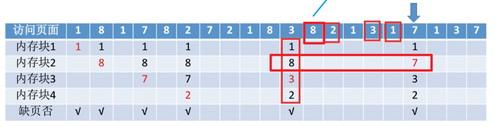

该算法的实现需要专门的硬件支持,虽然算法性能好，但是实现困难，开销大

#### LRU置换算法的硬件支持（实现）

LRU置换算法虽然较好，但需较多的硬件支持，为了了解一个进程在内存中的各个页面各有多少时间未被进程访问，以及如何快速地知道哪一页是最近最久未使用的页面，需有以下两类硬件之一的支持：

- 寄存器
- 栈

**（1）寄存器**

为内存中每个页面设立一个移位寄存器记录页面的访问情况。可表示为：R=R~n-1~R~n-2~ R~n-3~ … R~2~R~1~R~0~

当进程访问某物理块时，要将相应寄存器的最高位Rn-1位置成1。此时，定时信号将每隔一定时间(例如100 ms)将寄存器右移一位。

如果我们把n位寄存器的数看作是一个整数，那么，**具有最小数值的寄存器所对应的页面，就是最近最久未使用的页面。**

例如：下表中，第3页是最近最久未被访问的页。

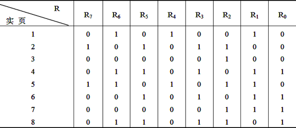

**（2）栈**

利用一个特殊的栈来保存当前使用的各个页面的页面号。每当进程访问某页面时，便将该页面的页面号从栈中移出，将它压入栈顶。因此，栈顶始终是最新被访问页面的编号，而栈底则是最近最久未使用页面的页面号。

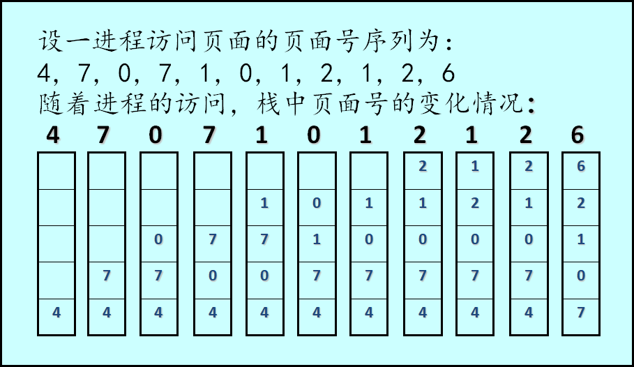

### 四、时钟置换算法—CLOCK

最佳置换算法性能最好，但无法实现;先进先出置换算法实现简单，但算法性能差;最近最久未使用置换算法性能好，是最接近OPT算法性能的，但是实现起来需要专门的硬件支持，算法开销大。

#### 1、简单的CLOCK算法

**时钟置换算法**是一种性能和开销较均衡的算法，又称CLOCk算法，或最近未用算法（NRU，NotRecently Used)是LRU 和FIFO的折衷。

**简单的CLOCK算法**实现方法:为每个页面设置一个**访问位**，再将内存中的页面都通过链接指针**链接成一个循环队列**。当某页被访问时，其访问位置为1。`当需要淘汰一个页面时，只需检查页的访问位。如果是0，就选择该页换出;如果是1，则将它置为0，暂不换出，继续检查下一个页面，若第一轮扫描中所有页面都是1，则将这些页面的访问位依次置为0后，再进行第二轮扫描（第二轮扫描中一定会有访问位为0的页面，`因此**简单的CLOCK算法选择一个淘汰页面最多会经过两轮扫描)**


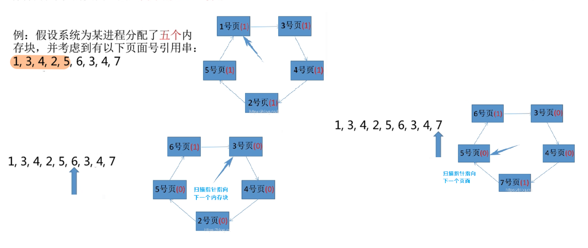

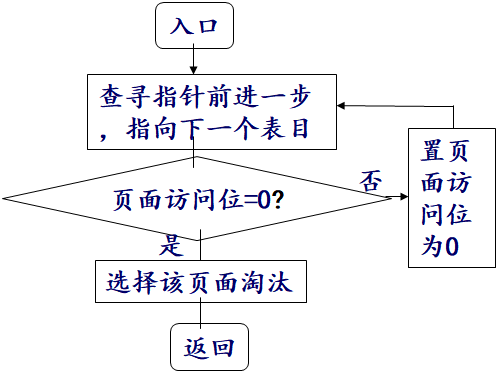

#### 2、改进的Clock置换算法

**简单的时钟置换算法**仅考虑到一个页面最近是否被访问过。事实上，如果被淘汰的页面没有被修改过，就不需要执行I/O操作写回外存。**只有被淘汰的页面被修改过时，才需要写回外存。**
因此，除了考虑一个页面最近有没有被访问过之外，操作系统还应考虑页面有没有被修改过。**在其他条件都相同时，应优先淘汰没有修改过的页面，避免I/O操作。**这就是改进型的时钟置换算法的思想。

修改位=0，表示页面没有被修改过;修改位=1，表示页面被修改过。

为方便讨论，用（访问位，修改位）的形式表示各页面状态。如
(1，1）表示一个页面近期被访问过，
且被修改过。

由访问位A和修改位M可以组合成下面四种情况：

​	1类(A=0,M=0) —最佳淘汰页；

​	2类(A=0,M=1)

​	3类(A=1,M=0)

​	4类(A=1,M=1)

**页面置换的执行过程：**

(1)  从指针当前位置开始扫描循环队列，寻找第一类页面，将所遇到的第一个此类的页面作为淘汰页。此轮扫描不改变访问位A；

(2)  如果第一步失败，则开始第二轮扫描，寻找第二类页面，将所遇到的第一个这类页面作为淘汰页。在第二轮扫描期间，所有扫描过的页面访问位都置为0；

(3)  如果第二步失败，则将指针返回到开始位置，并将所有访问位复0。然后重复第一步寻找第一类页面，如果仍失败，必要时重复第二步，寻找第二类页面，此时必能找到。


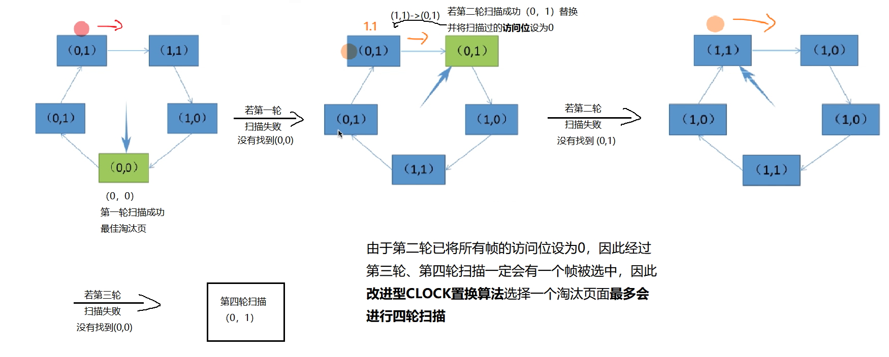

### 五、其它置换算法

####  1.最少使用置换算法LFU（Least Frequently Used) 

选择到**当前时间**为止**被访问次数最少**的页面被置换；

- 基本方法

  记录每个页面的访问次数，最少访问的页面首先考虑淘汰。 

- 实际采取方法
  
  - 为页面设置移位寄存器。

 与LRU的区别：R1=10000000

​                            R2=01110100

 LRU----------淘汰R2

 LFU----------淘汰R1

#### 2.页面缓冲算法PBA(Page Buffering Algorithm)

该算法在页面分配时，采用**可变分配**和**局部置换**的方式。

被置换页面的选择和处理：用FIFO算法选择被置换页，把被置换的页面放入两个链表之一。如果页面未被修改，就将其归入到空闲页面链表的末尾，否则将其归入到已修改页面链表。

当有一个未被修改的页要换出时，实际上并不将它换出内存，而是把它挂在自由页链表的未尾；类似的置换一个已修改的页面时，将其挂在修改页面链表的未尾。

空闲页面和已修改页面，仍停留在内存中一段时间，如果这些页面被再次访问，只需较小开销，而被访问的页面可以返还作为进程的内存页。

当已修改页面达到一定数目后，再将它们一起写回到磁盘上，然后将它们归入空闲页面链表，这样能大大减少I/O操作的次数。

## 4.11 请求分段存储管理方式

在请求分段系统中，程序运行之前，只需先调入若干个分段(不必调入所有的分段)，便可启动运行。当所访问的段不在内存中时，可请求OS将所缺的段调入内存。

### 一、请求分段中的硬件支持

#### 1. 段表机制

在请求分段系统中所需要的主要数据结构是段表。由于在应用程序的许多段中，只有部分段装入内存，其余的一些段仍留在外存上，故需在段表中增加若干项，以供程序在调进、调出时参考。

请求分段系统中的段表项：


(1) 存取方式：用于标识本分段的存取属性。（执行、只读、允许读/写）

(2) 访问字段A：用于记录本段被访问的频繁程度。

(3) 修改位M：表示该段在调入内存后是否被修改过。

(4) 存在位P：指示该段是否已调入内存。

(5) 增补位：用于表示该段在运行中是否做过动态增长。

(6) 外存地址：用于指出该段在外存上的起始地址(盘块号)。

#### 2.缺段中断机构

在请求分段系统中，每当发现运行进程所要访问的段尚未调入内存时，便由缺段中断机构产生一缺段中断信号，进入OS后由缺段中断处理程序将所需的段调入内存。

缺段中断同样需要在一条指令的执行期间，产生和处理中断，以及在一条指令执行期间，可能产生多次缺段中断。但不会出现一条指令被分割在两个分段中或一组信息被分割在两个分段中的情况。

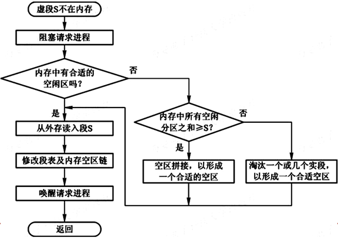

#### 3.地址变换机构

请求分段系统中的地址变换机构，是在分段系统地址变换机构的基础上形成的。

因为被访问的段并非全在内存，因而在地址变换时，若发现要访问的段不在内存，必须先将所缺的段调入内存，并修改段表，然后才能利用段表进行地址变换。

在地址变换机构中需增加缺段中断的处理及请求等功能。

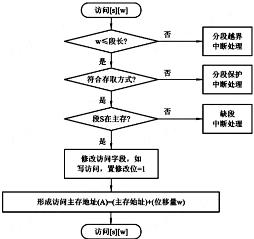

### 二、分段的共享与保护

#### 1.共享段表

为了实现共享，可在内存中配置一张共享段表，所有各共享段都在共享段表

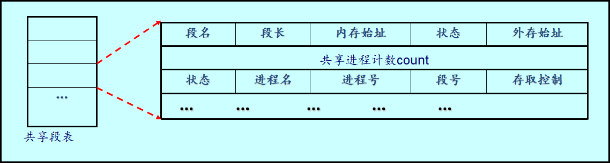

段号：对于一个共享段，不同的进程可以各用不同的段号去共享该段。

#### 2. 共享段的分配与回收

1) 共享段的分配

为共享段分配内存时，对第一个请求使用该共享段的进程，由系统为该共享段分配一物理区，再把共享段调入该区，同时将该区的始址填入请求进程的段表的相应项中，还须在共享段表中增加一表项，填写有关数据，把count置为1；之后，当又有其他进程需要调用该共享段时，无需再为该段分配内存，只需在调用进程的段表中，增加一表项，填写该共享段的物理地址；在共享段的段表中，填上调用进程的进程名、存取控制等，再执行count:=count+1操作。

2) 共享段的回收

当共享该段的进程不再需要该段时，应将该段释放，包括撤消在该进程段表中共享段所对应的表项，以及执行count:=count-1操作。如果结果为0，则需由系统回收该共享段的物理内存，以及取消在共享段表中该段所对应的表项，否则只取消调用者进程在共享段表中的有关记录。

#### 3. 分段保护

1）越界检查

段表寄存器存放了段表长度；同样，在段表中也存放了每个段的段长。在进行存储访问时，将段号与段表长度比较，段内地址与段长比较。

2）存取控制检查

段表中的每个表项都设置了“存取控制”字段，用于规定该段的访问方式: 只读； 只执行； 读/写

3）环保护机构

规定：低编号的环具有高优先权。OS核心处于0 环内。

遵循的原则：

 一个程序可以访问驻留在相同环或较低特权环中的数据。

 一个程序可以调用驻留在相同环或较高特权环中的服务。

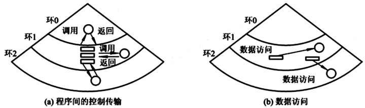

# 五、设备管理

## 5.1 I/O设备的概念和分类

### 一、什么是I/O设备、设备分类


#### 1.什么是I/O设备？

“I/O”就是“输入/输出”( Input/Output)

I/O 设备就是可以将数据输入到计算机，或者可以接收计算机输出数据的外部设备，属于计算机中的硬件部件。

- 鼠标、键盘――典型的输入型设备

- 显示器――输出型设备

- 移动硬盘――即可输入、又可输出的设备

UNIX系统将外部设备抽象为一种特殊的文件，用户可以使用与文件操作相同的方式对外部设备进行操作。

Write操作:向外部设备写出数据

Read操作:从外部设备读入数据

#### 2.I/O设备的分类

##### （1）按使用特性分类

- 人机交互类外部设备
  - 数据传输速度慢 
  - 鼠标、键盘、打印机等
- 存储设备：
  - 数据传输速度快
  - 移动硬盘、光盘等
- 网络通信设备
  - 数据传输速度介于上述二者之间
  - 调制解调器等

##### （2）按传输速率分类

- 低速设备
  - 传输速率为每秒几个到几百字节
  - 鼠标、键盘等
    

- 中速设备
  - 传输速率为每秒数千至上万个字节
  - 如激光打印机等

- 高速设备
  - 传输速率为每秒数千字节至千兆字节的设备
  - 磁盘

##### （3）按信息交换单位分类

- 块设备
  - 传输速率较高，可寻址，即对它可随机地读/写任一块
  - 磁盘——数据传输的基本单位是块
- 字符设备
  - 传输速率较慢，不可寻址，在输入/输出时常采用中断驱动方式
  - 鼠标、键盘——数据传输的基本单位是字符。

##### （4）设备按其共享属性分类

- 独占设备
  - 指在一段时间内只允许一个用户（进程）访问的设备，即临界资源。应互斥的访问独占设备。
- 共享设备
  - 指在一段时间内允许多个进程同时访问的设备。而某一时刻仍然是一个进程访问。如磁盘。
- 虚拟设备
  - 指通过虚拟技术将一台独占设备变换为若干台逻辑设备，供若干个用户（进程）同时使用。

#### 3.设备与控制器之间的接口

 通常设备并不是直接与CPU进行通信，而是与设备控制器通信，因此，在设备与设备控制器之间有一接口，在该接口中有三种类型的信号，各对应一条信号线。

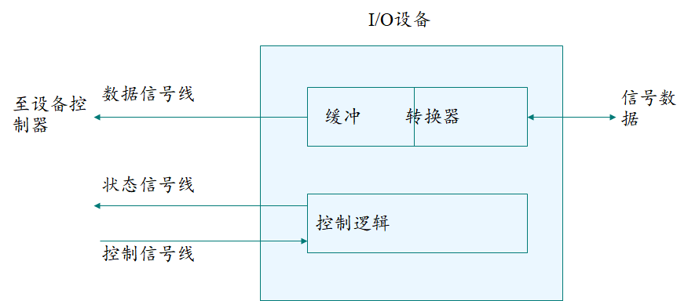

- 数据信号线
  -  用于在设备和设备控制器之间传送数据信号。
- 控制信号线
  -  作为设备控制器向I/O设备发送控制信号的通路。该信号 规定了设备将要执行的操作。

- 状态信号线
  - 用于传送指示设备当前状态的信号。

### 二、I/O控制器

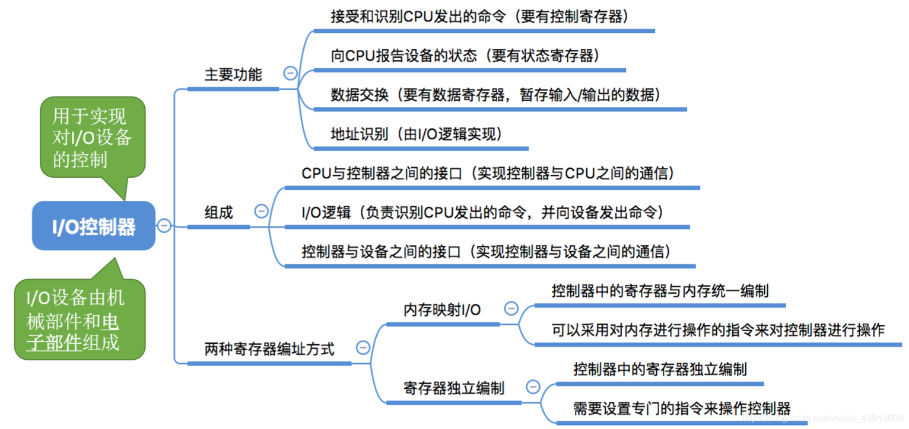

#### 1.I/O设备的组成

I/O设备由**机械部件**和**电子部件**(I/O控制器、设备控制器)组成

##### （1）机械部件

I/O设备的**机械部件**主要用来执行具体l/O操作。

如：我们看得见摸得着的鼠标/键盘的按钮；显示器的LED屏：移动硬盘的磁臂、磁盘盘面。

I/O设备的**电子部件**通常是一块插入主板扩充槽的印刷电路板。

##### （2）电子部件—I/O控制器的功能

CPU**无法直接控制**I/O设备的机械部件，因此I/O设备还要有一个电子部件作为CPU和I/O设备机械部件之间的“中介”，用于实现CPU对设备的控制。

这个电子部件就是**I/O控制器**，又称**设备控制器**。`CPU可控制I/O控制器，又由I/O控制器来控制设备的机械部件。`

I/O控制器的功能

- 接受和识别CPU发出的命令
  - 如CPU发来的read/write命令，I/O控制器中会有相应的**控制寄存器**来存放命令和参数
- 向CPU报告设备的状态
  - I/O控制器中会有相应的**状态寄存器**，用于记录I/O设备的当前状态。
  - 如:1表示空闲，0表示忙碌
- 数据交换
  - I/O控制器中会设置相应的**数据寄存器**。
  - 输出时，数据寄存器用于暂存CPU发来的数据，之后再由控制器传送设备。
  - 输入时，数据寄存器用于暂存设备发来的数据，之后CPU从数据寄存器中取走数据。
- 地址识别
  - 类似于内存的地址，为了区分设备控制器中的各个寄存器，也需要给各个寄存器设置一个特定的“地址”。I/O控制器通过CPU提供的“地址”来判断CPU要读/写的是哪个寄存器

#### 2.I/O控制器的组成

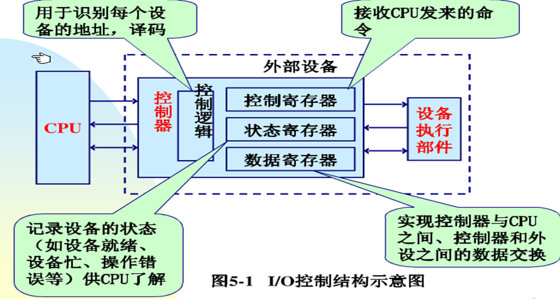

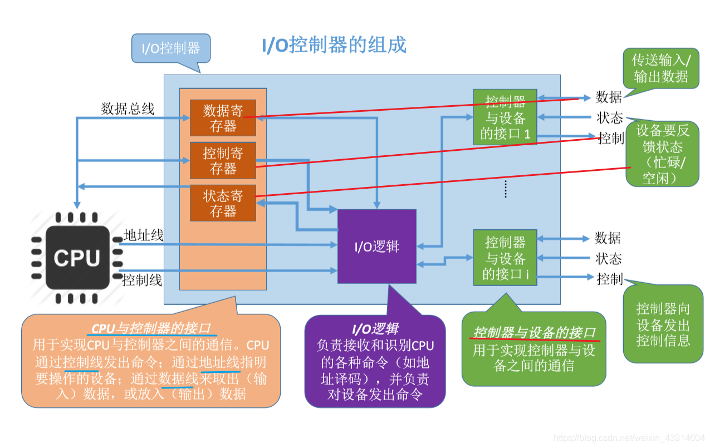

值得注意的小细节:

①一个I/O控制器可能会对应多个设备;

②数据寄存器、控制寄存器、状态寄存器可能有多个（如：每个控制/状态寄存器对应一个具体的设备），且这些寄存器都要有相应的地址，才能方便CPU操作。有的计算机会让这些寄存器占用内存地址的一部分，称为**内存映像I/O**；另一些计算机则采用I/O专用地址，即**寄存器独立编址。**

#### 3.I/O控制器的两种寄存器编址方式

##### 内存映像—独立编址


## 5.2 I/O控制方式

### 一、程序直接控制方式

由于无中断机构，处理机对I/O设备的控制采取程序I/O方式，或称为忙--等待方式，即在处理机向控制器发送一条I/O指令启动输入设备输入数据时，要同时把状态寄存器中的忙/闲标志置为1。然后便不断测试标志。当为1时，表示输入机尚未输完一个字，处理机应继续对该标志测试，直到它为0，表明数据已输入到控制器的数据寄存器中，于是处理机将数据取出送入内存单元，便完成了一个字的I/O 。

在程序I/O方式中，由于CPU高速,I/O设备低速致使CPU极大浪费。

**key word : 轮询**

完成一次读/写操作的流程图(以读操作为例)


**下面以C语言代码和流程图来剖析，程序直接控制方式**


**分析一下在思维导图中提到的几个问题：**

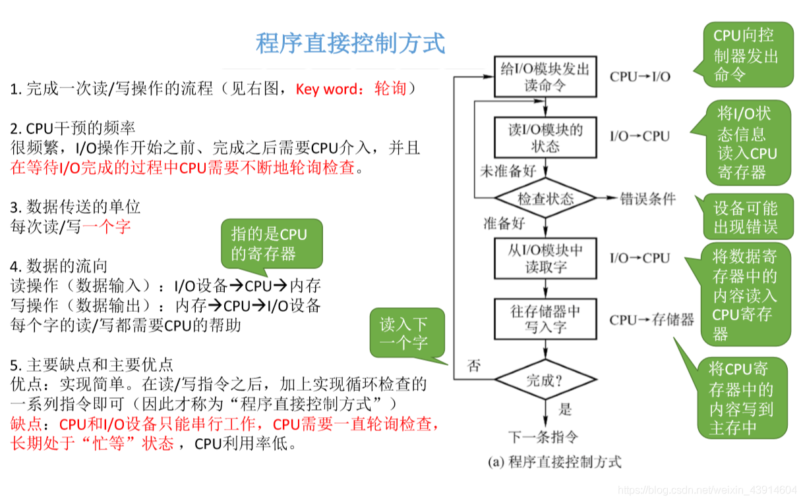

### 二、中断驱动方式

- 由于`程序直接控制方式`CPU利用率低，忙等，所以提出了中断驱动方式。

当某进程要启动某个I/O设备时，便由CPU向相应的设备控制器发出一条I/O命令，然后立即返回继续执行原来的任务。设备控制器于是按照命令的要求去控制指定I/O设备。这时CPU与I/O设备并行操作。

中断驱动方式在I/O设备输入数据的过程中，无需CPU干预，而是当I/O设备准备就绪时“主动”通知CPU。才需 CPU花费极短的时间去进行中断处理。从而大大地提高了整个系统的资源利用率及吞吐量，特别是CPU的利用率。


**分析一下在思维导图中提到的几个问题：**

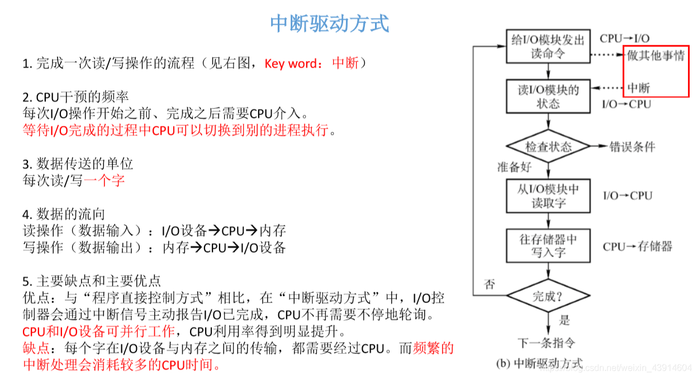

### 三、直接存储器访问(DMA)方式

- 虽然`中断驱动方式解决了程序直接控制方式`的问题，但是每一次只能读/写一个字，导致CPU频繁切换，耗费了很多时间。于是人们又发明了DMA方式。

虽然中断方式比程序I/O方式更有效，但它仍是以字（节）为单位进行I/O的，每当完成一个字（节）的I/O时，控制器便要请求一次中断。极其低效的。由此便引入了直接存储器访问方式。 

该方式的特点是：数据传输的基本单位是数据块；所传送的数据是从设备**直接送入内存**的，或者相反；仅在传送一个或多个数据块的开始和结束时，才需CPU干预，整块数据的传送是在控制器的控制下完成的。可见DMA方式又是成百倍的减少了CPU对I/O的干预，进一步提高了CPU与I/O设备的并行操作程度。

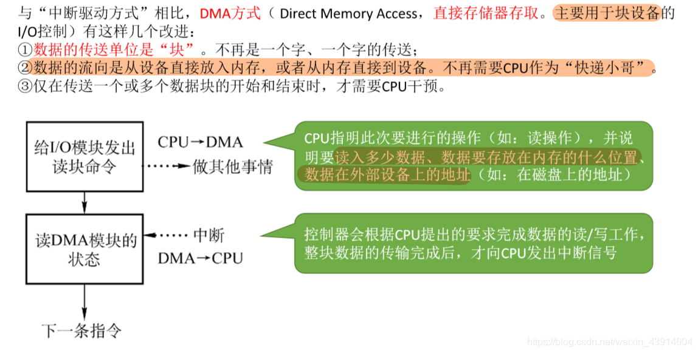

**DMA控制器：**

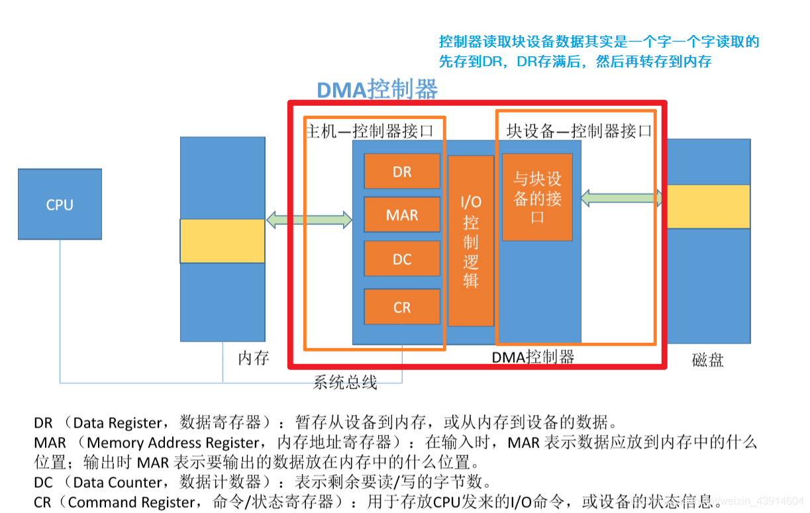

**分析一下在思维导图中提到的几个问题：**

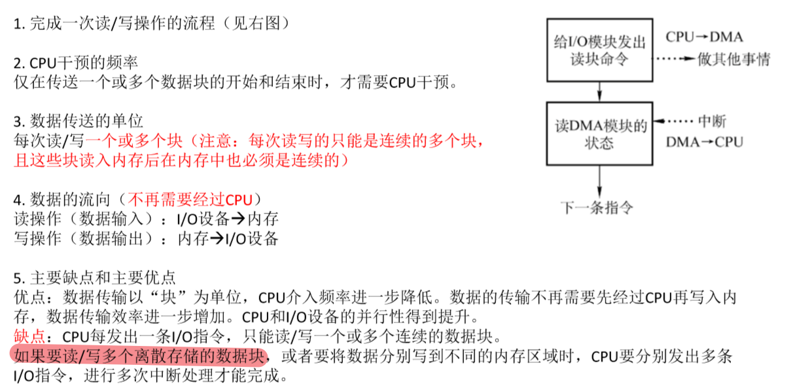

### 四、I/O通道控制方式

I/O通道控制方式是DMA方式的发展，为了解决DMA方式连续存储的问题，同时又可实现CPU、通道和I/O设备三者的并行操作，更有效的提高整个系统的资源利用率。

#### **通道程序**

通道是通过**执行通道程序**，并与设备控制器共同实现对I/O设备的控制的。**通道程序**由一系列**通道指令**所构成的。通道指令一般包含下列信息：

- 操作码。规定指令所执行的操作。
- 内存地址。
- 计数。表示本指令所要操作的字节数。
- 通道程序结束位。用以表示程序是否结束。
- 记录结束标志。表示该指令是否与下条指令有关。

#### 通道类型

由于外围设备的种类较多，且其传输速率相差很大，所以通道也具有多种类型。根据信息交换方式，通道分为三种类型：

- 字节多路通道（Byte Multiplexor Channel）
  - 在这种通道中，通常都含有较多个（8，16，32）非分配型子通道，每一个子通道连接一台I/O设备。这些子通道按时间片轮转方式共享主通道。一个子通道完成一个字节的传送后，立即让出字节多路通道（主通道），给另一个子通道使用。
  - 它适用于连接低速或中速设备，如打印机、终端等。
- 数组选择通道（Block Selector Channel）
  - 这种通道虽然可以连接多台I/O设备，但是它只有一个分配型子通道，在一段时间内只能执行一道通道程序、控制一台设备进行数据传送，其数据传送是按数组方式进行。即当某台设备一旦占用了该通道，就被它独占，直至该设备传送完毕释放该通道为止。
  - 可见，它适于连接高速设备（如磁盘机、磁带机），但是这种通道的利用率较低
- 数组多路通道（Block Multiplexor Channel）
  - 它含有多个非分配型子通道，可以连接多台高、中速的外围设备，其数据传送却是按数组方式进行。所以这种通道既具有很高的数据传输速率，又能获得令人满意的通道利用率。

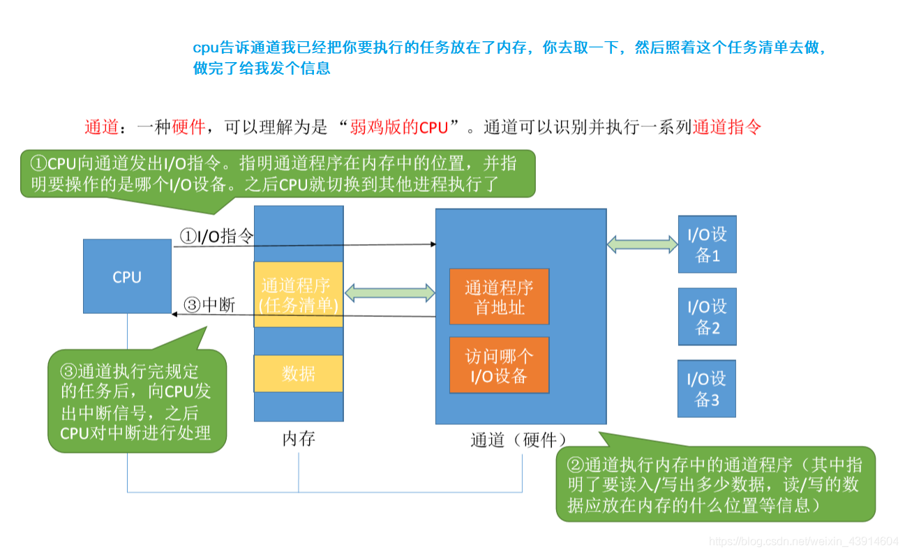


### 四种方式总结


## 5.3 设备分配

### 一、设备分配中的数据结构

  在进行设备分配时，通常都要借助一些表格的帮助。在表格中记录了相应设备或控制器的状态及对设备或控制器进行控制所需的信息。

在进行设备分配时所需的数据结构有：设备控制表、控制器控制表、通道控制表和系统设备表等。

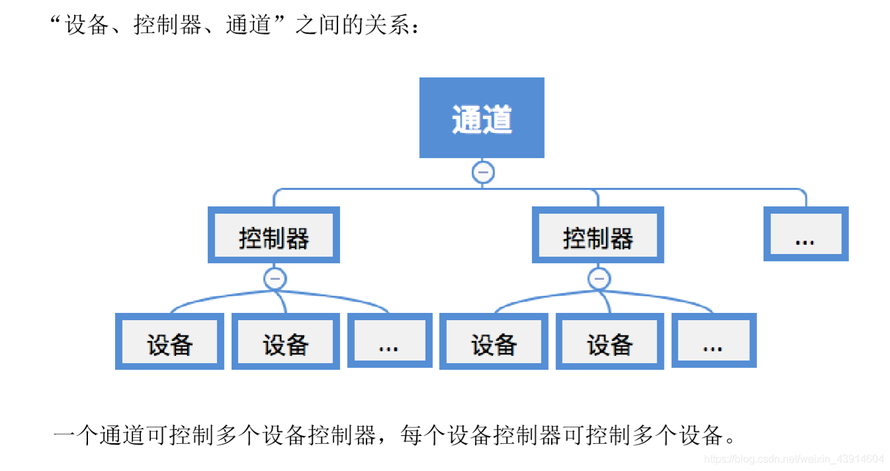

#### 设备控制表—DCT


#### 控制器控制表—COCT


#### 通道控制表—CHCT


#### 系统设备表—SDT

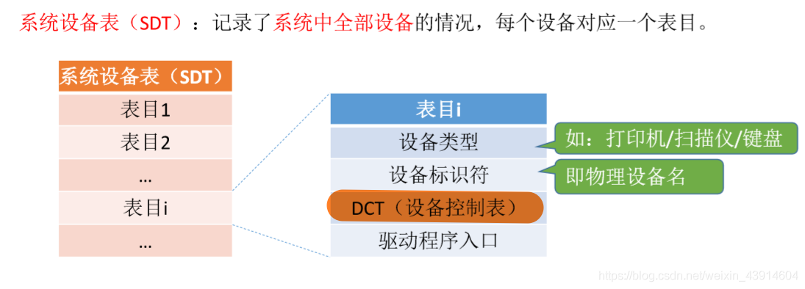

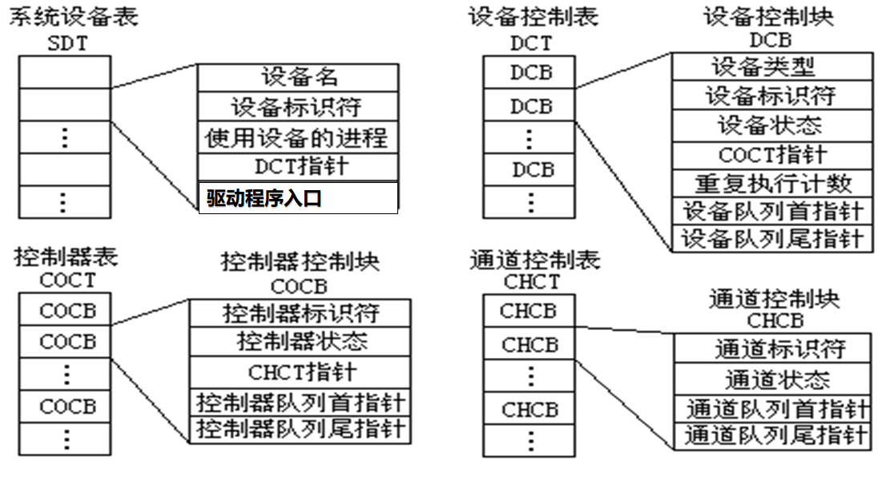

### 二、设备分配时应考虑的因素

#### 1.设备的固有属性

设备的固有属性可分为三种:独占设备、共享设备、虚拟设备。

- 独占设备
  - 一个时段只能分配给一个进程（如打印机）

- 共享设备
  - 可同时分配给多个进程使用（如磁盘），各进程往往是宏观上同时共享使用设备，而微观上交替使用。

- 虚拟设备
  - 采用SPOOLing 技术将独占设备改造成虚拟的共享设备，可同时分配给多个进程使用
  - （如采用SPoOLing技术实现的共享打印机)
    

#### 2.设备分配算法

- 先来先服务：根据请求的先后次序排成一个队列，设备总是 分配给队首进程。
- 优先级高者优先：将优先权高的进程安排在设备队列前面， 优先级相同的先来先服务。
- 短任务优先

####   3.设备分配中的安全性

从进程运行的安全性上考虑，设备分配有以下两种方式。

- 安全分配方式：每当进程发出I/O请求后便阻塞，直到I/O完成 后被唤醒。虽安全但缓慢。

  - 一个时段内每个进程只能使用一个设备
  - 优点:破坏了“请求和保持”条件，不会死锁
  - 缺点:对于一个进程来说，CPU和I/O设备只能串行工作

- 不安全分配方式：进程发出I/O请求后，系统为其分配I/O设备，进程可继续执行，之后还可以发出新的I/O请求。只有某个I/O请求得不到满足时才将进程阻塞。

  - 一个进程可以同时使用多个设备

  - 优点:进程的计算任务和I/O任务可以并行处理，使进程迅速推进

  - 缺点:有可能发生死锁（死锁避免、死锁的检测和解除)

**静态分配与动态分配**

- 静态分配:进程运行前为其分配全部所需资源，运行结束后归还资源
  - 破坏了“请求和保持”条件，不会发生死锁

- 动态分配:进程运行过程中动态申请设备资源

### 三、设备独立性

- 设备独立性（Device Independence）的概念--应用程序独立于具体使用的物理设备。
- 物理设备和逻辑设备：类似于物理地址和逻辑地址的概念。使用逻辑设备名称来请求使用某类设备；系统实际执行时，必须使用物理设备名称。

 设备独立性的优点

- 设备分配时的灵活性
  - 应用程序（进程）不必拘泥于某个物理设备，而可以用任意一台空闲设备。

- 易于实现I/O重定向
  - I/O重定向指用于I/O操作的设备可以更换（重定向），而不必改变应用程序。

### 四、独占设备的分配程序

#### 设备分配的步骤

1) 分配设备: 根据物理设备名在系统设备表SDT中找出该设备的DCT，若设备忙，便将请求I/O的进程PCB挂在设备队列上；否则，便按照一定的算法来计算本次设备分配的安全性，若不会导致系统进入不安全状态，便将设备分配给请求进程；否则，仍将其PCB插入设备队列。

2) 分配控制器: 分配设备给进程后，再到其DCT中找出与该设备连接的控制器的COCT。若控制器忙，便将请求I/O进程的PCB挂在该控制器的等待队列上；否则，将该控制器分配给进程。

3) 分配通道: 分配控制器后，再在COCT中找到与该控制器连接的CHCT。若通道忙，便将请求I/O的进程挂在该通道的等待队列上；否则，将该通道分配给进程。

只有在设备、控制器和通道三者都分配成功时，这次的设备分配才算成功；之后便可启动该I/O设备进行数据传送。


#### 设备分配程序的改进

上述基本的设备分配程序中，有以下特点：

① 进程以物理设备名提出I/O请求的；

② 采用的是单通路的I/O系统结构，容易产生“瓶颈”现象。

为使独占设备的分配程序具有更大的灵活性和提高分配的成功率，应从两方面对基本的设备分配程序加以改进：

- 增加设备的独立性
- 考虑多通路情况


##### 1、增加设备的独立性

为获得设备独立性，进程应用逻辑设备名请求I/O。系统先从SDT中找出第一个该类设备的DCT。如该设备忙，再找第二个，若所有该类设备部忙则把进程挂在该类设备的等待队列上；而只要有一个该类设备可用，系统就可进一步计算分配该设备的安全性。

##### 2、考虑多通路情况

分配控制器和通道时，若设备（控制器）所连接的第一个控制器（通道）忙时，应查看其所连接的第二个控制器（通道），仅当所有的控制器（通道）都忙时，此次的控制器（通道）分配才算失败，才把进程挂在控制器（通道）的等待队列上；而只要有一个控制器（通道）可用，系统便可将它分配给进程。

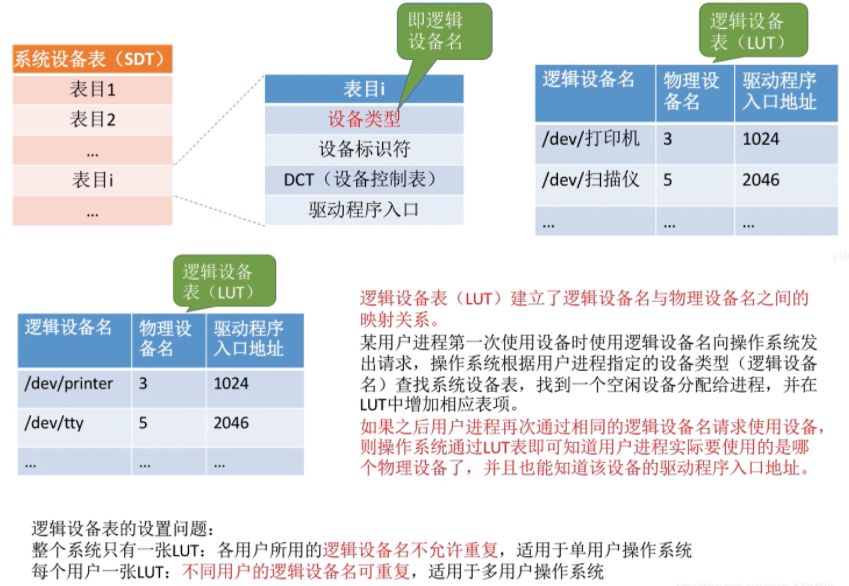

### 五、SPOOLing技术

####　1.什么是脱机技术？

**温习一下手工操作阶段：**

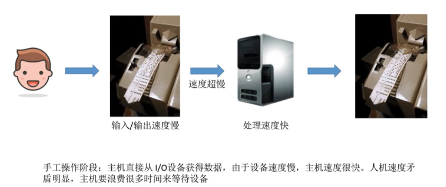

- 因为手工阶段的速度慢问题，引入了脱机技术


#### 2.什么是SPOOLing

为缓和CPU的高速性与I/O设备低速性间的矛盾而引入了**脱机输入、脱机输出技术**。该技术是利用专门的外围控制机，将低速设备上的数据传送到高速磁盘上；或者相反。

这样就可以在主机的直接控制下实现脱机输入输出。此时外围操作与CPU对数据的处理同时进行，我们把这种在联机情况下实现的同时外围操作称为SPOOLing（Simultaneaus Periphernal Operating On—Line），或称为假脱机操作。

#### 3.SPOOLing系统的三大部分组成

##### 输入井和输出井

是磁盘上开辟的两个大存储空间。

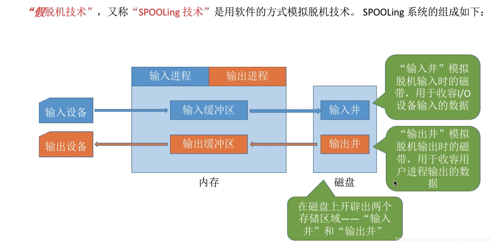


##### 输入进程与输出进程

利用两个进程模拟脱机I/O时的外围处理机

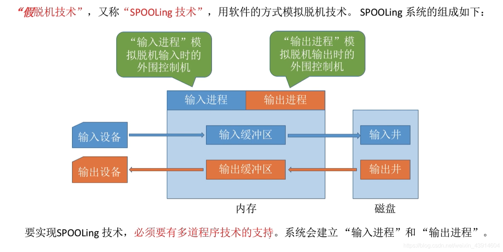

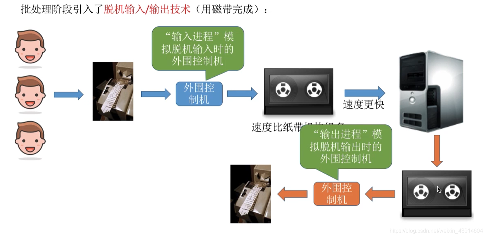

##### 输入输出缓冲区

在内存中开辟两个缓冲区，输入缓冲区暂存由输入设备送来的数据，后送输入井；输出缓冲区暂存从输出井送来的数据，后送输出设备。

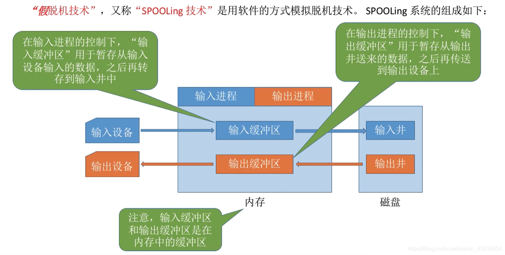

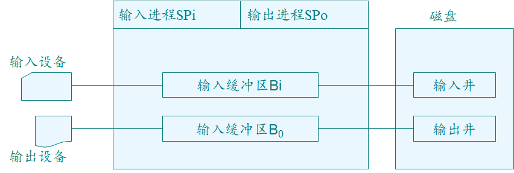

进程SPi模拟脱机输入时的外围控制机，将数据从输入机，通过输入缓冲区再送到输入井。CPU直接从输入井读数据入内存。

进程SPo模拟脱机输出时的外围控制机，把输出的数据从内存送到输出井，再待输出设备空闲时，将输出井中的数据，经过输出缓冲区送到输出设备上。

#### 4.共享打印机原理分析

##### 独占设备和共享设备

- 独占式设备――只允许各个进程串行使用的设备。一段时间内只能满足一个进程的请求。

- 共享设备――允许多个进程“同时”使用的设备（宏观上同时使用，微观上可能是交替使用）。可以同时满足多个进程的使用请求。

打印机是种“独占式设备”，但是可以用
SPOOLing技术改造成“共享设备”

独占式设备的例子:若进程1正在使用打印机，则进程2请求使用打印机时必然阻塞等待


- 打印请求完成后，请求表从打印队列删除，执行后续队列的打印任务

虽然系统中只有一个台打印机，但每个进程提出打印请求时，系统都会为在输出井中为其分配一个存储区（相当于分配了一个逻辑设备），使每个用户进程都觉得自己在独占一台打印机，从而实现对打印机的共享。
SPOOLing 技术可以把一台物理设备**虚拟**成逻辑上的多台设备，**可将独占式设备改造成共享设备。**

#### 5.SPOOLing系统的特点

- 提高了I/O的速度。利用输入输出井模拟成脱机输入输出，缓和了CPU和I/O设备速度不匹配的矛盾。

- 将独占设备改造为共享设备

- 实现了虚拟设备功能。多个进程同时使用一台独占设备，虚拟成了多台设备。

## 5.4 设备处理

### I/O软件层次总览

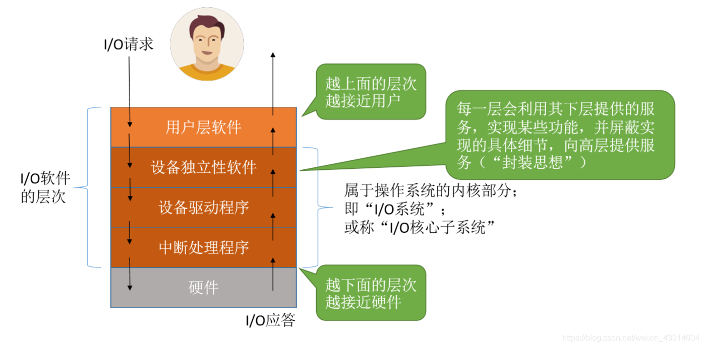

#### 用户层软件


#### 设备独立性软件

**六大功能**


#### 逻辑设备表—LUT


### 一、设备驱动程序的功能和特点


#### 设备驱动程序的功能

- 接收上层软件发来的抽象要求（如read命令等），再把它转换成具体要求。
- 检查用户I/O请求的合法性，了解I/O设备的状态，设置工作方式。
- 由驱动程序向设备控制器发出I/O命令，启动分配到的I/O设备，完成指定的I/O操作。
- 及时响应由控制器或通道发来的中断请求，并根据其中断调用相应的中断处理程序进行处理。
- 对于设置有通道的计算机系统，驱动程序还应能够根据用户的I/O请求，自动地构成通道程序。

#### 设备驱动程序的特点

与一般的应用程序及系统程序有明显的差异：

- 是一个请求I/O进程与设备控制器之间的一个通信和转换程序

- 驱动程序与I/O设备的硬件特性紧密相关

- 驱动程序与I/O控制方式紧密相关

- 驱动程序与硬件紧密相关

- 驱动程序应允许可重入

- 驱动程序不允许系统调用

### 二、设备驱动程序的处理过程

- 将抽象要求转换成为具体要求；如对抽象要求的盘块号转换为磁盘的盘面、磁道及扇区。
- 检查I/O请求的合理性。
- 读出和检查设备的状态，确保设备处于就绪态。
- 传送必要的参数，如传送的字节数，数据在主存的首址等。
- 工作方式的设置
- 启动I/O设备，并检查启动是否成功，如成功则将控制返回给I/O控制系统，在I/O设备忙于传送数据时，该用户进程把自己阻塞，直至中断到来才将它唤醒，而CPU可干别的事。

### 三、中断处理程序的处理过程

当一个进程请求I/O操作时，该进程将被阻塞，直到I/O设备完成了I/O操作后，设备控制器（或通道）便向CPU发出一中断请求，CPU响应后便转向中断处理程序，中断处理程序执行相应的处理，处理完后解除相应进程的阻塞状态。中断处理程序的处理过程如下：

 1、当中断处理程序开始执行时，都必须去唤醒阻塞的驱动（程序）进程。在采用信号量机制时，可通过执行V操作，将处于阻塞状态的驱动（程序）进程唤醒。

2、保护被中断进程的CPU现场。

3、分析中断原因，转入相应的设备中断处理程序。

4、进程中断处理，判别此次I/O完成是正常结束中断还是异常结束中断，分别作相应处理。

5、恢复被中断进程或由调度程序选中的进程的CPU的现场

6、返回被中断的进程，或进入新选中的进程继续运行。


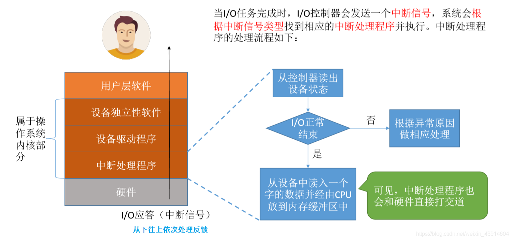

## 5.5 缓冲区管理

### 一、缓冲的引入

- 缓和CPU与I/O设备间速度不匹配的矛盾。
- 减少对CPU的中断频率，放宽对CPU中断响应时间的限制
- 提高CPU和I/O设备之间的并行性。
- 解决数据粒度不匹配的问题。

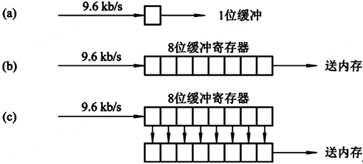

### 二、单缓冲与多缓冲

#### 单缓冲（Single Buffer）

在设备和处理机之间设置一个缓冲。设备与处理机交换数据时，先把交换的数据写入缓冲区，然后需要数据的设备/处理机再从缓冲区中取走数据。

  在单缓冲情况下，每当用户进程发出一I/O请求时，OS便在主存中为之分配一缓冲区。

  在字符设备输入时，缓冲区用于暂存用户输入的一行数据，在输入期间，用户进程被挂起以等待数据输入完毕；在输出时，用户进程将一行数据输入到缓冲区后，继续执行处理。当用户进程已有第二行数据输出时，如果第一行数据尚未被提取完毕，则此时用户进程应阻塞。

特点：

- 缓冲区数只有一个；
- 设备与处理机对缓冲区的操作是**串行**的；
- 设备的输入/输出与处理机对数据的处理时**并行**的。

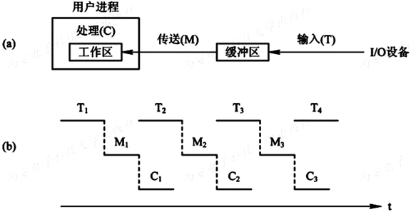

#### 双缓冲（Double Buffer）

为了加快输入和输出速度，提高设备利用率，人们又引入了双缓冲区机制，也称为缓冲对换（Buffer Swapping）。

在设备和处理机之间设置2个缓冲。

在设备输入时，先将数据送入第一缓冲区，装满后便转向第二缓冲区。此时OS可以从第一缓冲区中移出数据，并送入用户进程。

因缓冲区有2个，提高了设备与处理机并行操作的程度，只有当两个均为空时，需要数据的进程才等待。

**特点：**

- 缓冲区数有2个；

- 设备与处理机对缓冲区的操作可并行，提高了设备与处理机并行操作的程度。

**例题：**在某系统中，从磁盘将一块数据输入到缓冲区需要花费的时间T，CPU对一块数据进行处理的时间为C，将缓冲区的数据传送到用户区所花时间为M，那么在双缓冲情况下，系统处理大量数据时，一块数据的处理时间为多少？

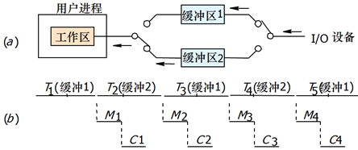

当M+C>T ：即M+C；

当M+C<T ：即为T。

粗略的认为M+C 就为C，则系统处理每块数据的的时间为MAX(C,T)

**双机通讯时缓冲区的设置**

我们在实现两台机器之间的通信时，为了实现双向数据传输，必须在两台机器中都设置两个缓冲区，一个用作发送缓冲区，另一个用作接收缓冲区。

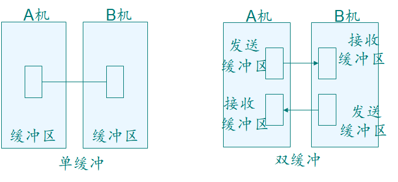

### 三、循环缓冲

#### 一、循环缓冲的组成

- 多个缓冲区。循环缓冲有多个大小相同的缓冲区，作为输入的缓冲区，有三种类型：

1. 用于装输入数据的空缓冲区R
2. 已装满数据的缓冲区G
3. 计算进程正在使用的现行工作缓冲区C

- 多个指针。作为输入的缓冲区可设置三个指针：

1. 用于指示计算进程下一个可用缓冲区G的指针Nextg
2. 指示输入进程下次可用的缓冲区R的指针Nexti
3. 用于指示计算进程正在使用的缓冲区C的指针Current

**循环缓冲的组成示意图**

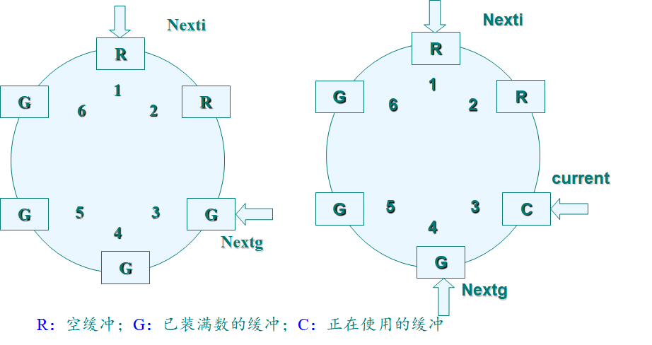

#### **二、循环缓冲区的使用**

计算进程和输入进程可利用两个过程来使用循环缓冲区。

- GetBuf过程。当计算进程要使用缓冲区中的数据时，可调用该过程。
- ReleaseBuf过程。当计算进程把C缓冲区中的数据提取完毕时，便调用该过程将缓冲区G释放。当输入进程把缓冲区装满时，也调用该进程将缓冲区释放。

#### **三、进程同步**

循环缓冲，可使输入进程和计算进程并行执行。相应的两个指针不断顺时针方向移动，这样就可能出现两种情况：

- Nexti赶上Nextg。意味着输入速度大于计算速度，缓冲区满，此情况称为系统受计算限制。

- Nextg赶上Nexti。意味着输入速度低于计算速度，缓冲区空，此情况称为系统受I/O限制。

### 四、缓冲池（Buffer Pool）

#### 1、缓冲池的组成

对于既可输入又可输出的公用缓冲池，至少应含三种类型缓冲区：

​     1、空缓冲区；

​     2、装满输入数据的缓冲区；

​     3、装满输出数据的缓冲区；

为管理方便将类型相同的缓冲区连成一个队列即空缓冲区队列、输入队列和输出队列。另还设置了四种工作缓冲区：收容输入数据的；收容输出数据的；用于提取输入数据的和用于提取输出数据的工作缓冲区。

缓冲区工作在四种方式下：

- 收容输入。输入进程需要输入时，取得空缓冲区，装满后放入输入队列。

- 提取输入。计算进程需要输入时，在输入队列取缓冲区，提取数据后挂在空缓冲区队列上。

- 收容输出。计算进程需要输出时，取空缓冲区，装满数据后挂在输出缓冲队列上。

- 提取输出。输出进程从输出队列取缓冲区，提取完数据后挂在空缓冲区上。

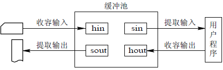

## 5.6 磁盘存储器管理

### 一、磁盘的结构


#### 1.磁盘、磁道、扇区

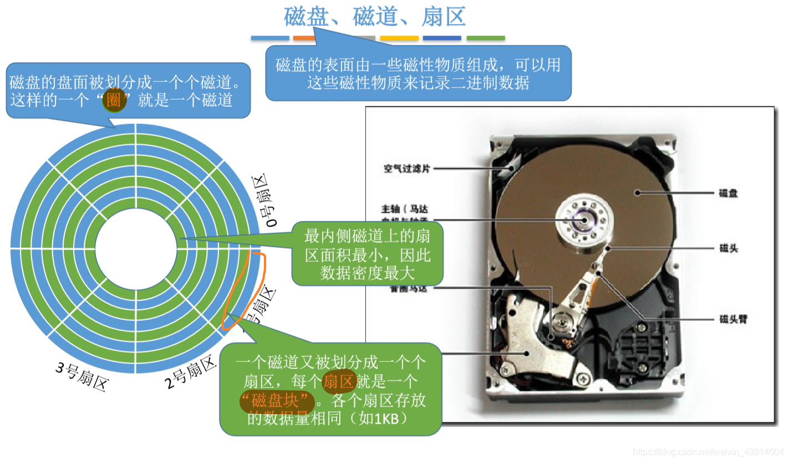

#### 2.如何在磁盘中读/写数据


#### 3.盘面、柱面

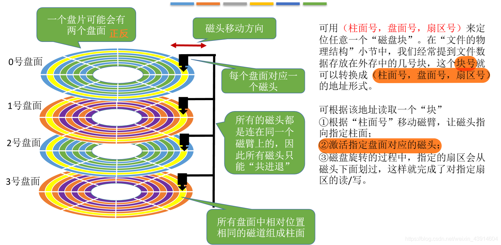

#### 4.磁盘的分类

##### 按磁头是否可移动分类

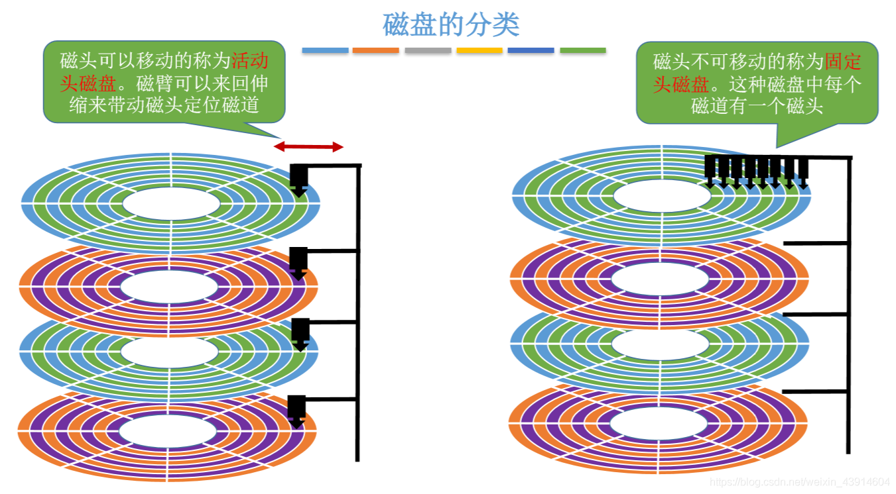

##### 按盘片是否可更换分类

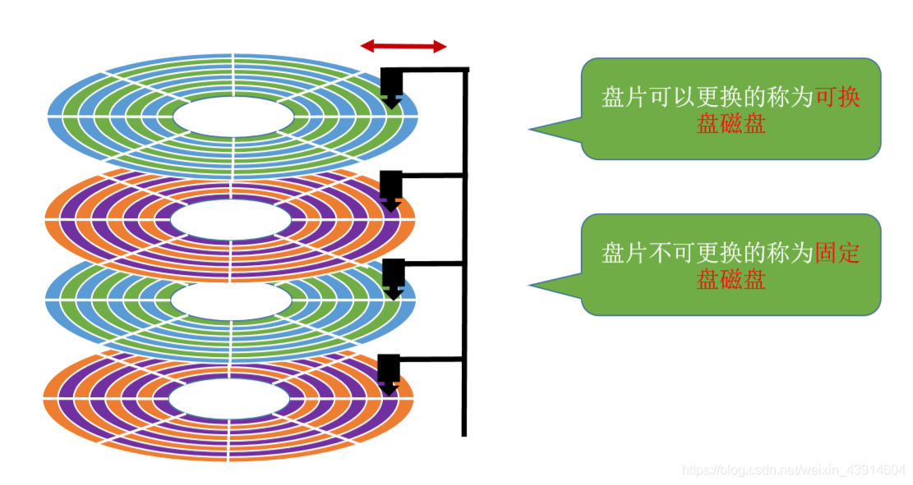

### 二、磁盘调度 ⭐⭐

#### 磁盘性能概述

磁盘访问时间

磁盘设备在工作时以恒定速率旋转。为了读/写，磁头必须能移动到所指定的磁道上，并等待所指定的扇区的开始位置旋转到磁头下，然后再开始读/写。

因此，可以把对**磁盘的访问时间Ta分成三部分**：

(1)寻道时间T~s~：

将磁头从当前位置移到指定磁道所经历时间T~s~=m*n+s 

其中，m是常数，与磁盘驱动器的速度有关。

​     n为移动的磁道数，即寻道距离

​     s为启动磁臂的时间

(2)旋转延迟时间Tτ：

指定扇区移动到磁头下面所经历时间

假设r为每秒磁盘的转数，则1/r为每转一周所需的时间。

Tτ= 1/2r

(3)传输时间T~t~：将扇区上的数据从磁盘读出/向磁盘写入数据所经历的时间。

T~t~=b/rN=(b/N)*(1/r)

其中，r为每秒磁盘的转数；

​      N为一条磁道上的字节数；

​      b为每次所读/写的字节数；

则：**T~a~=T~s~+T~τ~+T~t~=T~s~+1/2r+b/rN**

#### 一、先来先服务（FCFS）

根据进程请求访问磁盘的先后次序进行调度。

- 优点：公平、简单，且每个进程的请求都能依次得到处理，不会出现某一进程的请求长期得不到满足的情况。

- 缺点：未对寻道进行优化，致使平均寻道时间可能较长。仅适用于请求磁盘I/O的进程数目较少的场合。

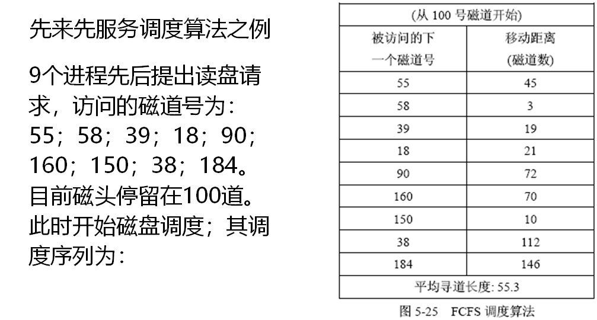

#### 二、最短寻道时间优先SSTF

优先满足访问磁道与当前磁头所在磁道距离最近的进程，以使每次的寻道时间最短。

问题：可能导致某些进程发生“饥饿”。因为只要不断有所要访问的磁道与磁头当前所在磁道的距离较近的新进程到达，就会出现“老进程饥饿”现象。这种调度算法**不能**保证**平均寻道时间最短。** 

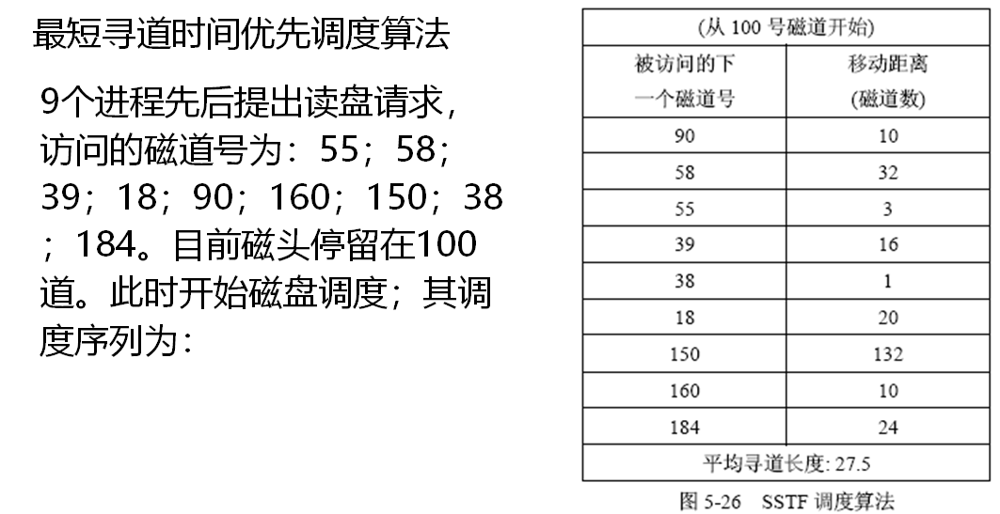

#### 三、扫描（SCAN）算法（电梯调度算法）

SCAN算法中磁头移动的规律似电梯的运行，又称为电梯调度算法。算法既能获得较好的寻道性能，又能防止进程饥饿，被广泛用于大、中、小型机和网络中的磁盘调度。

问题：当磁头刚从里向外移动过某一磁道时，恰有一进程请求访问此磁道，这时该进程必须等待，待磁头从里向外，然后再从外向里扫描完所有要访问的磁道后，才处理该进程的请求，致使该进程的请求被严重地推迟。

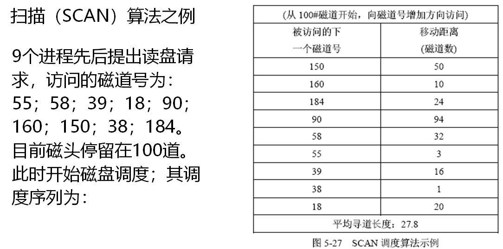

#### 四、循环扫描CSCAN算法

为了减少请求进程的延迟，CSCAN算法规定磁头单向移动。若规定只自里向外移动，当磁头移到最外的被访问磁道时，磁头立即返回到最里的欲访磁道，即将最小磁道号紧接着最大磁道号构成循环，进行扫描。

  采用循环扫描方式后，上述请求进程的请求延迟，将从原来的2T减为T+Smax，其中，T为由里向外（或相反）扫描完所有要访问的磁道所需的寻道时间，而Smax是将磁头从最外面被访问的磁道直接移到最里边欲访问的磁道所需的寻道时间。 

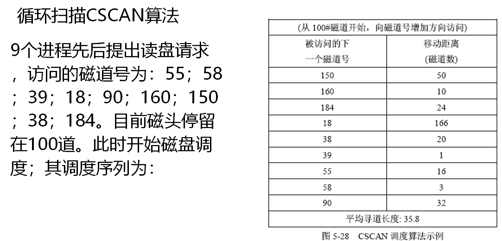

#### 例题

磁盘调度算法之例：

（1）先来先服务：

 例：假设磁盘访问序列：98，183，37，122，14，124，65，67。读写头起始位置：53，安排磁头服务序列，计算磁头移动总距离（道数）。

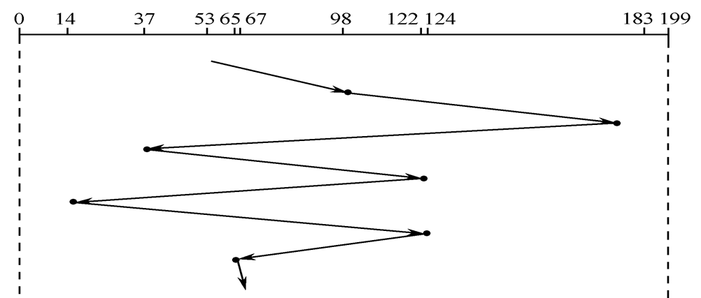

（2）最短寻道时间优先

 例：假设磁盘访问序列：98，183，37，122，14，124，65，67。读写头起始位置：53，安排磁头服务序列，计算磁头移动总距离（道数）。

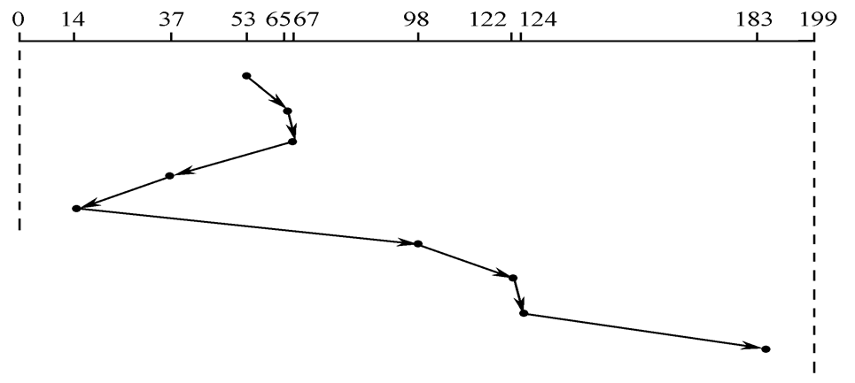

（3）SCAN调度

 例：假设磁盘访问序列：98，183，37，122，14，124，65，67。读写头起始位置：53，安排磁头服务序列，计算磁头移动总距离（道数）。

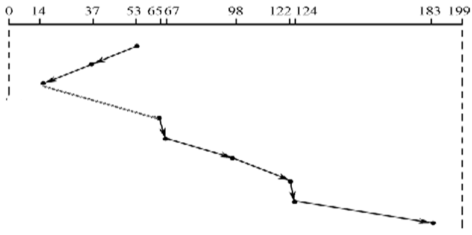

（4）C-SCAN调度算法

 例：假设磁盘访问序列：98，183，37，122，14，124，65，67。读写头起始位置：53，安排磁头服务序列，计算磁头移动总距离（道数）。

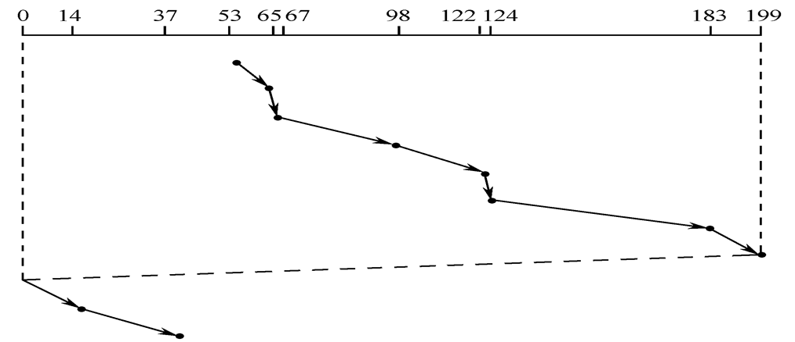

####  N-Step-SCAN和FSCAN调度算法

N-Step-SCAN算法：SSTF、SCAN、CSCAN几种调度算法都可能出现磁臂停留在某处不动的情况，称为磁臂粘着。在高密度盘上更容易出现此情况。N-Step-SCAN算法将磁盘请求队列分成若干个长度为N的子队列。磁盘调度将按FCFS算法依次处理这些子队列，而每处理一个队列时，又是按SCAN算法。这样就可避免出现粘着现象。

N值取得很大时，其性能接近SCAN算法；N=1时，则退化为FCFS算法。

### 三、磁盘高速缓存

磁盘的I/O 速度远低于对内存的访问速度，通常要低上4～6 个数量级。因此，磁盘的I/O 已成为计算机系统的瓶颈。为了提高磁盘I/O 的速度，最主要的技术便是采用磁盘高速缓存(Disk Cache)。

高速缓存是一组在逻辑上属于磁盘，而物理上是驻留在内存中的盘块。

高速缓存在内存中可分成两种形式：

- 在内存中开辟一个单独的存储空间来作为磁盘高速缓存，其大小是固定的，不会受应用程序多少的影响；

- 把所有未利用的内存空间变为一个缓冲池，供请求分页系统和磁盘I/O 时(作为磁盘高速缓存)共享

#### 2．数据交付方式

系统可以采取两种方式将数据交付给请求进程：

(1) 数据交付。这是直接将高速缓存中的数据，传送到请求者进程的内存工作区中。

(2) 指针交付。只将指向高速缓存中某区域的指针交付给请求者进程。

后一种方式由于所传送的数据量少，因而节省了数据从磁盘高速缓存到进程的内存工作区的时间。

#### 3．置换算法

常用的置换算法仍然是最近最久未使用算法LRU、最近未使用算法NRU及最少使用算法LFU等。

高速缓存的置换算法时，除了考虑到最近最久未使用这一原则外，还考虑了以下几点：

1) 访问频率

2) 可预见性

3) 数据的一致性

#### 4．周期性地写回磁盘

经常被访问的盘块数据一直保存在高速缓存的LRU链中，系统突然发生故障导致数据修改丢失。

为了解决这一问题，UNIX 系统中专门增设了一个修改(update)程序，周期性（30S）地调用一个系统调用SYNC。该调用的主要功能是强制性地将所有在高速缓存中已修改的盘块数据写回磁盘。

### 四、提高磁盘I/O速度的其他方法

#### 1．提前读(Read-ahead)

用户(进程)对文件进行访问时，经常采用顺序访问方式，即顺序地访问文件各盘块的数据。在读当前块时可以预知下一次要读的盘块。因此，可以采取预先读方式，即在读当前块的同时，还要求将下一个盘块(提前读的块)中的数据也读入缓冲区。当下一次要读该盘块中的数据时，由于该数据已被提前读入缓冲区，因而此时便可直接从缓冲区中取得下一盘块的数据，而不需再去启动磁盘I/O，从而大大减少了读数据的时间。

#### 2．延迟写

延迟写是指在缓冲区A中的数据，本应立即写回磁盘，但考虑到该缓冲区中的数据在不久之后可能还会再被本进程或其它进程访问(共享资源)，因而并不立即将该缓冲区A 中的数据写入磁盘，而是将它挂在空闲缓冲区队列的末尾。随着空闲缓冲区的使用，缓冲区也缓缓往前移动，直至移到空闲缓冲队列之首。当再有进程申请到该缓冲区时，才将该缓冲区中的数据写入磁盘，而把该缓冲区作为空闲缓冲区分配出去。当该缓冲区A仍在队列中时，任何访问该数据的进程，都可直接读出其中的数据而不必去访问磁盘。

#### 3．优化物理块的分布

另一种提高磁盘I/O 速度的重要措施是优化文件物理块的分布，使磁头的移动距离最小。虽然链接分配和索引分配方式都允许将一个文件的物理块分散在磁盘的任意位置，但如果将一个文件的多个物理块安排得过于分散，会增加磁头的移动距离。

#### 4．虚拟盘

是指利用内存空间去仿真磁盘，又称为RAM 盘。

虚拟盘的主要问题是：一旦系统或电源发生故障，虚拟盘中的数据将会丢失。因此，虚拟盘常用于存放临时文件，如编译程序所产生的目标程序等。

虚拟盘与磁盘高速缓存的主要区别在于: 虚拟盘中的内容完全由用户控制，而高速磁盘缓存中的内容则是由OS 控制的。

### 五、廉价磁盘冗余阵列

#### 1．并行交叉存取

为了提高对磁盘的访问速度，已把在大、中型机中应用的交叉存取(Interleave)技术应用到了磁盘存储系统中。在该系统中，有多台磁盘驱动器，系统将每一盘块中的数据分为若干个子盘块数据，再把每一个子盘块的数据分别存储到各个不同磁盘中的相同位置上。在以后，当要将一个盘块的数据传送到内存时，采取并行传输方式。

#### 2 . RAID（独立磁盘冗余阵列）

把多个相对便宜的磁盘组合起来，成为一个磁盘组，配合数据分散排列的设计，提升数据的安全性和整个磁盘系统效能。

利用多磁盘来提高数据传输率；通过数据冗余与校验实现可靠性。

RAID应用的主要技术有分块技术、交叉技术和重聚技术。

# 六、文件管理

在现代计算机系统中，要用到大量的程序和数据，由于内存容量有限，且不能长期保存，故而平时总是把他们以文件的形式存放在外存中，需要时调入内存。

但用户不能够胜任管理文件的工作，于是在OS中又增加了文件管理功能，构成一个文件系统，负责管理在外存上的文件，把文件的存取、共享和保护等手段提供给用户，方便了用户，保证了文件的安全，提高了系统资源的利用率。

## 6.1 文件和文件系统

### 一、文件、记录和数据项

- 现代OS中是通过文件系统来组织和管理计算机中存储的数据；
- 文件则是指具有文件名的若干相关元素的集合。
- 基于文件系统的概念，可以把数据组成分为数据项、记录和文件三级。

#### **文件、记录和数据项之间的关系**

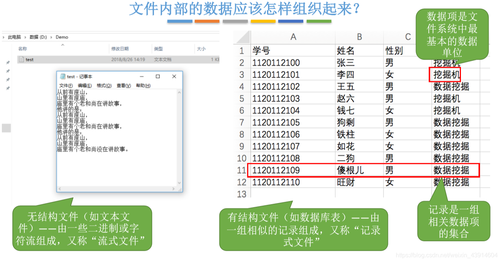

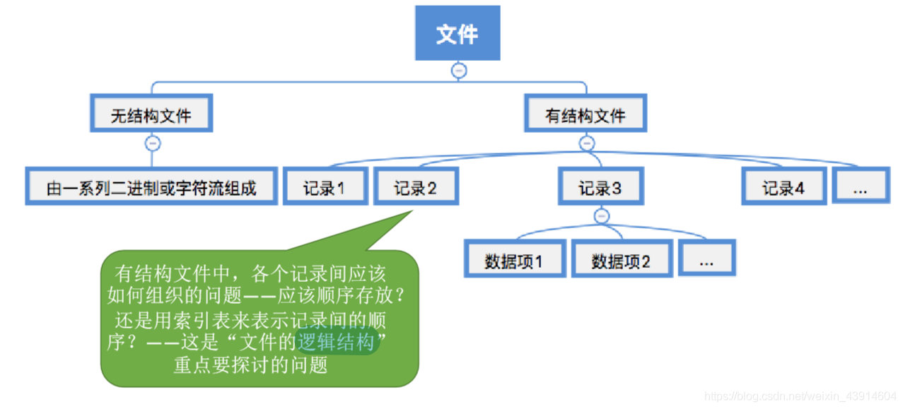

#### **文件属性**

- 文件类型
  - 可以从不同的角度来规定文件的类型。如源文件、目标文件及可执行文件。
- 文件长度
  - 指文件的当前长度，长度的单位可以是字节、字或块，也可能是最大允许的长度。
- 文件的物理位置
  - 通常是用于指示文件在哪一个设备上及在该设备的哪一个位置的指针。
- 文件的建立时间
  - 指最后一次的修改时间等。

### 二、文件类型和文件系统模型

- 按用途分类
  - 系统文件、用户文件和库文件。

- 按文件中数据的形式分类
  - 源文件、目标文件和可执行文件

- 按存取控制属性分类
  - 只执行文件、只读文件和读写文件。

#### 文件系统模型

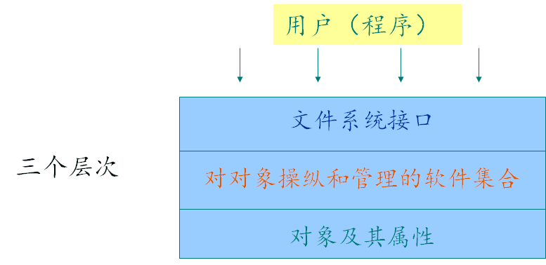

- 对象及其属性。文件管理系统的对象有：文件、目录和磁盘存储空间。

- 对对象操纵和管理的软件集合。是文件管理的核心部分。实现了文件系统的大部分功能--对文件存储空间的管理、对文件目录的管理、将文件的地址转换机制、对文件读写管理以及对文件的共享和保护。

- 文件系统的接口。命令接口（用户与文件系统）和程序接口（用户程序和文件系统）。

### 三、文件操作


用户通过文件系统所提供的系统调用实施对文件的操作。最基本的文件操作有：创建文件、删除文件、读文件、写文件、截断文件和设置文件的读/写位置。

但对于一个实际的OS，为了方便用户使用文件而提供了更多地对文件的操作，如打开和关闭一个文件及改变文件名等操作。

#### 1.创建文件


#### 2.删除文件


#### 3.打开文件

所谓“打开”，是指系统将指名文件的属性从外存拷贝到内存打开文件表的一个表目中，并将该表目的编号返回给用户。以后当用户再要求对该文件操作时，便可利用系统所返回的索引号向系统提出操作请求。此时可直接利用索引号到打开文件表中查找，避免了再次检索。这样不仅节省大量检索开销而且显著提高操作速度。

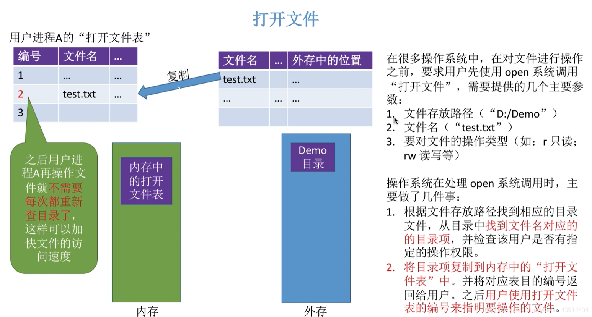

**打开文件表有两种：**

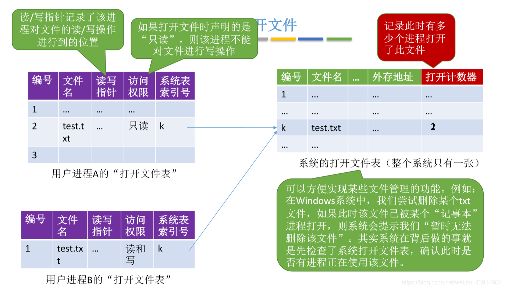

#### 4.关闭文件

当用户不再需要对该文件实施相应的操作时，可利用“关闭”此文件，OS将会把该文件从打开文件表中的表目上删除。

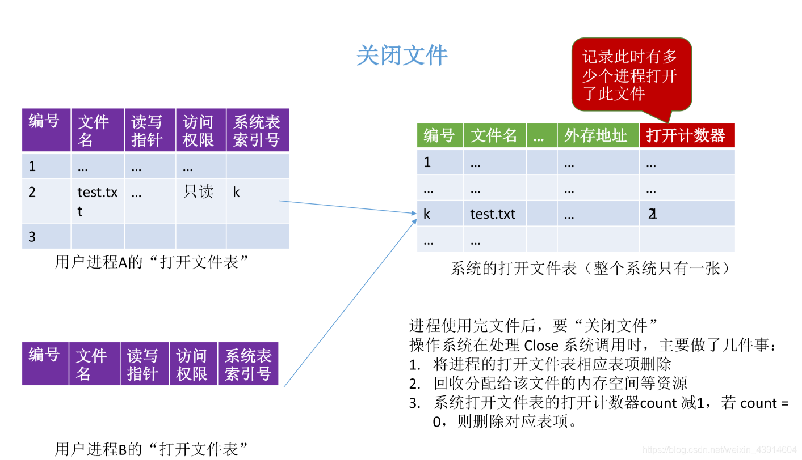

#### 5.读文件


#### 6.写文件


## 6.2 文件的逻辑结构

### 一、文件逻辑结构的类型

#### 1.文件结构

通常文件是由一系列的记录组成的。文件系统设计的关键要素，是将这些记录构成一个文件的方法，以及将一个文件存储到外存上的方法。任何一个文件都存在以下两种形式的结构：

- 文件的逻辑结构。从用户观点出发所观察到的文件组织形式，是用户可以直接处理的数据及其结构，它独立于文件的物理特性，又称为文件组织

- 文件的物理结构。又称为文件的存储结构，是指文件在外存上的存储组织形式。与存储介质的存储性能和采用的外存分配方式有关


#### 2.文件逻辑结构的类型

可以分为两大类：

- 有结构文件，是指由一个以上的记录构成的文件，又把它称为记录式文件；根据记录的长度可分为定长记录文件；不定长记录文件。

- 无结构文件，这是指由字符流构成的文件，故又称为是流式文件。

##### 有结构文件

有结构文件:由一组相似的记录组成，又称“**记录式文件**”。每条记录又若干个数据项组成。如:数据库表文件。一般来说，每条记录有一个数据项可作为**关键字**。

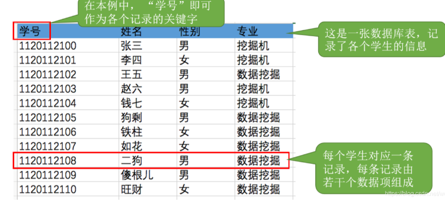

根据各条记录的长度（占用的存储空间）是否相等，又可分为**定长记录**和可变长记录两种。

**定长记录：**

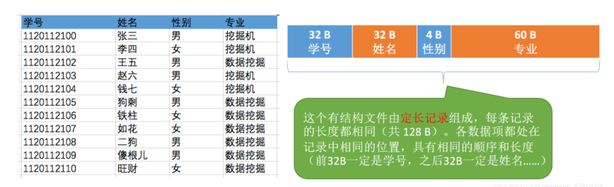

**不定长记录**：

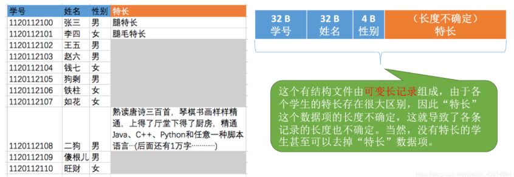

##### 无结构文件

无结构文件:文件内部的数据就是一系列二进制流或字符流组成。又称“**流式文件**”。如:Windows操作系统中的.txt文件。

- 如果说大量的数据结构和数据库，是采用有结构的文件形式的话，则大量的源程序、可执行文件、库函数等，所采用的就是无结构的文件形式，即流式文件。其长度以字节为单位。对流式文件的访问，则是采用读写指针来指出下一个要访问的字符。

- UNIX 系统中，所有的文件都被看做是流式文件。

### 二、有结构文件的逻辑结构

- 顺序文件。由一系列记录按某种顺序排列所形成的文件。通常是定长记录。

- 索引文件。当记录可变长时，通常为之建立一张索引表，并为每个记录设置一个表项以加快对记录检索的速度。

- 索引顺序文件。上述两种方式的结合。为文件建立一张索引表，为每一组记录中的第一个记录设置一个表项。

#### 1.顺序文件

顺序文件:文件中的记录一个接一个地顺序排列（逻辑上），记录可以是**定长**的或**可变长**的。各个记录在物理上可以顺序存储或链**式存储**。


##### 逻辑记录的排序

串结构：各记录之间的顺序与关键字无关。通常由时间来决定。

顺序结构：文件中的所有记录按关键字排列。可以按关键字的长短或英文字母书写排序。顺序结构的检索效率更高。

#####  **对顺序文件的读/写操作**

优点：

- 顺序文件的最佳应用场合是在对诸记录进行批量存取时，即每次操作一大批记录。只有顺序文件才能存储在磁带上，并能有效的工作。

缺点：

- 在交互应用的场合，如果进程操作对象是单个记录，顺序文件的性能就可能很差。当文件较大时更差。

- 如想增加或删除一个记录都比较困难。

#### 2.索引文件


#### 3.索引顺序文件


## 6.3 文件的物理结构

**文件块、磁盘块**


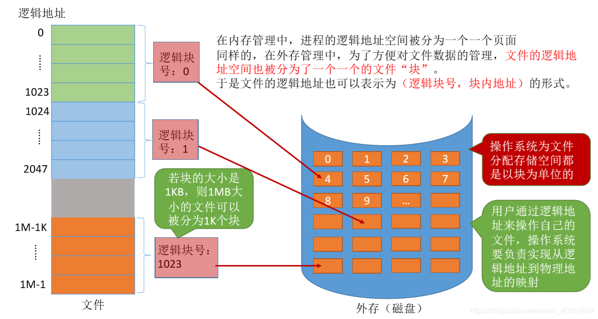

**外存分配方式**

- 由于磁盘具有可直接访问的特性，故当利用磁盘来存放文件时，具有很大的灵活性。

常用的外存分配方法有：连续分配、链接分配和索引分配三种。在一个系统通常只采用一种方法。

- 文件的物理结构和外存分配方法有关。在采用不同的分配方式时将形成不同的文件物理结构。

 如：连续方式对应顺序结构；链接分配方式形成链接式结构；索引方式形成索引式结构。

### 一、连续分配

- 连续分配要求为每一个文件分配一组相邻的盘块。在采用该方式时，可把逻辑文件中的记录顺序的存储到邻接的各物理块中，这样所形成的文件结构成为顺序文件结构，此时的物理文件称为顺序文件。这种分配方式保证了逻辑文件中的记录顺序与存储器中文件占用盘块的顺序的一致性。

- 随着文件的建立与删除不断进行，将产生很多外存的碎片，利用紧凑方法也可消除碎片。


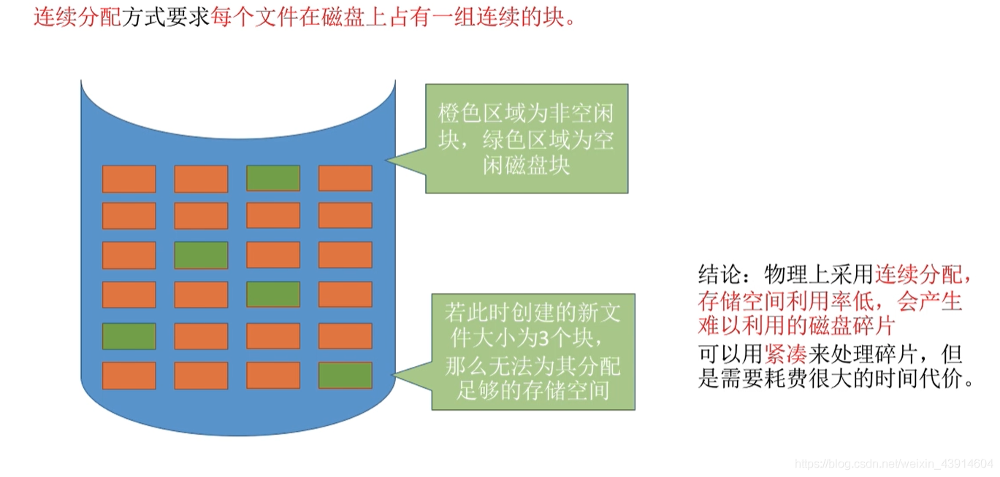

优点：顺序访问容易,支持直接存取； 

​			 顺序访问速度快。

缺点：要求有连续的存储空间；

​			不方便文件拓展;

​			存储空间利用率低，会产生磁盘碎片

​			 必须事先知道文件的长度。

### **二、链接分配**

采用链接分配方式时，可通过在每个盘块上的链接指针，将同属于一个文件的多个离散的盘块链接成一个链表，把这样形成的文件称为链接文件。

链接方式又可分为两种形式:

- 隐式链接

- 显式链接

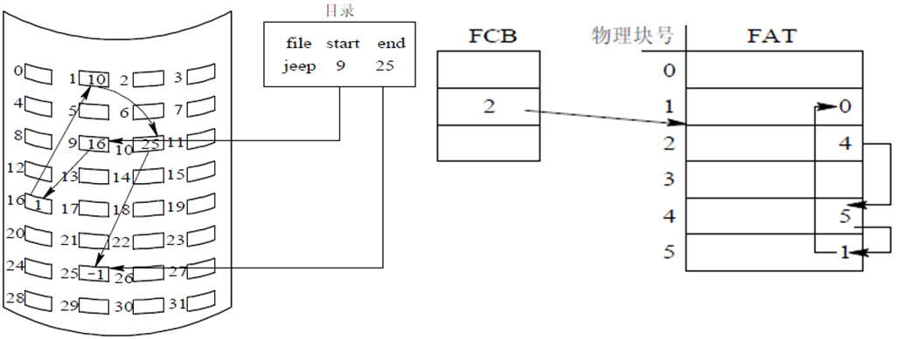

链式分配的特点

- 由于链式分配是采取离散分配方式，消除了外部碎片；

- 因为是根据文件的当前需要，为它分配必须的盘块，当文件动态增长时，可动态的再为它分配盘块，故而无需事先知道文件的大小。

- 对文件的增、删、改也十分方便。


例、假定磁盘块大小为1K，对于540M的硬盘，其文件分配表FAT需占用多少存储空间？

答： 由题目条件可知，硬盘大小为540M，磁盘块大小为1K,所以硬盘共有盘块： 

540M / 1K=540 K (个) 

又 512K< 540K < 1024K 故 540K 个盘块号要用20位二进制表示，即文件分配表的每一个表目为2.5个字节。

FAT要占用的存储空间总数为： 2.5×540K=1350K

### **三、索引分配**

索引分配方式示意图

- 单级索引方式

- 多级索引方式

- 混合索引方式

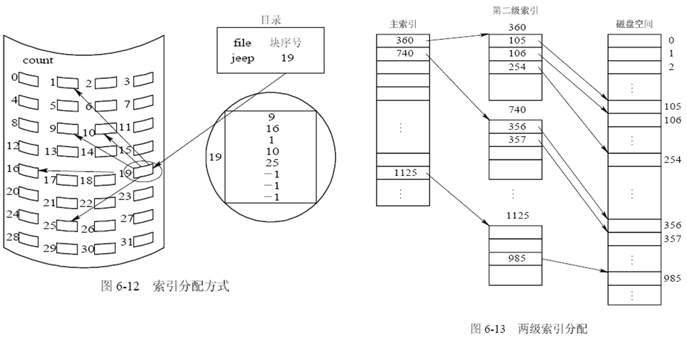

索引分配方式的问题

可能要花费较多的外存空间。每当建立一个文件时，便须为之分配一个索引块，将分配给该文件的所有盘块号记录于其中。


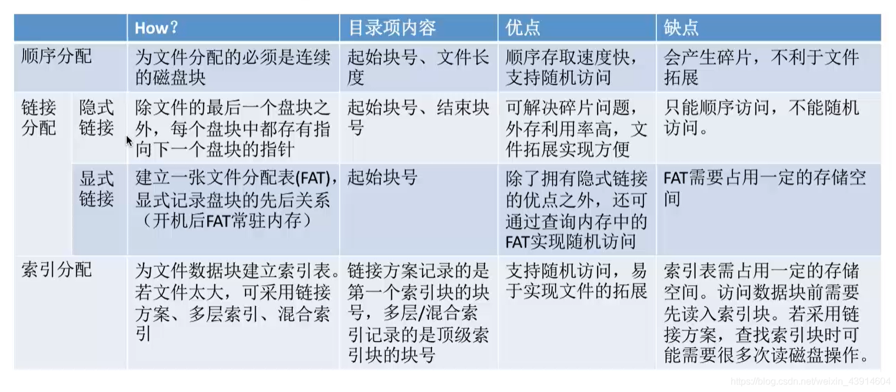

## 6.4 目录管理

通常在现代计算机系统中，都要存储大量的文件。为了能对这些文件实施有效的管理，必须对它们加以妥善组织，这主要是通过文件目录来实现的。文件目录也是一种数据结构，用于标识系统中的文件及其物理地址，供检索时使用。对目录管理的要求如下：

- 实现“按名存取”。
- 提高对目录的检索速度。
- 文件共享。
- 允许文件重名。

### 一、文件控制块和索引结点

#### 文件控制块

为了能对一个文件进行正确的存取，必须为文件设置用于描述和控制文件的数据结构，称之为“文件控制块（FCB）”

文件管理程序可借助于文件控制块中的信息对文件施以各种操作。文件与文件控制块一一对应，而人们把文件控制块的有序集合称为文件目录，即一个文件控制块就是一个文件目录项。通常一个文件目录也被看作是一个文件，称为目录文件。

FCB通常含有三类信息：

- 基本信息类。包括：文件名，文件物理位置，文件逻辑结构，文件的物理结构。

- 存取控制信息类。包括：文件主的存取权限，核准用户的存取权限和一般用户的存取权限。

- 使用信息类。包括：文件的建立日期和时间、文件上次修改的日期和时间及当前使用信息。


#### 索引结点

索引结点的引入

  文件目录通常是存放在磁盘上的，当文件很多时，文件目录要占用大量的盘块。在检索目录文件的时候，需要将目录调入内存后比较文件名，但是只用到文件名，而不需要其它那些对文件的描述信息。所以便把文件名与文件信息分开，使文件描述信息单独形成一个索引结点。

**磁盘索引结点**

存放在磁盘上的索引结点。每个文件有唯一的一个磁盘索引结点，主要包括以下内容：

- 文件主标识符。
- 文件类型。
- 文件存取权限。
- 文件物理地址。
- 文件长度。
- 文件链接计数。
- 文件存取时间。

**内存索引结点**

放在内存中的索引结点。当文件被打开后，将磁盘索引结点拷贝到内存索引结点中以便使用。

比磁盘索引结点增加了以下内容：

​        索引结点编号；状态；访问计数；

​       文件所属文件系统的逻辑设备号；链接指针。

### 二、目录结构

目录结构的组织，关系到文件系统的存取速度，也关系到文件的共享性和安全性。因此，组织好文件的目录是设计好文件系统的重要环节。

#### 1、单级目录结构


最简单的目录结构。整个文件系统中只建立一张目录表，每个文件一个目录项，目录项含有文件相关信息。状态位表明每个目录项是否空闲。

**优点：**

   简单且能实现目录管理的基本功能。

**缺点：**

   查找速度慢。

   不允许重名。名字过多难记忆。多用户环境下重名难以避免。

   不便于实现文件共享

#### 2、两级目录结构

- 为了克服单级目录所存在的缺点，可以为每个用户建立一个单独的用户文件目录UFD。由该用户所有文件的文件控制块组成。

- 在系统中再建立一个主文件目录MFD。在主文件目录中每个用户目录文件都占有一个目录项，其中包括用户名和指向该用户文件的指针。

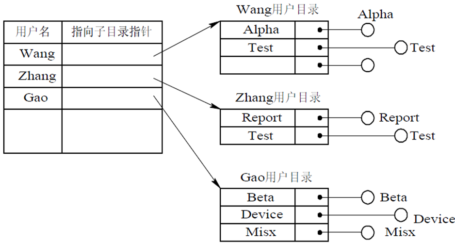

两级目录的特点

基本克服了单级目录的缺点，并具有以下优点：

- 提高了检索目录的速度。

- 在不同的目录中可以有相同的文件名。

- 不同用户还可以使用不同的文件名来访问系统中的同一个共享文件。

存在的问题是各用户之间被完全隔离了，无法进行合作。

#### 3、多级目录结构（树型目录结构）

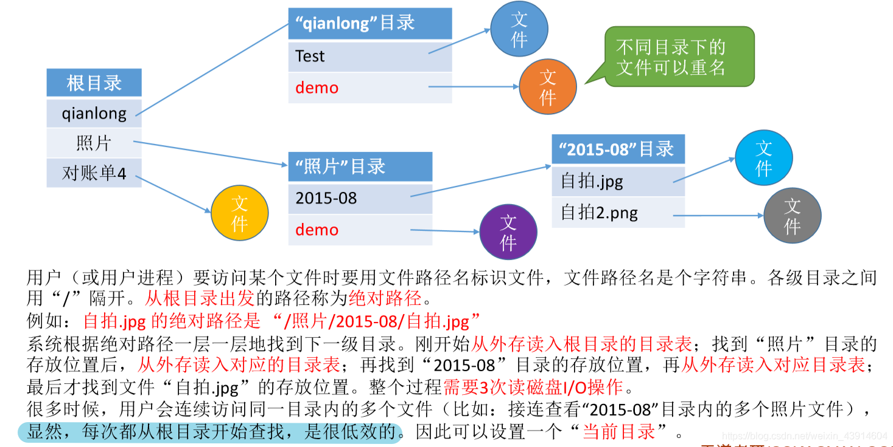


### 三、目录查询技术

#### 1、线性检索法

又称为顺序检索法。

  假定用户给定的文件路径是/usr/ast/mbox，则查找过程

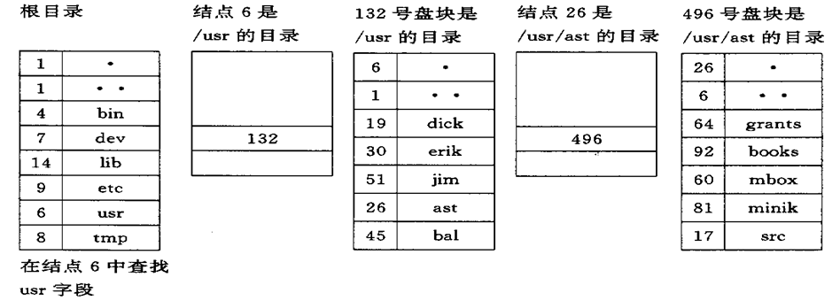

#### 2、Hash方法

建立了一张Hash索引文件目录，利用Hash 方法进行查询，即系统利用用户提供的文件名并将它变换为文件目录的索引值，再利用该索引值到目录中去查找，显著地提高检索速度。

## 6.5 文件存储空间的管理

文件管理要解决的重要问题之一是如何为新创建的文件分配存储空间。其解决方法与内存的分配情况有许多相似之处

连续分配方式、离散分配方式

存储空间的基本分配单位都是**磁盘块**而非字节。

为了实现存储空间的分配，首先必须记住空闲存储空间的使用情况**。**


### 一、空闲表法

属于连续分配方式。与内存的动态分配方式雷同，它为每个文件分配一块连续的存储空间。系统为外存上的所有空闲区建立一张空闲表，每个空闲区对应于一个空闲表项，再将所有空闲区按其起始盘块号递增的次序排列


**分配与回收**

与内存的动态分配类似，同样是采用首次适应算法、循环首次适应算法等。应该说明，虽然很少采用连续分配方式，然而在外存的管理中，由于它具有较高的分配速度，可减少访问磁盘的I/O频率，故它在诸多分配方式中仍占有一席之地。


### 二、空闲链表法

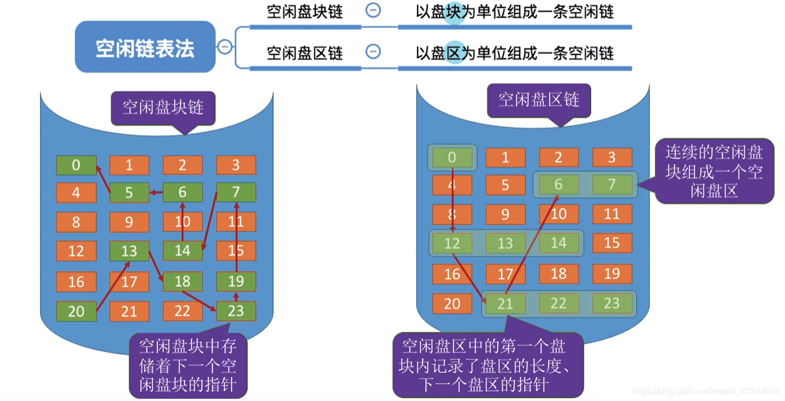

#### 空闲盘块链

这是将磁盘上的所有空闲空间，以盘块为单位拉成一条链。当用户因创建文件而请求分配存储空间时，系统从链首开始，依次摘下适当数目的空闲盘块分配给用户。当用户因删除文件而释放存储空间时，系统将回收的盘块依次插入空闲盘块链的末尾。这种方法的优点是用于分配和回收一个盘块的过程非常简单，但在为一个文件分配盘块时，可能要重复操作多次。


#### 空闲盘区链

这是将磁盘上的所有空闲盘区拉成一条链。在每个盘区上除含有用于指示下一个空闲盘区的指针外，还应有能指明本盘区大小的信息。分配盘区的方法与内存动态分区分配类似，通常采用首次适应算法。在回收盘区时，同样也要将回收区与相邻的空闲盘区相合并。在采用首次适应算法时，为提高对空闲盘区的检索速度，可以采用显式链接方法，亦即，在内存中为空闲盘区建立一张链表。


### 三、位示图法

 是利用二进制的一位来表示磁盘中一个盘块的使用情况。当其值为0时表示对应的盘块空闲，为1时表示已分配（Linux)。有的系统则相反。磁盘上的所有盘块都有一个二进制位与之对应，这样由所有盘块所对应的位构成一个集合，称为位示图。通常可用m * n个位数来构成位示图，并使 m*n等于**磁盘的总块数**。

二维数组

Var map：array[1…m, 1…n] of bit

#### 盘块的分配

①顺序扫描位示图。以找到一个或一组其值为“0”的二进制位;

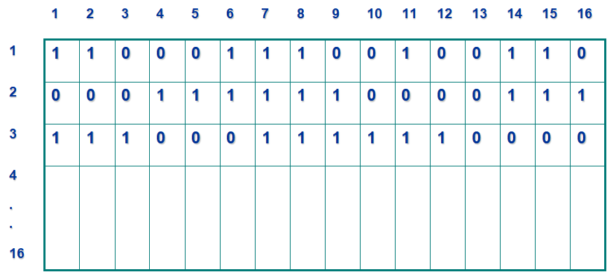

顺序扫描位示图。以找到一个或一组其值为“0”的二进制位;

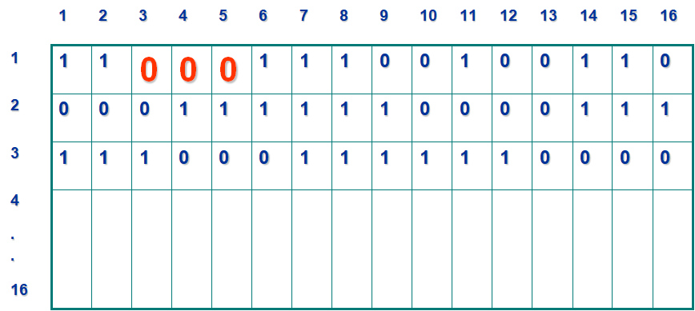

②将所找到的一个或一组二进制位转换成盘块号b 

b=列数n*（i-1）+j;

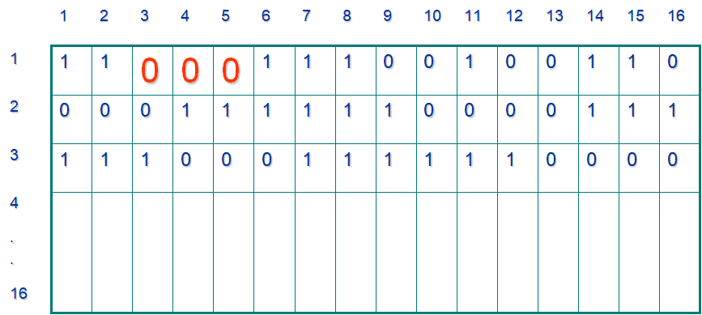

得

**b=16*(1-1)+3=3;**

**b=4;**

**b=5**

③修改位示图。Map[i,j]=1

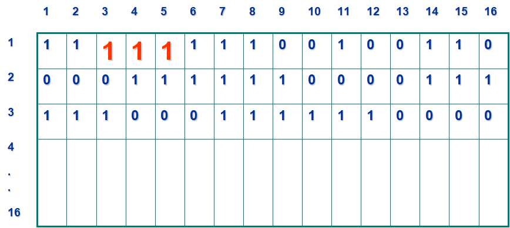

#### 盘块的回收

①将回收盘块的盘块号转换成位示图中的行号和列号。转换公式为：

   i=(b-1)DIV n+1

   j=(b-1)MOD n+1

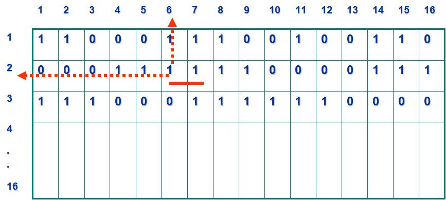

②修改位示图

Map[i,j]=0;

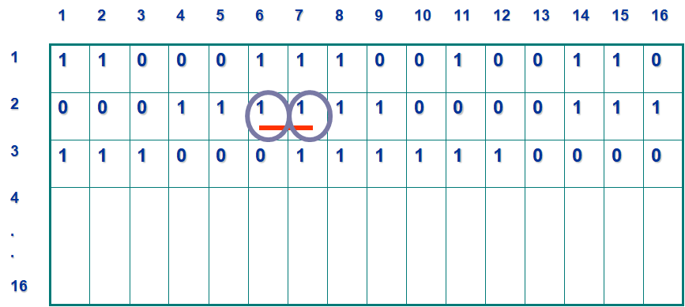

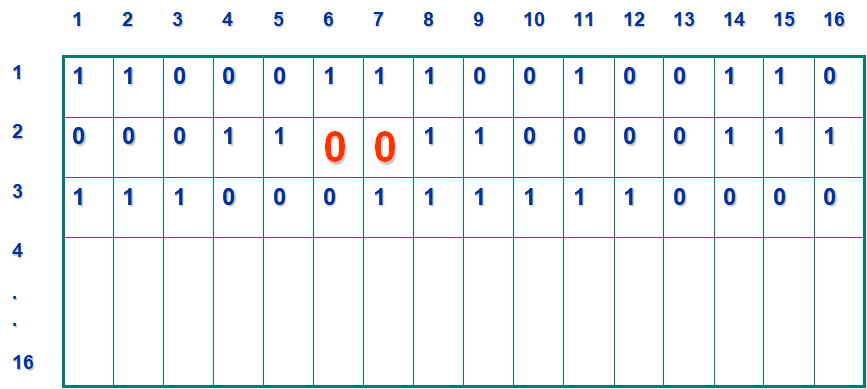

#### 优点

从位示图中很容易找到一个或一组相邻接的空闲盘块。此外，由于位示图很小，占用空间少，因而可将它保存在内存中，从而在每次进行盘区分配时，无需首先把磁盘分配表读入内存，从而省掉许多磁盘的启动操作。位示图常用于微型机和小型机中，如Linux

## 6.6 文件共享与文件保护

### 一、基于索引结点的共享方式（硬链接）

在树型结构的目录中，当有两个（或多个）用户要共享一个子目录或文件时，必须将共享文件或子目录连接到两个（或多个）用户的目录中，才能方便得找到该文件。此时该文件系统的目录结构已不再是树型结构，而是个有向非循环图。

如果通过在文件目录中包含文件的物理地址的方法实现共享有很多缺陷。故采用基于索引结点的共享方式。

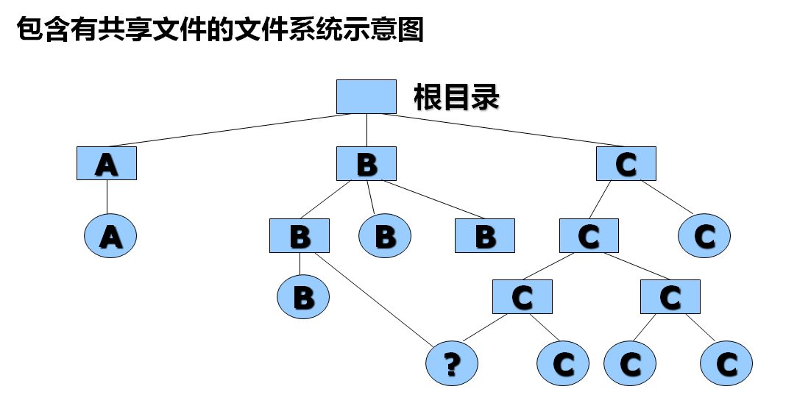


### 二、利用符号链实现文件共享（软链接）

为使B能共享C的一个文件F，可以由系统创建一个LINK类型的新文件，也取名为F，并将F写入B的目录中，以实现B的目录与文件F的链接。在新文件中只包含被链接文件F的路径名。这样的链接方法被称为符号链接。当B要访问被链接的文件F且正要读LINK类新文件时，将被OS截获，OS根据新文件中的路径名去读该文件，于是就实现了B对文件F的共享。

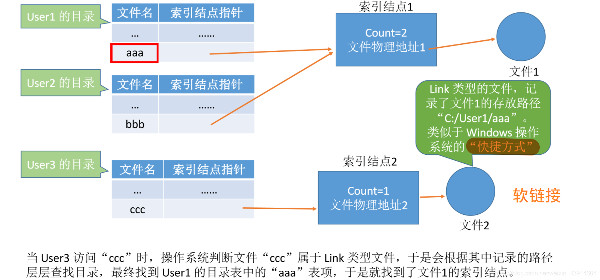

例子：创建快捷方式

### **三、磁盘容错技术**

影响文件安全性的主要因素：

(1) 人为因素

(2) 系统因素

(3) 自然因素

针对上述原因而采取以下措施：

(1) 通过存取控制机制来防止由人为因素所造成的文件不安全性。

(2) 通过磁盘容错技术来防止由磁盘故障所造成的文件不安全性。

(3) 通过“后备系统”来防止由自然因素所造成的不安全性。

磁盘容错技术称为系统容错技术SFT。

分成三个级别：

- 低级磁盘容错技术；

- 中级磁盘容错技术；

- 系统容错技术，它基于集群技术实现容错


### 四、文件保护

#### 1.口令保护


#### 2.加密保护


#### 3.访问控制


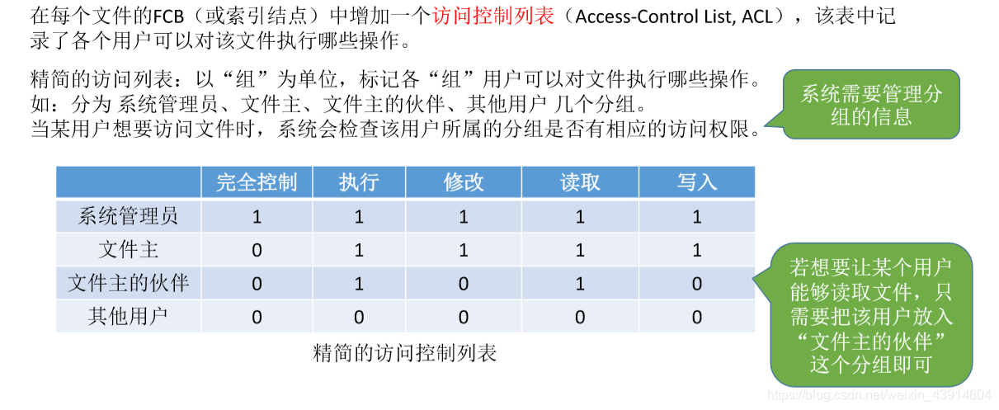

## 文件系统的层次结构

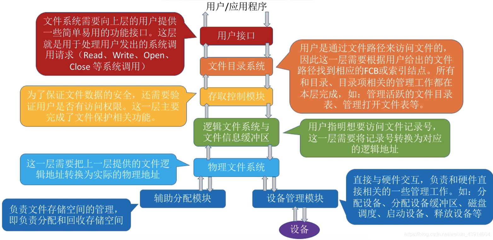


